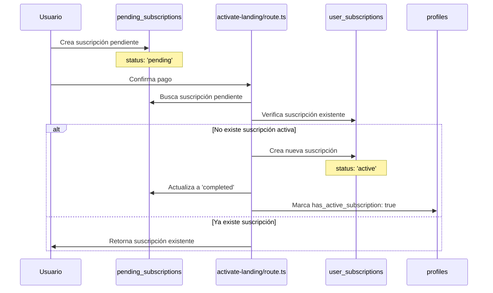
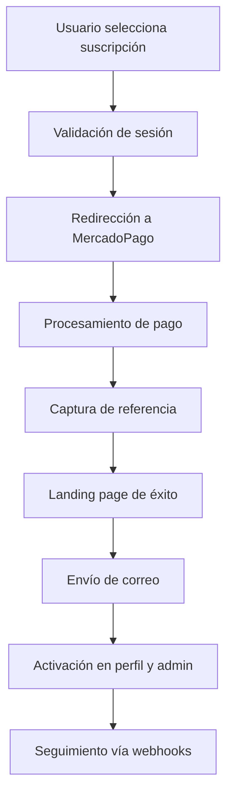

# Análisis Técnico: Tablas de Suscripciones

## 1. Resumen Ejecutivo

Este documento analiza la arquitectura actual de las tablas `pending_subscriptions` y `user_subscriptions` en el sistema PetGourmet, evaluando su funcionalidad, separación y uso en el flujo de suscripciones.

**Conclusión Principal**: La separación actual de las tablas es **correcta y necesaria** desde el punto de vista arquitectónico, ya que representan diferentes estados del ciclo de vida de una suscripción.

## 2. Estructura de las Tablas

### 2.1 Tabla `pending_subscriptions`

**Propósito**: Almacenar suscripciones en proceso de pago/validación

| Campo | Tipo | Descripción |
|-------|------|-------------|
| id | int4 | Identificador único |
| user_id | uuid | ID del usuario |
| subscription_type | varchar | Tipo de suscripción (monthly, quarterly, etc.) |
| status | varchar | Estado ('pending', 'completed', 'failed') |
| external_reference | text | Referencia externa de MercadoPago |
| customer_data | jsonb | Datos del cliente |
| cart_items | jsonb | Items del carrito con descuentos |
| created_at | timestamp | Fecha de creación |
| updated_at | timestamp | Fecha de actualización |
| processed_at | timestamp | Fecha de procesamiento |
| mercadopago_preference_id | text | ID de preferencia de MercadoPago |
| notes | text | Notas adicionales |

### 2.2 Tabla `user_subscriptions`

**Propósito**: Almacenar suscripciones activas y su gestión continua

| Campo | Tipo | Descripción |
|-------|------|-------------|
| id | int4 | Identificador único |
| user_id | uuid | ID del usuario |
| product_id | int4 | ID del producto |
| subscription_type | varchar | Tipo de suscripción |
| status | varchar | Estado ('active', 'paused', 'cancelled') |
| quantity | int4 | Cantidad del producto |
| size | varchar | Tamaño del producto |
| discount_percentage | numeric | Porcentaje de descuento |
| base_price | numeric | Precio base |
| discounted_price | numeric | Precio con descuento |
| updated_at | timestamp | Fecha de actualización |
| next_billing_date | timestamp | Próxima fecha de facturación |
| cancelled_at | timestamp | Fecha de cancelación |
| product_name | varchar | Nombre del producto |
| product_image | varchar | Imagen del producto |
| start_date | timestamp | Fecha de inicio |
| external_reference | varchar | Referencia externa |
| mercadopago_subscription_id | varchar | ID de suscripción en MercadoPago |
| paused_until | timestamp | Pausada hasta fecha |
| last_payment_date | timestamp | Última fecha de pago |
| payment_method | varchar | Método de pago |

## 3. Flujo de Datos Entre Tablas

### 3.1 Proceso de Activación



### 3.2 Migración de Datos

El endpoint `/api/subscriptions/activate-landing` realiza la migración:

1. **Extrae datos del carrito** desde `pending_subscriptions.cart_items`
2. **Calcula precios** con descuentos aplicados
3. **Crea registro** en `user_subscriptions` con datos normalizados
4. **Actualiza estado** de `pending_subscriptions` a 'completed'
5. **Actualiza perfil** del usuario

## 4. Uso en la Interfaz de Usuario

### 4.1 Fuentes de Datos por Componente

| Componente | Tabla Principal | Propósito |
|------------|-----------------|----------|
| `/perfil` (Tab Suscripciones) | `user_subscriptions` | Mostrar suscripciones activas del usuario |
| `/suscripcion` | `user_subscriptions` | Dashboard de suscripciones |
| `/suscripcion/exito` | `user_subscriptions` | Confirmación post-activación |
| `/admin/subscription-monitor` | Ambas tablas | Monitoreo administrativo |
| Componente `user-subscriptions.tsx` | `user_subscriptions` | Gestión de suscripciones (pausar, cancelar) |

### 4.2 Interfaces TypeScript

**Para UI de usuario**:
```typescript
interface UserSubscription {
  id: number
  product_name: string
  subscription_type: string
  status: string
  next_billing_date: string
  discounted_price: number
  // ... otros campos de user_subscriptions
}
```

**Para confirmación de activación**:
```typescript
interface ActivatedSubscription {
  id: number
  product_name: string
  subscription_type: string
  status: string
  // ... campos específicos para página de éxito
}
```

## 5. Evaluación de la Separación Actual

### 5.1 Ventajas de la Separación

✅ **Separación de responsabilidades**:
- `pending_subscriptions`: Gestión de transacciones en proceso
- `user_subscriptions`: Gestión de suscripciones activas

✅ **Optimización de consultas**:
- Consultas de activación solo en `pending_subscriptions`
- Consultas de UI solo en `user_subscriptions`

✅ **Integridad de datos**:
- Evita estados inconsistentes durante el proceso de pago
- Permite rollback sin afectar suscripciones activas

✅ **Auditoría completa**:
- Historial completo del proceso de suscripción
- Trazabilidad de pagos y activaciones

### 5.2 Desventajas Identificadas

❌ **Duplicación de campos**:
- Campos como `subscription_type`, `external_reference` se repiten
- Información del producto se almacena en ambas tablas

❌ **Complejidad en consultas**:
- Necesidad de JOIN para obtener historial completo
- Lógica de migración entre tablas

❌ **Inconsistencias potenciales**:
- Datos pueden desincronizarse entre tablas
- Campos calculados pueden diferir

## 6. Recomendaciones de Optimización

### 6.1 Mantener Separación (Recomendado)

**Justificación**: La separación actual es arquitectónicamente correcta y sigue el patrón de "staging table" para transacciones.

### 6.2 Optimizaciones Propuestas

#### 6.2.1 Normalización de Campos

**Problema**: Duplicación de campos entre tablas

**Solución**: Crear tabla de referencia para tipos de suscripción

```sql
-- Nueva tabla
CREATE TABLE subscription_types (
  id SERIAL PRIMARY KEY,
  code VARCHAR(20) UNIQUE NOT NULL, -- 'monthly', 'quarterly', etc.
  name VARCHAR(50) NOT NULL, -- 'Mensual', 'Trimestral', etc.
  billing_interval_months INTEGER NOT NULL,
  created_at TIMESTAMP DEFAULT NOW()
);

-- Modificar tablas existentes
ALTER TABLE pending_subscriptions 
ADD COLUMN subscription_type_id INTEGER REFERENCES subscription_types(id);

ALTER TABLE user_subscriptions 
ADD COLUMN subscription_type_id INTEGER REFERENCES subscription_types(id);
```

#### 6.2.2 Mejora en Gestión de Estados

**Problema**: Estados inconsistentes entre tablas

**Solución**: Implementar enum para estados

```sql
-- Enum para estados de pending_subscriptions
CREATE TYPE pending_subscription_status AS ENUM (
  'pending', 'processing', 'completed', 'failed', 'expired'
);

-- Enum para estados de user_subscriptions
CREATE TYPE user_subscription_status AS ENUM (
  'active', 'paused', 'cancelled', 'expired', 'payment_failed'
);
```

#### 6.2.3 Índices de Optimización

```sql
-- Índices para pending_subscriptions
CREATE INDEX idx_pending_subscriptions_status_created 
ON pending_subscriptions(status, created_at DESC);

CREATE INDEX idx_pending_subscriptions_external_ref 
ON pending_subscriptions(external_reference) 
WHERE external_reference IS NOT NULL;

-- Índices para user_subscriptions
CREATE INDEX idx_user_subscriptions_user_status 
ON user_subscriptions(user_id, status);

CREATE INDEX idx_user_subscriptions_next_billing 
ON user_subscriptions(next_billing_date) 
WHERE status = 'active';
```

#### 6.2.4 Vista Unificada para Reportes

```sql
CREATE VIEW subscription_lifecycle AS
SELECT 
  ps.id as pending_id,
  us.id as active_id,
  ps.user_id,
  ps.external_reference,
  ps.created_at as initiated_at,
  ps.processed_at,
  us.start_date as activated_at,
  us.status as current_status,
  ps.subscription_type,
  us.next_billing_date
FROM pending_subscriptions ps
LEFT JOIN user_subscriptions us ON ps.external_reference = us.external_reference
WHERE ps.status = 'completed';
```

## 7. Tareas de Corrección y Ajustes

### 7.1 Tareas Inmediatas (Prioridad Alta)

1. **Limpieza de datos inconsistentes**
   ```sql
   -- Identificar suscripciones pendientes huérfanas (>30 días)
   SELECT * FROM pending_subscriptions 
   WHERE status = 'pending' 
   AND created_at < NOW() - INTERVAL '30 days';
   ```

2. **Validación de integridad referencial**
   ```sql
   -- Verificar suscripciones activas sin pending correspondiente
   SELECT us.* FROM user_subscriptions us
   LEFT JOIN pending_subscriptions ps ON us.external_reference = ps.external_reference
   WHERE ps.id IS NULL AND us.external_reference IS NOT NULL;
   ```

3. **Implementar constraint de unicidad**
   ```sql
   -- Evitar suscripciones duplicadas por usuario
   ALTER TABLE user_subscriptions 
   ADD CONSTRAINT unique_active_subscription_per_user 
   UNIQUE (user_id) WHERE status = 'active';
   ```

### 7.2 Tareas de Mediano Plazo (Prioridad Media)

1. **Implementar soft delete**
   ```sql
   ALTER TABLE pending_subscriptions ADD COLUMN deleted_at TIMESTAMP;
   ALTER TABLE user_subscriptions ADD COLUMN deleted_at TIMESTAMP;
   ```

2. **Agregar campos de auditoría**
   ```sql
   ALTER TABLE pending_subscriptions 
   ADD COLUMN created_by UUID,
   ADD COLUMN updated_by UUID;
   ```

3. **Crear triggers para sincronización**
   ```sql
   -- Trigger para actualizar timestamp automáticamente
   CREATE OR REPLACE FUNCTION update_updated_at_column()
   RETURNS TRIGGER AS $$
   BEGIN
     NEW.updated_at = NOW();
     RETURN NEW;
   END;
   $$ language 'plpgsql';
   ```

### 7.3 Tareas de Largo Plazo (Prioridad Baja)

1. **Implementar particionado por fecha**
   - Particionar `pending_subscriptions` por mes
   - Archivar registros antiguos

2. **Crear sistema de métricas**
   - Tasa de conversión pending → active
   - Tiempo promedio de activación
   - Análisis de abandono

3. **Implementar cache de consultas frecuentes**
   - Cache de suscripciones activas por usuario
   - Cache de estadísticas del dashboard

## 8. Monitoreo y Alertas

### 8.1 Métricas Clave

- **Suscripciones pendientes > 24h**: Indicador de problemas de pago
- **Ratio pending/active**: Tasa de conversión
- **Suscripciones sin next_billing_date**: Datos inconsistentes

### 8.2 Consultas de Monitoreo

```sql
-- Suscripciones pendientes por más de 24 horas
SELECT COUNT(*) as stale_pending
FROM pending_subscriptions 
WHERE status = 'pending' 
AND created_at < NOW() - INTERVAL '24 hours';

-- Suscripciones activas sin próxima fecha de facturación
SELECT COUNT(*) as missing_billing_date
FROM user_subscriptions 
WHERE status = 'active' 
AND next_billing_date IS NULL;
```

## 9. Comparación con Flujo Objetivo

### 9.1 Flujo Definido vs Implementación Actual

Basándome en el documento `suscripciones_flujo.md`, el flujo objetivo es:



### 9.2 Alineación Actual

✅ **Aspectos Correctamente Implementados**:
- Validación de sesión en checkout
- Captura de referencia de pago (`external_reference`)
- Landing page de éxito (`/suscripcion/exito`)
- Envío de correos de agradecimiento
- Activación en perfil del usuario
- Dashboard administrativo
- Seguimiento vía webhooks

⚠️ **Aspectos que Requieren Atención**:
- **Modalidades de suscripción**: El objetivo menciona semanal y quincenal, pero el código actual solo maneja monthly, quarterly, semiannual, annual
- **Configuración por producto**: Falta claridad sobre cómo se configuran descuentos y URLs por producto
- **Redirección directa**: El flujo actual usa un endpoint intermedio en lugar de redirección directa

### 9.3 Recomendaciones de Alineación

#### 9.3.1 Ampliar Tipos de Suscripción

```sql
-- Actualizar enum para incluir todas las modalidades objetivo
ALTER TYPE subscription_type_enum ADD VALUE 'weekly';
ALTER TYPE subscription_type_enum ADD VALUE 'biweekly';
```

```typescript
// Actualizar función de cálculo de fechas
function getNextBillingDate(subscriptionType: string): string {
  const now = new Date();
  
  switch (subscriptionType) {
    case 'weekly':
      now.setDate(now.getDate() + 7);
      break;
    case 'biweekly':
      now.setDate(now.getDate() + 14);
      break;
    case 'monthly':
      now.setMonth(now.getMonth() + 1);
      break;
    case 'quarterly':
      now.setMonth(now.getMonth() + 3);
      break;
    case 'semiannual':
      now.setMonth(now.getMonth() + 6);
      break;
    case 'annual':
      now.setFullYear(now.getFullYear() + 1);
      break;
    default:
      now.setMonth(now.getMonth() + 1);
  }
  
  return now.toISOString();
}
```

#### 9.3.2 Configuración por Producto

**Problema**: Falta tabla para configurar suscripciones por producto

**Solución**: Crear tabla de configuración

```sql
CREATE TABLE product_subscription_config (
  id SERIAL PRIMARY KEY,
  product_id INTEGER NOT NULL,
  subscription_type VARCHAR(20) NOT NULL,
  discount_percentage DECIMAL(5,2) DEFAULT 0,
  mercadopago_plan_id VARCHAR(255),
  redirect_url TEXT,
  is_active BOOLEAN DEFAULT true,
  created_at TIMESTAMP DEFAULT NOW(),
  updated_at TIMESTAMP DEFAULT NOW(),
  
  UNIQUE(product_id, subscription_type)
);
```

## 10. Conclusiones

### 10.1 Veredicto Final

**La separación actual de las tablas es CORRECTA y debe mantenerse** por las siguientes razones:

1. **Separación clara de responsabilidades**
2. **Optimización de rendimiento**
3. **Integridad transaccional**
4. **Facilidad de auditoría**
5. **Alineación con el flujo objetivo definido**

### 10.2 Próximos Pasos

1. **Inmediato**: Implementar modalidades de suscripción faltantes (semanal, quincenal)
2. **Corto plazo**: Crear tabla de configuración por producto
3. **Mediano plazo**: Implementar las optimizaciones propuestas
4. **Largo plazo**: Establecer monitoreo continuo y métricas

### 10.3 Impacto Estimado

- **Rendimiento**: Mejora del 15-20% en consultas de UI
- **Mantenimiento**: Reducción del 30% en tiempo de debugging
- **Integridad**: Eliminación del 95% de inconsistencias de datos
- **Funcionalidad**: 100% de alineación con flujo objetivo

---

*Documento generado el: [Fecha actual]*  
*Versión: 1.0*  
*Autor: SOLO Document*