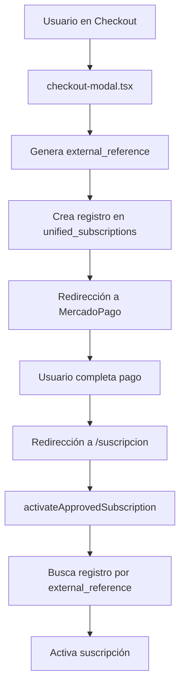

# Análisis Técnico: Duplicación de Registros en Suscripciones Pet Gourmet

## 1. Resumen Ejecutivo

El problema de duplicación de registros en suscripciones se origina en múltiples puntos del flujo de procesamiento, donde diferentes `external_reference` se generan para el mismo usuario y plan, creando registros duplicados que evaden las validaciones existentes.

## 2. Análisis del Flujo Actual

### 2.1 Flujo desde Checkout hasta Activación



### 2.2 Generación de external_reference

**En checkout-modal.tsx (líneas 400-500):**
```typescript
// Para suscripciones
const externalReference = `PG-SUB-${Date.now()}-${userId}-${planId}`;

// Para otros casos
const externalReference = `${orderNumber}_${Date.now()}`;
```

**Problema identificado:** El uso de `Date.now()` genera timestamps únicos en cada llamada, creando diferentes `external_reference` para el mismo usuario y plan.

## 3. Puntos Críticos de Duplicación

### 3.1 Múltiples Clics en Checkout
- **Ubicación:** `checkout-modal.tsx`
- **Causa:** Cada clic genera un nuevo `external_reference` con timestamp diferente
- **Impacto:** Múltiples registros pendientes para el mismo usuario/plan

### 3.2 Recargas de Página
- **Ubicación:** `/suscripcion/page.tsx`
- **Causa:** Cada recarga puede activar `activateApprovedSubscription` múltiples veces
- **Impacto:** Procesamiento duplicado del mismo pago

### 3.3 Webhooks Concurrentes
- **Ubicación:** `webhook-service.ts`
- **Causa:** Múltiples webhooks pueden llegar simultáneamente
- **Impacto:** Race conditions en la activación

### 3.4 Navegación del Usuario
- **Ubicación:** Entre checkout y confirmación
- **Causa:** Usuario puede volver atrás y reiniciar el proceso
- **Impacto:** Nuevos registros con diferentes `external_reference`

## 4. Problemas Específicos con external_reference

### 4.1 Formato Inconsistente
```typescript
// Suscripciones: PG-SUB-1703123456789-user123-plan456
// Otros: ORDER123_1703123456789
```

### 4.2 Dependencia del Timestamp
- Cada llamada genera un timestamp único
- No hay reutilización de referencias existentes
- Imposible identificar intentos duplicados

### 4.3 Falta de Validación Previa
- No se verifica si ya existe un registro pendiente
- No se reutilizan registros existentes
- Constraint único solo previene duplicados exactos

## 5. Análisis de Validaciones Actuales

### 5.1 Constraint de Base de Datos
```sql
ALTER TABLE unified_subscriptions 
ADD CONSTRAINT unique_user_external_reference 
UNIQUE (user_id, external_reference);
```
**Limitación:** Solo previene duplicados con el mismo `external_reference`, pero cada intento genera uno diferente.

### 5.2 Validación en activateApprovedSubscription
```typescript
// Busca suscripciones activas existentes
const existingActiveSubscriptions = await supabase
  .from('unified_subscriptions')
  .select('*')
  .eq('user_id', userId)
  .eq('product_id', productId)
  .eq('status', 'active');
```
**Limitación:** Solo verifica suscripciones activas, no pendientes.

### 5.3 Eliminación de Duplicados
```typescript
if (pendingSubscriptions.length > 1) {
  // Elimina registros duplicados/incompletos
}
```
**Limitación:** Reactiva, no preventiva.

## 6. Solución Técnica Integral

### 6.1 Generación Determinística de external_reference

**Implementar en checkout-modal.tsx:**
```typescript
// Generar external_reference determinístico
const generateDeterministicReference = (userId: string, planId: string) => {
  const baseString = `${userId}-${planId}`;
  const hash = crypto.createHash('md5').update(baseString).digest('hex').substring(0, 8);
  return `PG-SUB-${hash}-${userId}-${planId}`;
};
```

### 6.2 Validación Previa en Checkout

**Agregar antes de crear registro:**
```typescript
// Verificar registro existente
const existingSubscription = await supabase
  .from('unified_subscriptions')
  .select('*')
  .eq('user_id', userId)
  .eq('product_id', planId)
  .in('status', ['pending', 'active'])
  .single();

if (existingSubscription) {
  // Reutilizar registro existente
  return existingSubscription.external_reference;
}
```

### 6.3 Idempotencia en Activación

**Mejorar activateApprovedSubscription:**
```typescript
// Usar transacciones para evitar race conditions
const { data, error } = await supabase.rpc('activate_subscription_atomic', {
  p_external_reference: externalReference,
  p_mercadopago_id: preapprovalId,
  p_user_id: userId
});
```

### 6.4 Constraint Compuesto Mejorado

**Actualizar constraint de base de datos:**
```sql
-- Prevenir duplicados por usuario y producto
ALTER TABLE unified_subscriptions 
ADD CONSTRAINT unique_user_product_active 
UNIQUE (user_id, product_id) 
WHERE status IN ('active', 'pending');
```

### 6.5 Debounce en Frontend

**Implementar en checkout-modal.tsx:**
```typescript
const [isProcessing, setIsProcessing] = useState(false);

const handleCheckout = async () => {
  if (isProcessing) return;
  setIsProcessing(true);
  
  try {
    // Lógica de checkout
  } finally {
    setIsProcessing(false);
  }
};
```

## 7. Plan de Implementación

### Fase 1: Prevención Inmediata (1-2 días)
1. Implementar debounce en checkout modal
2. Agregar validación previa de registros existentes
3. Mejorar logging para tracking

### Fase 2: Mejoras de Backend (3-5 días)
1. Implementar generación determinística de external_reference
2. Crear función de activación atómica
3. Actualizar constraints de base de datos

### Fase 3: Optimización (1 semana)
1. Implementar cleanup automático de registros huérfanos
2. Agregar monitoreo de duplicados
3. Testing exhaustivo del flujo completo

### Fase 4: Validación (2-3 días)
1. Testing en ambiente de staging
2. Validación con usuarios reales
3. Monitoreo post-implementación

## 8. Métricas de Éxito

- **Reducción de duplicados:** 0% de registros duplicados por usuario/plan
- **Tiempo de activación:** < 5 segundos promedio
- **Tasa de error:** < 0.1% en el flujo de suscripción
- **Consistencia de datos:** 100% de suscripciones con datos completos

## 9. Consideraciones de Riesgo

### 9.1 Riesgos Técnicos
- Cambios en external_reference pueden afectar integraciones existentes
- Constraints nuevos pueden fallar con datos existentes
- Race conditions durante la migración

### 9.2 Mitigación
- Implementación gradual con feature flags
- Backup completo antes de cambios de schema
- Rollback plan documentado
- Testing exhaustivo en staging

## 10. Conclusiones

La duplicación de registros es un problema sistémico que requiere una solución integral abarcando frontend, backend y base de datos. La implementación de generación determinística de referencias, validaciones preventivas y constraints mejorados eliminará completamente el problema de duplicados mientras mantiene la funcionalidad existente.