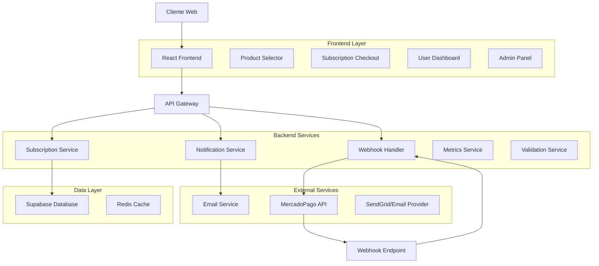
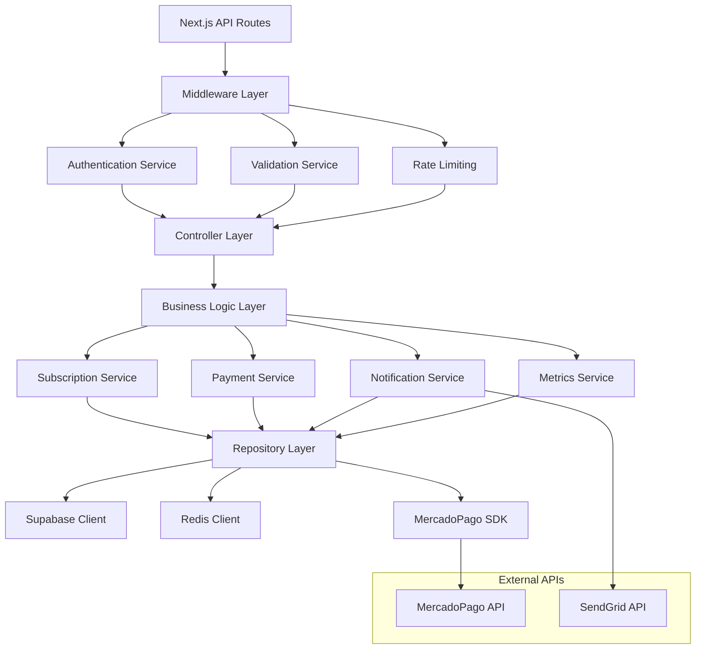
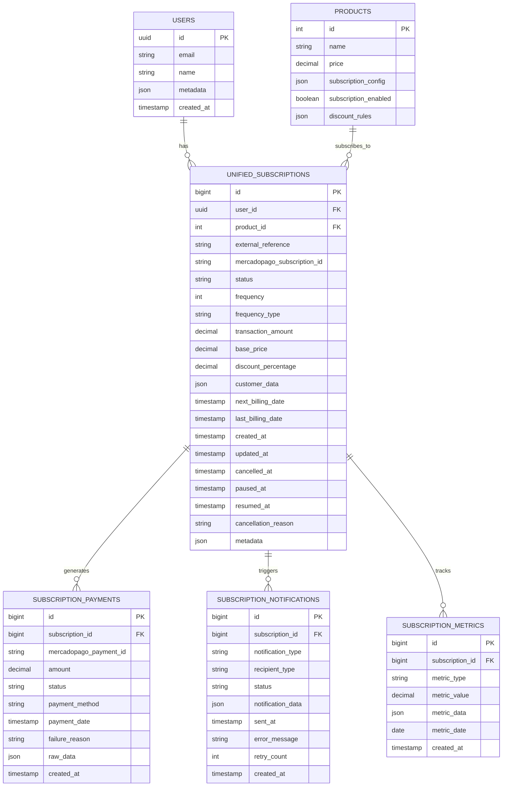

# 🏗️ Arquitectura Técnica: Sistema de Suscripciones Dinámicas

## 1. Arquitectura del Sistema



## 2. Tecnologías y Stack

- **Frontend**: React 18 + TypeScript + Tailwind CSS + Vite
- **Backend**: Next.js 14 API Routes + TypeScript
- **Base de Datos**: Supabase (PostgreSQL) + Redis para cache
- **Pagos**: MercadoPago API (Preapproval sin planes)
- **Notificaciones**: SendGrid + React Toast
- **Validación**: Zod + React Hook Form
- **Estado**: Zustand + React Query
- **Testing**: Jest + React Testing Library + Playwright

## 3. Definición de Rutas Frontend

| Ruta | Propósito | Componente Principal |
|------|-----------|---------------------|
| `/producto/[slug]` | Página de producto con selector de suscripción | `ProductSubscriptionSelector` |
| `/suscripcion/checkout` | Checkout personalizado para suscripciones | `SubscriptionCheckout` |
| `/suscripcion/exito` | Confirmación de suscripción creada | `SubscriptionSuccess` |
| `/perfil/suscripciones` | Panel de gestión de suscripciones del usuario | `UserSubscriptionDashboard` |
| `/perfil/suscripciones/[id]` | Gestión individual de suscripción | `SubscriptionManagement` |
| `/admin/suscripciones` | Dashboard administrativo de suscripciones | `AdminSubscriptionDashboard` |
| `/admin/suscripciones/metricas` | Métricas y análisis de suscripciones | `SubscriptionMetrics` |
| `/admin/suscripciones/problemas` | Gestión de suscripciones problemáticas | `SubscriptionTroubleshooting` |

## 4. Definición de APIs

### 4.1 APIs de Suscripciones

#### Crear Suscripción Dinámica
```typescript
POST /api/subscriptions/create-dynamic

Request:
{
  user_id: string
  product_id: number
  frequency: number // 1-90 días
  frequency_type: 'days' | 'months'
  payment_method: 'pending' | 'authorized'
  customer_data: {
    email: string
    name: string
    phone?: string
    address: AddressData
  }
  card_token?: string // Solo para método autorizado
}

Response:
{
  success: boolean
  subscription: {
    id: string
    external_reference: string
    status: 'pending' | 'authorized'
    init_point?: string // Para método pendiente
    next_payment_date: string
    amount: number
  }
  error?: string
}
```

#### Gestionar Suscripción
```typescript
PATCH /api/subscriptions/manage

Request:
{
  subscription_id: string
  action: 'pause' | 'resume' | 'cancel' | 'update_frequency' | 'update_payment_method'
  data?: {
    frequency?: number
    frequency_type?: 'days' | 'months'
    card_token?: string
    pause_until?: string
  }
}

Response:
{
  success: boolean
  subscription: SubscriptionData
  message: string
  error?: string
}
```

#### Obtener Suscripciones del Usuario
```typescript
GET /api/subscriptions/user/[user_id]

Query Parameters:
- status?: 'active' | 'paused' | 'cancelled' | 'pending'
- limit?: number
- offset?: number

Response:
{
  subscriptions: SubscriptionData[]
  total: number
  pagination: {
    page: number
    limit: number
    total_pages: number
  }
}
```

### 4.2 APIs de Webhooks

#### Webhook de MercadoPago
```typescript
POST /api/subscriptions/webhook

Headers:
- x-signature: string // Firma de MercadoPago
- x-request-id: string

Request:
{
  id: string
  live_mode: boolean
  type: 'subscription_preapproval' | 'subscription_authorized_payment'
  date_created: string
  application_id: number
  user_id: string
  version: number
  api_version: string
  action: 'created' | 'updated' | 'payment.created' | 'payment.updated'
  data: {
    id: string
  }
}

Response:
{
  status: 'processed' | 'ignored' | 'error'
  message: string
}
```

### 4.3 APIs Administrativas

#### Métricas de Suscripciones
```typescript
GET /api/admin/subscriptions/metrics

Query Parameters:
- period?: 'day' | 'week' | 'month' | 'year'
- start_date?: string
- end_date?: string

Response:
{
  metrics: {
    total_subscriptions: number
    active_subscriptions: number
    monthly_recurring_revenue: number
    churn_rate: number
    conversion_rate: number
    average_subscription_value: number
    payment_success_rate: number
    top_products: ProductMetric[]
    growth_trend: TrendData[]
  }
}
```

#### Suscripciones Problemáticas
```typescript
GET /api/admin/subscriptions/issues

Query Parameters:
- type?: 'payment_failed' | 'expired_card' | 'cancelled' | 'paused_too_long'
- severity?: 'low' | 'medium' | 'high' | 'critical'

Response:
{
  issues: {
    id: string
    subscription_id: string
    type: string
    severity: string
    description: string
    suggested_actions: string[]
    created_at: string
    customer_info: CustomerData
  }[]
}
```

### 4.4 APIs de Notificaciones

#### Enviar Notificación de Suscripción
```typescript
POST /api/notifications/subscription

Request:
{
  subscription_id: string
  type: 'created' | 'payment_success' | 'payment_failed' | 'cancelled' | 'paused' | 'resumed'
  recipient: 'customer' | 'admin' | 'both'
  custom_data?: any
}

Response:
{
  success: boolean
  notifications_sent: {
    email: boolean
    toast: boolean
    push?: boolean
  }
  error?: string
}
```

## 5. Arquitectura de Servidor



## 6. Modelo de Datos

### 6.1 Esquema de Base de Datos



### 6.2 DDL (Data Definition Language)

```sql
-- Actualizar tabla unified_subscriptions para suscripciones dinámicas
ALTER TABLE unified_subscriptions 
ADD COLUMN IF NOT EXISTS frequency_type VARCHAR(10) DEFAULT 'days' CHECK (frequency_type IN ('days', 'months')),
ADD COLUMN IF NOT EXISTS discount_percentage DECIMAL(5,2) DEFAULT 0,
ADD COLUMN IF NOT EXISTS base_price DECIMAL(10,2),
ADD COLUMN IF NOT EXISTS paused_at TIMESTAMPTZ,
ADD COLUMN IF NOT EXISTS resumed_at TIMESTAMPTZ,
ADD COLUMN IF NOT EXISTS cancellation_reason TEXT,
ADD COLUMN IF NOT EXISTS payment_method VARCHAR(20) DEFAULT 'pending' CHECK (payment_method IN ('pending', 'authorized')),
ADD COLUMN IF NOT EXISTS retry_count INTEGER DEFAULT 0,
ADD COLUMN IF NOT EXISTS last_retry_at TIMESTAMPTZ;

-- Crear tabla de métricas de suscripciones
CREATE TABLE IF NOT EXISTS subscription_metrics (
    id BIGSERIAL PRIMARY KEY,
    subscription_id BIGINT REFERENCES unified_subscriptions(id) ON DELETE CASCADE,
    metric_type VARCHAR(50) NOT NULL,
    metric_value DECIMAL(15,2) NOT NULL,
    metric_data JSONB,
    metric_date DATE NOT NULL DEFAULT CURRENT_DATE,
    created_at TIMESTAMPTZ DEFAULT NOW()
);

-- Crear tabla de configuración de productos para suscripciones
CREATE TABLE IF NOT EXISTS product_subscription_config (
    id BIGSERIAL PRIMARY KEY,
    product_id INTEGER REFERENCES products(id) ON DELETE CASCADE,
    subscription_enabled BOOLEAN DEFAULT false,
    min_frequency INTEGER DEFAULT 1,
    max_frequency INTEGER DEFAULT 90,
    frequency_type VARCHAR(10) DEFAULT 'days' CHECK (frequency_type IN ('days', 'months')),
    discount_rules JSONB DEFAULT '{}',
    created_at TIMESTAMPTZ DEFAULT NOW(),
    updated_at TIMESTAMPTZ DEFAULT NOW(),
    UNIQUE(product_id)
);

-- Índices para optimización
CREATE INDEX IF NOT EXISTS idx_unified_subscriptions_status_frequency ON unified_subscriptions(status, frequency_type);
CREATE INDEX IF NOT EXISTS idx_unified_subscriptions_next_billing ON unified_subscriptions(next_billing_date) WHERE status IN ('active', 'authorized');
CREATE INDEX IF NOT EXISTS idx_unified_subscriptions_user_status ON unified_subscriptions(user_id, status);
CREATE INDEX IF NOT EXISTS idx_subscription_metrics_date_type ON subscription_metrics(metric_date, metric_type);
CREATE INDEX IF NOT EXISTS idx_subscription_payments_date ON subscription_payments(payment_date DESC);

-- Función para calcular métricas diarias
CREATE OR REPLACE FUNCTION calculate_daily_subscription_metrics()
RETURNS void AS $$
BEGIN
    -- Insertar métricas diarias
    INSERT INTO subscription_metrics (metric_type, metric_value, metric_data, metric_date)
    SELECT 
        'daily_active_subscriptions',
        COUNT(*),
        json_build_object(
            'by_frequency', json_object_agg(frequency_type, count)
        ),
        CURRENT_DATE
    FROM (
        SELECT frequency_type, COUNT(*) as count
        FROM unified_subscriptions 
        WHERE status IN ('active', 'authorized')
        GROUP BY frequency_type
    ) freq_counts;
    
    -- Calcular MRR (Monthly Recurring Revenue)
    INSERT INTO subscription_metrics (metric_type, metric_value, metric_date)
    SELECT 
        'monthly_recurring_revenue',
        SUM(
            CASE 
                WHEN frequency_type = 'days' THEN (transaction_amount * 30.0 / frequency)
                WHEN frequency_type = 'months' THEN (transaction_amount / frequency)
                ELSE transaction_amount
            END
        ),
        CURRENT_DATE
    FROM unified_subscriptions 
    WHERE status IN ('active', 'authorized');
END;
$$ LANGUAGE plpgsql;

-- Trigger para actualizar métricas cuando cambia el estado de una suscripción
CREATE OR REPLACE FUNCTION update_subscription_metrics()
RETURNS TRIGGER AS $$
BEGIN
    -- Registrar cambio de estado
    IF OLD.status IS DISTINCT FROM NEW.status THEN
        INSERT INTO subscription_metrics (subscription_id, metric_type, metric_value, metric_data)
        VALUES (
            NEW.id,
            'status_change',
            1,
            json_build_object(
                'old_status', OLD.status,
                'new_status', NEW.status,
                'change_reason', COALESCE(NEW.cancellation_reason, 'automatic')
            )
        );
    END IF;
    
    RETURN NEW;
END;
$$ LANGUAGE plpgsql;

CREATE TRIGGER trigger_subscription_metrics
    AFTER UPDATE ON unified_subscriptions
    FOR EACH ROW
    EXECUTE FUNCTION update_subscription_metrics();

-- Datos iniciales para configuración de productos
INSERT INTO product_subscription_config (product_id, subscription_enabled, min_frequency, max_frequency, frequency_type, discount_rules)
SELECT 
    id,
    true,
    7, -- mínimo 7 días
    90, -- máximo 90 días
    'days',
    '{"monthly": 5, "quarterly": 10, "custom": 0}'::jsonb
FROM products 
WHERE subscription_types IS NOT NULL
ON CONFLICT (product_id) DO NOTHING;
```

## 7. Componentes Frontend

### 7.1 Selector de Suscripción en Producto

```typescript
// components/subscription/ProductSubscriptionSelector.tsx
interface SubscriptionSelectorProps {
  product: Product
  onSubscriptionSelect: (config: SubscriptionConfig) => void
}

interface SubscriptionConfig {
  frequency: number
  frequency_type: 'days' | 'months'
  discount_percentage: number
  final_price: number
  estimated_delivery_date: Date
}
```

### 7.2 Checkout de Suscripción

```typescript
// components/subscription/SubscriptionCheckout.tsx
interface SubscriptionCheckoutProps {
  product: Product
  subscriptionConfig: SubscriptionConfig
  user: User
  onSuccess: (subscription: Subscription) => void
  onError: (error: string) => void
}
```

### 7.3 Dashboard de Usuario

```typescript
// components/subscription/UserSubscriptionDashboard.tsx
interface UserDashboardProps {
  userId: string
}

interface SubscriptionCardProps {
  subscription: Subscription
  onManage: (subscription: Subscription) => void
  onCancel: (subscriptionId: string) => void
}
```

### 7.4 Panel Administrativo

```typescript
// components/admin/SubscriptionAdminDashboard.tsx
interface AdminDashboardProps {
  initialMetrics?: SubscriptionMetrics
}

interface MetricsCardProps {
  title: string
  value: number | string
  trend?: 'up' | 'down' | 'stable'
  format?: 'currency' | 'percentage' | 'number'
}
```

## 8. Sistema de Notificaciones

### 8.1 Tipos de Notificaciones

```typescript
type NotificationType = 
  | 'subscription_created'
  | 'subscription_activated'
  | 'payment_success'
  | 'payment_failed'
  | 'payment_retry'
  | 'subscription_paused'
  | 'subscription_resumed'
  | 'subscription_cancelled'
  | 'payment_method_expired'
  | 'subscription_expiring'

interface NotificationTemplate {
  type: NotificationType
  recipient: 'customer' | 'admin'
  channels: ('email' | 'toast' | 'push')[]
  template: {
    subject: string
    html_body: string
    text_body: string
  }
}
```

### 8.2 Servicio de Notificaciones

```typescript
// lib/services/notification.service.ts
class NotificationService {
  async sendSubscriptionNotification(
    subscriptionId: string,
    type: NotificationType,
    recipient: 'customer' | 'admin' | 'both'
  ): Promise<NotificationResult>
  
  async sendEmailNotification(
    to: string,
    template: NotificationTemplate,
    data: any
  ): Promise<boolean>
  
  async sendToastNotification(
    userId: string,
    message: string,
    type: 'success' | 'error' | 'info' | 'warning'
  ): Promise<void>
}
```

## 9. Validación de Webhooks

### 9.1 Validador de Firma

```typescript
// lib/webhook-validator.ts
class WebhookValidator {
  validateMercadoPagoSignature(
    payload: string,
    signature: string,
    secret: string
  ): boolean
  
  validateWebhookData(
    data: any,
    expectedType: string
  ): ValidationResult
  
  processWebhookSafely(
    webhook: WebhookData,
    processor: (data: any) => Promise<void>
  ): Promise<WebhookProcessResult>
}
```

### 9.2 Procesador de Webhooks

```typescript
// lib/webhook-processor.ts
class SubscriptionWebhookProcessor {
  async processSubscriptionCreated(data: WebhookData): Promise<void>
  async processSubscriptionUpdated(data: WebhookData): Promise<void>
  async processPaymentCreated(data: WebhookData): Promise<void>
  async processPaymentUpdated(data: WebhookData): Promise<void>
  
  private async updateSubscriptionStatus(
    subscriptionId: string,
    newStatus: SubscriptionStatus,
    metadata?: any
  ): Promise<void>
  
  private async createPaymentRecord(
    subscriptionId: string,
    paymentData: PaymentData
  ): Promise<void>
}
```

## 10. Plan de Testing

### 10.1 Testing de Componentes

```typescript
// __tests__/components/subscription/ProductSubscriptionSelector.test.tsx
describe('ProductSubscriptionSelector', () => {
  test('should calculate correct discount for monthly subscription')
  test('should validate frequency limits')
  test('should update price when frequency changes')
  test('should handle product without subscription config')
})

// __tests__/components/subscription/SubscriptionCheckout.test.tsx
describe('SubscriptionCheckout', () => {
  test('should validate customer data')
  test('should handle payment method selection')
  test('should create subscription with correct data')
  test('should handle API errors gracefully')
})
```

### 10.2 Testing de APIs

```typescript
// __tests__/api/subscriptions/create-dynamic.test.ts
describe('/api/subscriptions/create-dynamic', () => {
  test('should create pending subscription successfully')
  test('should create authorized subscription with card token')
  test('should validate required fields')
  test('should handle MercadoPago API errors')
  test('should prevent duplicate subscriptions')
})

// __tests__/api/subscriptions/webhook.test.ts
describe('/api/subscriptions/webhook', () => {
  test('should validate webhook signature')
  test('should process subscription created webhook')
  test('should process payment success webhook')
  test('should handle malformed webhook data')
  test('should prevent replay attacks')
})
```

### 10.3 Testing End-to-End

```typescript
// e2e/subscription-flow.spec.ts
describe('Subscription Flow', () => {
  test('complete subscription creation flow', async ({ page }) => {
    // 1. Navigate to product page
    // 2. Configure subscription
    // 3. Complete checkout
    // 4. Verify success page
    // 5. Check database state
  })
  
  test('subscription management flow', async ({ page }) => {
    // 1. Login as user with subscription
    // 2. Navigate to subscription dashboard
    // 3. Modify subscription frequency
    // 4. Pause subscription
    // 5. Resume subscription
    // 6. Cancel subscription
  })
})
```

### 10.4 Testing de Webhooks en Tiempo Real

```typescript
// __tests__/webhooks/real-time-validation.test.ts
describe('Real-time Webhook Validation', () => {
  test('should process webhook within 5 seconds')
  test('should handle concurrent webhooks')
  test('should retry failed webhook processing')
  test('should maintain webhook processing order')
  test('should handle webhook timeout scenarios')
})
```

## 11. Consideraciones de Seguridad

### 11.1 Validación de Entrada

- **Sanitización**: Todos los inputs del usuario deben ser sanitizados
- **Validación de esquemas**: Usar Zod para validar estructura de datos
- **Rate limiting**: Limitar requests por IP y por usuario
- **CSRF protection**: Tokens CSRF para formularios críticos

### 11.2 Autenticación y Autorización

- **JWT tokens**: Para autenticación de usuarios
- **Role-based access**: Separar permisos de usuario y admin
- **API key validation**: Para webhooks de MercadoPago
- **Session management**: Manejo seguro de sesiones

### 11.3 Protección de Datos

- **Encriptación**: Datos sensibles encriptados en base de datos
- **PCI compliance**: Nunca almacenar datos de tarjetas
- **Audit logs**: Registro de todas las operaciones críticas
- **Data retention**: Políticas de retención de datos

## 12. Monitoreo y Observabilidad

### 12.1 Métricas de Negocio

- **Conversion rate**: Visitantes → Suscriptores
- **Churn rate**: Cancelaciones por período
- **MRR growth**: Crecimiento de ingresos recurrentes
- **Payment success rate**: Tasa de éxito de pagos
- **Customer lifetime value**: Valor promedio por cliente

### 12.2 Métricas Técnicas

- **API response time**: Tiempo de respuesta de endpoints
- **Error rate**: Tasa de errores por endpoint
- **Webhook processing time**: Tiempo de procesamiento de webhooks
- **Database query performance**: Performance de consultas
- **Cache hit rate**: Efectividad del cache

### 12.3 Alertas

- **Payment failures**: Alertas por pagos fallidos
- **High error rate**: Alertas por alta tasa de errores
- **Webhook delays**: Alertas por retrasos en webhooks
- **Database performance**: Alertas por queries lentas
- **Security incidents**: Alertas por intentos de acceso no autorizado

## 13. Deployment y DevOps

### 13.1 Configuración de Entornos

```yaml
# .env.example
# MercadoPago Configuration
MERCADOPAGO_ACCESS_TOKEN=your_access_token
MERCADOPAGO_PUBLIC_KEY=your_public_key
MERCADOPAGO_WEBHOOK_SECRET=your_webhook_secret

# Supabase Configuration
NEXT_PUBLIC_SUPABASE_URL=your_supabase_url
SUPABASE_SERVICE_ROLE_KEY=your_service_role_key

# Email Configuration
SENDGRID_API_KEY=your_sendgrid_key
SENDGRID_FROM_EMAIL=noreply@petgourmet.mx

# Redis Configuration (optional)
REDIS_URL=your_redis_url

# Application Configuration
NEXT_PUBLIC_APP_URL=https://petgourmet.mx
WEBHOOK_SIGNATURE_SECRET=your_webhook_secret
```

### 13.2 Scripts de Deployment

```json
{
  "scripts": {
    "build": "next build",
    "start": "next start",
    "test": "jest",
    "test:e2e": "playwright test",
    "db:migrate": "supabase db push",
    "db:seed": "node scripts/seed-subscription-config.js",
    "webhook:test": "node scripts/test-webhooks.js"
  }
}
```

Este documento técnico proporciona la base completa para implementar el sistema de suscripciones dinámicas de PetGourmet con todas las funcionalidades requeridas, incluyendo testing, validación de webhooks en tiempo real, y sistema de notificaciones robusto.