# Arquitectura Técnica - Sistema de Pagos y Suscripciones Pet Gourmet

## 1. Arquitectura del Sistema


## 2. Tecnologías Utilizadas

- **Frontend:** Next.js 15.2.4 + React 19 + TypeScript
- **Base de Datos:** Supabase (PostgreSQL)
- **Pagos:** MercadoPago API v1
- **Email:** Nodemailer + SMTP
- **Tiempo Real:** Supabase Realtime
- **Autenticación:** Supabase Auth

## 3. Estructura de Rutas

| Ruta | Propósito |
|------|----------|
| `/api/mercadopago/webhook` | Endpoint principal para webhooks de MercadoPago |
| `/api/mercadopago/verify-payment` | Verificación manual de estados de pago |
| `/admin/(dashboard)/orders` | Panel de administración de órdenes |
| `/admin/(dashboard)/orders/[id]` | Detalle específico de orden |
| `/admin/subscription-orders` | Panel de administración de suscripciones |
| `/perfil` | Perfil de usuario con órdenes y suscripciones |

## 4. APIs y Endpoints

### 4.1 Webhook Principal

**Endpoint:** `POST /api/mercadopago/webhook`

**Headers Requeridos:**
| Header | Tipo | Descripción |
|--------|------|-------------|
| x-signature | string | Firma HMAC-SHA256 del payload |
| x-request-id | string | ID único de la request |
| user-agent | string | Identificación de MercadoPago |

**Payload de Entrada:**
```typescript
interface WebhookPayload {
  id: string
  live_mode: boolean
  type: 'payment' | 'subscription_preapproval' | 'subscription_authorized_payment'
  date_created: string
  application_id: string
  user_id: string
  version: number
  api_version: string
  action: string
  data: {
    id: string
  }
}
```

**Respuesta:**
```json
{
  "success": true,
  "message": "Webhook procesado",
  "type": "payment",
  "action": "payment.updated"
}
```

### 4.2 Verificación de Pagos

**Endpoint:** `POST /api/mercadopago/verify-payment`

**Request:**
| Campo | Tipo | Requerido | Descripción |
|-------|------|-----------|-------------|
| payment_id | string | true | ID del pago en MercadoPago |
| order_id | string | true | ID de la orden local |

**Response:**
```json
{
  "success": true,
  "payment_status": "approved",
  "order_status": "confirmed"
}
```

### 4.3 Actualización de Estado de Orden

**Endpoint:** `POST /api/admin/update-order-status`

**Request:**
```json
{
  "orderId": "uuid",
  "newStatus": "confirmed",
  "sendEmail": true
}
```

## 5. Modelo de Datos

### 5.1 Diagrama de Entidades


### 5.2 Definiciones de Tablas

#### Tabla: orders
```sql
CREATE TABLE orders (
    id UUID PRIMARY KEY DEFAULT gen_random_uuid(),
    user_id UUID REFERENCES auth.users(id),
    total DECIMAL(10,2) NOT NULL,
    status VARCHAR(50) DEFAULT 'pending_payment',
    payment_status VARCHAR(50) DEFAULT 'pending',
    mercadopago_payment_id VARCHAR(255),
    external_reference VARCHAR(255),
    customer_name VARCHAR(255),
    customer_email VARCHAR(255),
    customer_phone VARCHAR(50),
    shipping_address JSONB,
    created_at TIMESTAMP WITH TIME ZONE DEFAULT NOW(),
    updated_at TIMESTAMP WITH TIME ZONE DEFAULT NOW(),
    confirmed_at TIMESTAMP WITH TIME ZONE
);

-- Índices
CREATE INDEX idx_orders_user_id ON orders(user_id);
CREATE INDEX idx_orders_status ON orders(status);
CREATE INDEX idx_orders_payment_status ON orders(payment_status);
CREATE INDEX idx_orders_mercadopago_payment_id ON orders(mercadopago_payment_id);
CREATE INDEX idx_orders_external_reference ON orders(external_reference);
```

#### Tabla: user_subscriptions
```sql
CREATE TABLE user_subscriptions (
    id UUID PRIMARY KEY DEFAULT gen_random_uuid(),
    user_id UUID REFERENCES auth.users(id) NOT NULL,
    product_id UUID REFERENCES products(id) NOT NULL,
    status VARCHAR(50) DEFAULT 'active',
    subscription_type VARCHAR(50) NOT NULL,
    price DECIMAL(10,2) NOT NULL,
    quantity INTEGER DEFAULT 1,
    size VARCHAR(50),
    next_billing_date DATE NOT NULL,
    last_billing_date DATE,
    mercadopago_subscription_id VARCHAR(255),
    created_at TIMESTAMP WITH TIME ZONE DEFAULT NOW(),
    updated_at TIMESTAMP WITH TIME ZONE DEFAULT NOW(),
    cancelled_at TIMESTAMP WITH TIME ZONE,
    is_active BOOLEAN GENERATED ALWAYS AS (status = 'active' AND cancelled_at IS NULL) STORED
);

-- Índices
CREATE INDEX idx_user_subscriptions_user_id ON user_subscriptions(user_id);
CREATE INDEX idx_user_subscriptions_status ON user_subscriptions(status);
CREATE INDEX idx_user_subscriptions_next_billing ON user_subscriptions(next_billing_date);
CREATE INDEX idx_user_subscriptions_mercadopago_id ON user_subscriptions(mercadopago_subscription_id);
```

#### Tabla: subscription_billing_history
```sql
CREATE TABLE subscription_billing_history (
    id UUID PRIMARY KEY DEFAULT gen_random_uuid(),
    subscription_id UUID REFERENCES user_subscriptions(id) NOT NULL,
    billing_date DATE NOT NULL,
    amount DECIMAL(10,2) NOT NULL,
    status VARCHAR(50) NOT NULL,
    status_detail VARCHAR(255),
    payment_method VARCHAR(100),
    mercadopago_payment_id VARCHAR(255),
    payment_details JSONB,
    created_at TIMESTAMP WITH TIME ZONE DEFAULT NOW(),
    updated_at TIMESTAMP WITH TIME ZONE DEFAULT NOW()
);

-- Índices
CREATE INDEX idx_billing_history_subscription_id ON subscription_billing_history(subscription_id);
CREATE INDEX idx_billing_history_billing_date ON subscription_billing_history(billing_date DESC);
CREATE INDEX idx_billing_history_status ON subscription_billing_history(status);
CREATE INDEX idx_billing_history_mercadopago_id ON subscription_billing_history(mercadopago_payment_id);
```

## 6. Flujos de Procesamiento

### 6.1 Flujo de Pago de Orden

```mermaid
sequenceDiagram
    participant U as Usuario
    participant F as Frontend
    participant MP as MercadoPago
    participant W as Webhook
    participant DB as Database
    participant E as Email

    U->>F: Crear orden
    F->>DB: Guardar orden (status: pending_payment)
    F->>MP: Crear preferencia de pago
    MP-->>F: Preference ID
    F->>U: Mostrar checkout
    U->>MP: Procesar pago
    MP->>W: Enviar webhook (payment)
    W->>MP: Obtener datos del pago
    MP-->>W: Payment data
    W->>DB: Actualizar orden (status: confirmed)
    W->>E: Enviar email de confirmación
    W-->>MP: Respuesta 200 OK
```



### 6.2 Flujo de Suscripción

```mermaid
sequenceDiagram
    participant U as Usuario
    participant F as Frontend
    participant MP as MercadoPago
    participant W as Webhook
    participant DB as Database
    participant E as Email

    U->>F: Crear suscripción
    F->>MP: Crear preapproval
    MP-->>F: Preapproval ID
    F->>DB: Guardar suscripción
    U->>MP: Autorizar suscripción
    MP->>W: Webhook (subscription_preapproval.created)
    W->>DB: Actualizar suscripción (status: active)
    W->>E: Email de bienvenida
    
    Note over MP: Pago recurrente automático
    MP->>W: Webhook (payment)
    W->>DB: Crear registro en billing_history
    W->>DB: Actualizar last_billing_date
    W->>E: Email de confirmación de pago
```



## 7. Configuración de Seguridad

### 7.1 Validación de Webhooks

```typescript
// Validación de firma HMAC-SHA256
function validateWebhookSignature(payload: string, signature: string): boolean {
  const expectedSignature = crypto
    .createHmac('sha256', process.env.MERCADOPAGO_WEBHOOK_SECRET!)
    .update(payload)
    .digest('hex')
  
  return crypto.timingSafeEqual(
    Buffer.from(signature, 'hex'),
    Buffer.from(expectedSignature, 'hex')
  )
}
```

### 7.2 Políticas de Seguridad de Base de Datos

```sql
-- RLS para orders
ALTER TABLE orders ENABLE ROW LEVEL SECURITY;

CREATE POLICY "Users can view own orders" ON orders
  FOR SELECT USING (auth.uid() = user_id);

CREATE POLICY "Admins can view all orders" ON orders
  FOR ALL USING (auth.jwt() ->> 'role' = 'admin');

-- RLS para user_subscriptions
ALTER TABLE user_subscriptions ENABLE ROW LEVEL SECURITY;

CREATE POLICY "Users can view own subscriptions" ON user_subscriptions
  FOR SELECT USING (auth.uid() = user_id);

CREATE POLICY "Admins can view all subscriptions" ON user_subscriptions
  FOR ALL USING (auth.jwt() ->> 'role' = 'admin');
```

## 8. Manejo de Estados

### 8.1 Estados de Órdenes

| Estado Local | Estado MercadoPago | Descripción |
|--------------|-------------------|-------------|
| `pending_payment` | `pending` | Esperando pago |
| `processing` | `in_process` | Pago en proceso |
| `confirmed` | `approved`, `paid` | Pago confirmado |
| `cancelled` | `cancelled`, `rejected` | Pago cancelado/rechazado |
| `refunded` | `refunded` | Pago reembolsado |

### 8.2 Estados de Suscripciones

| Estado | Descripción |
|--------|-------------|
| `active` | Suscripción activa y facturando |
| `paused` | Suscripción pausada temporalmente |
| `cancelled` | Suscripción cancelada permanentemente |
| `expired` | Suscripción vencida por falta de pago |

## 9. Optimizaciones y Mejores Prácticas

### 9.1 Manejo de Errores

```typescript
// Retry logic para llamadas a MercadoPago
async function fetchWithRetry(url: string, options: RequestInit, maxRetries = 3): Promise<Response> {
  for (let i = 0; i < maxRetries; i++) {
    try {
      const response = await fetch(url, options)
      if (response.ok) return response
      
      if (i === maxRetries - 1) throw new Error(`HTTP ${response.status}`)
      
      // Exponential backoff
      await new Promise(resolve => setTimeout(resolve, Math.pow(2, i) * 1000))
    } catch (error) {
      if (i === maxRetries - 1) throw error
      await new Promise(resolve => setTimeout(resolve, Math.pow(2, i) * 1000))
    }
  }
  throw new Error('Max retries exceeded')
}
```

### 9.2 Logging Estructurado

```typescript
interface LogEntry {
  timestamp: string
  level: 'info' | 'warn' | 'error'
  service: string
  action: string
  data?: any
  error?: string
}

function log(entry: Omit<LogEntry, 'timestamp'>): void {
  const logEntry: LogEntry = {
    ...entry,
    timestamp: new Date().toISOString()
  }
  
  console.log(JSON.stringify(logEntry))
}

// Uso
log({
  level: 'info',
  service: 'webhook',
  action: 'payment_processed',
  data: { paymentId, orderId, status }
})
```

### 9.3 Caché y Performance

```typescript
// Cache para datos de productos
const productCache = new Map<string, any>()

async function getProductWithCache(productId: string) {
  if (productCache.has(productId)) {
    return productCache.get(productId)
  }
  
  const product = await supabase
    .from('products')
    .select('*')
    .eq('id', productId)
    .single()
  
  if (product.data) {
    productCache.set(productId, product.data)
    // Limpiar cache después de 5 minutos
    setTimeout(() => productCache.delete(productId), 5 * 60 * 1000)
  }
  
  return product.data
}
```

## 10. Monitoreo y Métricas

### 10.1 Métricas Clave

- **Tasa de éxito de webhooks:** % de webhooks procesados exitosamente
- **Tiempo de respuesta:** Tiempo promedio de procesamiento de webhooks
- **Órdenes pendientes:** Número de órdenes sin confirmar > 24h
- **Suscripciones activas:** Número total de suscripciones facturando
- **Tasa de conversión:** % de órdenes que se completan exitosamente

### 10.2 Alertas

```typescript
// Sistema de alertas básico
function sendAlert(type: 'error' | 'warning', message: string, data?: any) {
  const alert = {
    type,
    message,
    data,
    timestamp: new Date().toISOString(),
    service: 'payment-system'
  }
  
  // Enviar a sistema de monitoreo (ej: Slack, email, etc.)
  console.error('🚨 ALERT:', JSON.stringify(alert))
  
  // En producción, integrar con servicio de alertas
  // await sendToSlack(alert)
  // await sendEmailAlert(alert)
}

// Uso en webhook service
if (failedWebhooks > 5) {
  sendAlert('error', 'Multiple webhook failures detected', {
    failedCount: failedWebhooks,
    timeWindow: '5 minutes'
  })
}
```

---

**Documento técnico complementario al Plan de Implementación**
**Versión:** 1.0
**Fecha:** Enero 2025