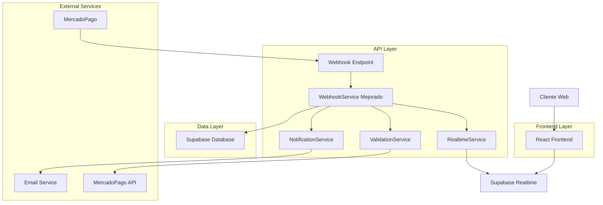
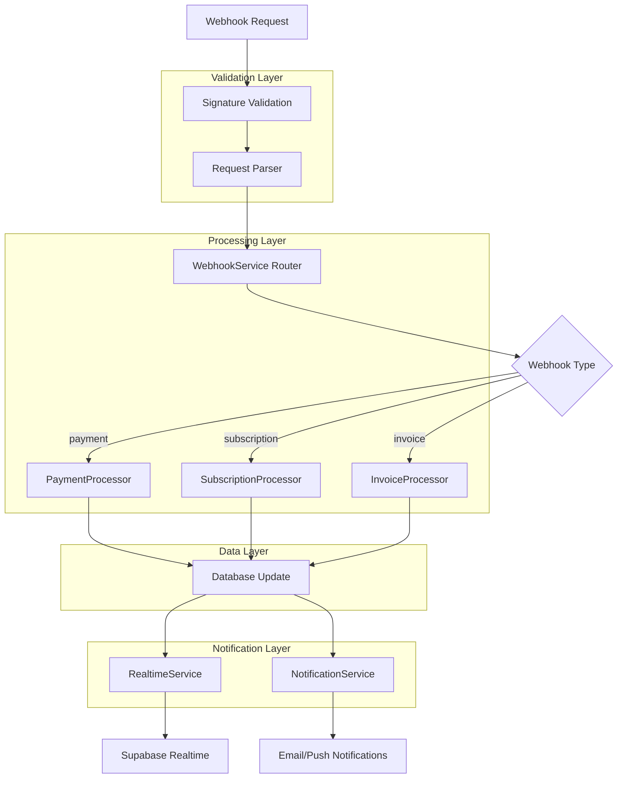
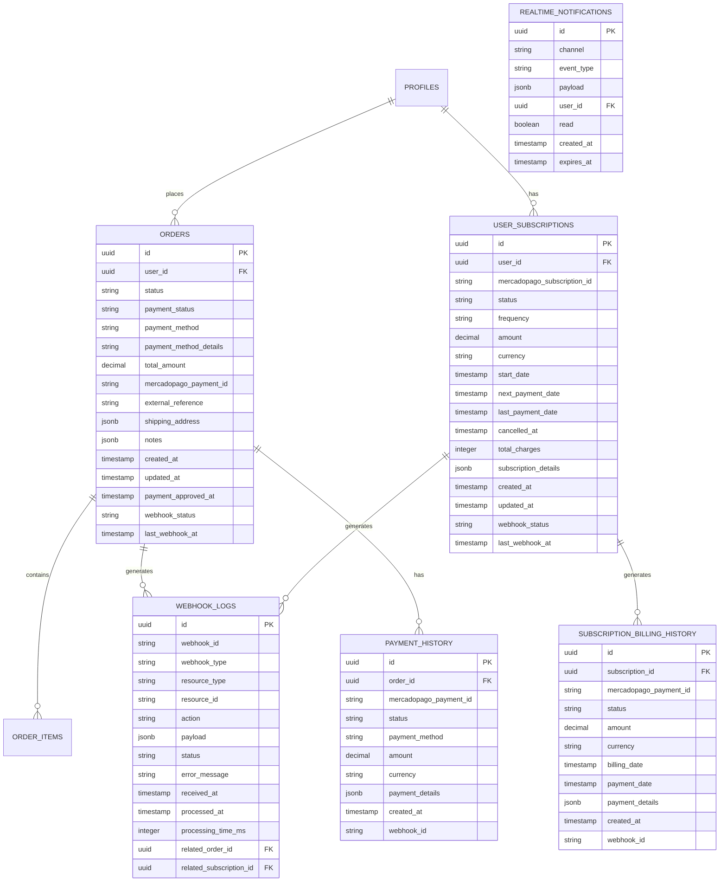

# Arquitectura Técnica: Sistema de Webhooks y Tiempo Real Mejorado

## 1. Diseño de Arquitectura



## 2. Descripción de Tecnologías

- **Frontend**: React@18 + TypeScript + TailwindCSS + Supabase Client
- **Backend**: Next.js API Routes + Supabase Server Client
- **Base de Datos**: Supabase (PostgreSQL) con Realtime habilitado
- **Servicios Externos**: MercadoPago API, Resend/NodeMailer para emails
- **Tiempo Real**: Supabase Realtime + WebSocket connections
- **Validación**: Crypto para validación de firmas de webhooks

## 3. Definiciones de Rutas

| Ruta | Propósito |
|------|----------|
| `/api/mercadopago/webhook` | Endpoint principal para recibir webhooks de MercadoPago |
| `/api/admin/orders` | API para obtener y filtrar órdenes con paginación |
| `/api/admin/orders/[id]` | API para obtener y actualizar detalles de orden específica |
| `/api/admin/subscription-orders` | API para gestionar suscripciones |
| `/api/admin/webhook-monitor` | API para monitorear estado de webhooks |
| `/api/admin/payment-validation` | API para validar y sincronizar pagos manualmente |
| `/admin/orders` | Panel de administración de órdenes |
| `/admin/orders/[id]` | Vista detallada de orden individual |
| `/admin/subscription-orders` | Panel de gestión de suscripciones |
| `/admin/webhook-monitor` | Dashboard de monitoreo de webhooks |

## 4. Definiciones de API

### 4.1 API de Webhooks Mejorada

**Webhook de MercadoPago**
```
POST /api/mercadopago/webhook
```

Request Headers:
| Header | Tipo | Requerido | Descripción |
|--------|------|-----------|-------------|
| x-signature | string | true | Firma de MercadoPago para validación |
| x-request-id | string | true | ID único de la petición |

Request Body:
| Campo | Tipo | Requerido | Descripción |
|-------|------|-----------|-------------|
| id | number | true | ID del recurso en MercadoPago |
| live_mode | boolean | true | Indica si es producción o sandbox |
| type | string | true | Tipo de webhook (payment, subscription, etc.) |
| date_created | string | true | Fecha de creación del evento |
| application_id | number | true | ID de la aplicación |
| user_id | number | true | ID del usuario en MercadoPago |
| version | number | true | Versión del webhook |
| api_version | string | true | Versión de la API |
| action | string | true | Acción realizada (created, updated, etc.) |
| data | object | true | Datos del recurso |

Response:
```json
{
  "status": "success",
  "message": "Webhook processed successfully",
  "processed_at": "2024-01-15T10:30:00Z",
  "webhook_id": "wh_123456789"
}
```

**API de Validación de Pagos**
```
POST /api/admin/payment-validation
```

Request:
| Campo | Tipo | Requerido | Descripción |
|-------|------|-----------|-------------|
| order_ids | array | false | IDs específicas de órdenes a validar |
| validate_all | boolean | false | Validar todas las órdenes pendientes |
| date_from | string | false | Fecha desde para validar |
| date_to | string | false | Fecha hasta para validar |

Response:
```json
{
  "validated_orders": 25,
  "discrepancies_found": 3,
  "discrepancies": [
    {
      "order_id": "ord_123",
      "local_status": "pending",
      "mercadopago_status": "approved",
      "action_taken": "updated_local_status"
    }
  ],
  "processing_time_ms": 1250
}
```

### 4.2 API de Monitoreo de Webhooks

**Estadísticas de Webhooks**
```
GET /api/admin/webhook-monitor/stats
```

Response:
```json
{
  "total_webhooks_24h": 156,
  "successful_webhooks_24h": 154,
  "failed_webhooks_24h": 2,
  "success_rate": 98.7,
  "average_processing_time_ms": 245,
  "last_webhook_received": "2024-01-15T10:25:00Z",
  "orders_pending_sync": 0,
  "subscriptions_pending_sync": 1
}
```

**Alertas Activas**
```
GET /api/admin/webhook-monitor/alerts
```

Response:
```json
{
  "alerts": [
    {
      "id": "alert_001",
      "type": "webhook_failure",
      "severity": "medium",
      "message": "3 webhooks fallidos en la última hora",
      "created_at": "2024-01-15T09:30:00Z",
      "resolved": false
    }
  ]
}
```

## 5. Arquitectura del Servidor



## 6. Modelo de Datos

### 6.1 Definición del Modelo de Datos



### 6.2 Definición de Lenguaje de Datos (DDL)

**Tabla de Historial de Pagos**
```sql
-- Crear tabla de historial de pagos
CREATE TABLE payment_history (
    id UUID PRIMARY KEY DEFAULT gen_random_uuid(),
    order_id UUID REFERENCES orders(id) ON DELETE CASCADE,
    mercadopago_payment_id VARCHAR(255) NOT NULL,
    status VARCHAR(50) NOT NULL,
    payment_method VARCHAR(100),
    amount DECIMAL(10,2) NOT NULL,
    currency VARCHAR(3) DEFAULT 'ARS',
    payment_details JSONB,
    created_at TIMESTAMP WITH TIME ZONE DEFAULT NOW(),
    webhook_id VARCHAR(255)
);

-- Índices para payment_history
CREATE INDEX idx_payment_history_order_id ON payment_history(order_id);
CREATE INDEX idx_payment_history_mercadopago_id ON payment_history(mercadopago_payment_id);
CREATE INDEX idx_payment_history_status ON payment_history(status);
CREATE INDEX idx_payment_history_created_at ON payment_history(created_at DESC);
```

**Tabla de Logs de Webhooks**
```sql
-- Crear tabla de logs de webhooks
CREATE TABLE webhook_logs (
    id UUID PRIMARY KEY DEFAULT gen_random_uuid(),
    webhook_id VARCHAR(255) UNIQUE NOT NULL,
    webhook_type VARCHAR(50) NOT NULL,
    resource_type VARCHAR(50) NOT NULL,
    resource_id VARCHAR(255) NOT NULL,
    action VARCHAR(50) NOT NULL,
    payload JSONB NOT NULL,
    status VARCHAR(20) DEFAULT 'pending' CHECK (status IN ('pending', 'processing', 'success', 'failed', 'retry')),
    error_message TEXT,
    received_at TIMESTAMP WITH TIME ZONE DEFAULT NOW(),
    processed_at TIMESTAMP WITH TIME ZONE,
    processing_time_ms INTEGER,
    related_order_id UUID REFERENCES orders(id),
    related_subscription_id UUID REFERENCES user_subscriptions(id)
);

-- Índices para webhook_logs
CREATE INDEX idx_webhook_logs_webhook_id ON webhook_logs(webhook_id);
CREATE INDEX idx_webhook_logs_resource ON webhook_logs(resource_type, resource_id);
CREATE INDEX idx_webhook_logs_status ON webhook_logs(status);
CREATE INDEX idx_webhook_logs_received_at ON webhook_logs(received_at DESC);
CREATE INDEX idx_webhook_logs_related_order ON webhook_logs(related_order_id);
CREATE INDEX idx_webhook_logs_related_subscription ON webhook_logs(related_subscription_id);
```

**Actualizar tabla de órdenes**
```sql
-- Agregar campos adicionales a la tabla orders
ALTER TABLE orders ADD COLUMN IF NOT EXISTS payment_method_details JSONB;
ALTER TABLE orders ADD COLUMN IF NOT EXISTS payment_approved_at TIMESTAMP WITH TIME ZONE;
ALTER TABLE orders ADD COLUMN IF NOT EXISTS webhook_status VARCHAR(20) DEFAULT 'pending';
ALTER TABLE orders ADD COLUMN IF NOT EXISTS last_webhook_at TIMESTAMP WITH TIME ZONE;

-- Índices adicionales para orders
CREATE INDEX IF NOT EXISTS idx_orders_payment_status ON orders(payment_status);
CREATE INDEX IF NOT EXISTS idx_orders_webhook_status ON orders(webhook_status);
CREATE INDEX IF NOT EXISTS idx_orders_mercadopago_payment_id ON orders(mercadopago_payment_id);
```

**Actualizar tabla de suscripciones**
```sql
-- Agregar campos adicionales a user_subscriptions
ALTER TABLE user_subscriptions ADD COLUMN IF NOT EXISTS total_charges INTEGER DEFAULT 0;
ALTER TABLE user_subscriptions ADD COLUMN IF NOT EXISTS subscription_details JSONB;
ALTER TABLE user_subscriptions ADD COLUMN IF NOT EXISTS webhook_status VARCHAR(20) DEFAULT 'pending';
ALTER TABLE user_subscriptions ADD COLUMN IF NOT EXISTS last_webhook_at TIMESTAMP WITH TIME ZONE;

-- Índices adicionales para user_subscriptions
CREATE INDEX IF NOT EXISTS idx_user_subscriptions_status ON user_subscriptions(status);
CREATE INDEX IF NOT EXISTS idx_user_subscriptions_next_payment ON user_subscriptions(next_payment_date);
CREATE INDEX IF NOT EXISTS idx_user_subscriptions_webhook_status ON user_subscriptions(webhook_status);
```

**Tabla de notificaciones en tiempo real**
```sql
-- Crear tabla de notificaciones en tiempo real
CREATE TABLE realtime_notifications (
    id UUID PRIMARY KEY DEFAULT gen_random_uuid(),
    channel VARCHAR(100) NOT NULL,
    event_type VARCHAR(50) NOT NULL,
    payload JSONB NOT NULL,
    user_id UUID REFERENCES profiles(id),
    read BOOLEAN DEFAULT FALSE,
    created_at TIMESTAMP WITH TIME ZONE DEFAULT NOW(),
    expires_at TIMESTAMP WITH TIME ZONE DEFAULT (NOW() + INTERVAL '24 hours')
);

-- Índices para realtime_notifications
CREATE INDEX idx_realtime_notifications_channel ON realtime_notifications(channel);
CREATE INDEX idx_realtime_notifications_user_id ON realtime_notifications(user_id);
CREATE INDEX idx_realtime_notifications_read ON realtime_notifications(read);
CREATE INDEX idx_realtime_notifications_expires_at ON realtime_notifications(expires_at);
```

**Configurar permisos de Supabase**
```sql
-- Permisos para webhook_logs
GRANT SELECT ON webhook_logs TO authenticated;
GRANT INSERT ON webhook_logs TO service_role;
GRANT UPDATE ON webhook_logs TO service_role;

-- Permisos para payment_history
GRANT SELECT ON payment_history TO authenticated;
GRANT ALL PRIVILEGES ON payment_history TO service_role;

-- Permisos para realtime_notifications
GRANT SELECT ON realtime_notifications TO authenticated;
GRANT ALL PRIVILEGES ON realtime_notifications TO service_role;

-- Habilitar realtime para las tablas necesarias
ALTER PUBLICATION supabase_realtime ADD TABLE orders;
ALTER PUBLICATION supabase_realtime ADD TABLE user_subscriptions;
ALTER PUBLICATION supabase_realtime ADD TABLE payment_history;
ALTER PUBLICATION supabase_realtime ADD TABLE webhook_logs;
ALTER PUBLICATION supabase_realtime ADD TABLE realtime_notifications;
```

**Datos iniciales y funciones**
```sql
-- Función para limpiar notificaciones expiradas
CREATE OR REPLACE FUNCTION cleanup_expired_notifications()
RETURNS void AS $$
BEGIN
    DELETE FROM realtime_notifications 
    WHERE expires_at < NOW();
END;
$$ LANGUAGE plpgsql;

-- Función para actualizar estadísticas de suscripción
CREATE OR REPLACE FUNCTION update_subscription_stats()
RETURNS TRIGGER AS $$
BEGIN
    IF TG_OP = 'INSERT' AND NEW.status = 'approved' THEN
        UPDATE user_subscriptions 
        SET 
            total_charges = total_charges + 1,
            last_payment_date = NEW.payment_date,
            next_payment_date = CASE 
                WHEN frequency = 'weekly' THEN NEW.payment_date + INTERVAL '1 week'
                WHEN frequency = 'monthly' THEN NEW.payment_date + INTERVAL '1 month'
                ELSE next_payment_date
            END
        WHERE id = NEW.subscription_id;
    END IF;
    RETURN NEW;
END;
$$ LANGUAGE plpgsql;

-- Trigger para actualizar estadísticas automáticamente
CREATE TRIGGER trigger_update_subscription_stats
    AFTER INSERT ON subscription_billing_history
    FOR EACH ROW
    EXECUTE FUNCTION update_subscription_stats();
```

## 7. Servicios Principales

### 7.1 WebhookService Mejorado
```typescript
interface WebhookProcessingResult {
  success: boolean;
  webhookId: string;
  resourceType: string;
  resourceId: string;
  processingTimeMs: number;
  error?: string;
}

class EnhancedWebhookService {
  async processWebhook(payload: any, signature: string): Promise<WebhookProcessingResult>
  async validateSignature(payload: string, signature: string): Promise<boolean>
  async logWebhook(webhookData: WebhookLogData): Promise<void>
  async processPaymentWebhook(paymentId: string): Promise<void>
  async processSubscriptionWebhook(subscriptionId: string): Promise<void>
  async syncWithMercadoPago(resourceType: string, resourceId: string): Promise<void>
}
```

### 7.2 RealtimeService
```typescript
interface RealtimeNotification {
  channel: string;
  eventType: string;
  payload: any;
  userId?: string;
}

class RealtimeService {
  async sendNotification(notification: RealtimeNotification): Promise<void>
  async broadcastOrderUpdate(orderId: string, updateData: any): Promise<void>
  async broadcastSubscriptionUpdate(subscriptionId: string, updateData: any): Promise<void>
  async createUserNotification(userId: string, message: string, type: string): Promise<void>
}
```

### 7.3 ValidationService
```typescript
interface ValidationResult {
  orderId: string;
  localStatus: string;
  mercadopagoStatus: string;
  discrepancy: boolean;
  actionTaken?: string;
}

class ValidationService {
  async validateOrder(orderId: string): Promise<ValidationResult>
  async validateAllPendingOrders(): Promise<ValidationResult[]>
  async validateSubscription(subscriptionId: string): Promise<ValidationResult>
  async syncOrderWithMercadoPago(orderId: string): Promise<void>
  async generateDiscrepancyReport(): Promise<ValidationResult[]>
}
```

Esta arquitectura técnica proporciona la base sólida necesaria para implementar el sistema de webhooks mejorado y garantizar la sincronización en tiempo real entre MercadoPago y la plataforma PetGourmet.