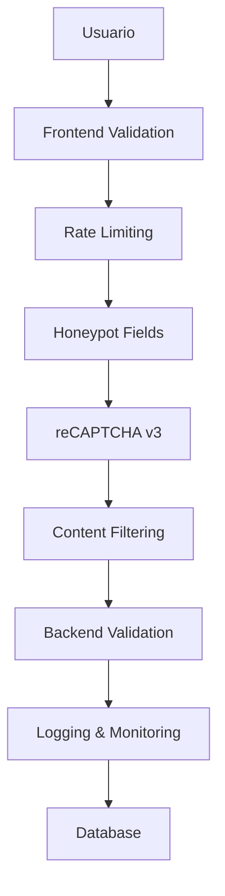

# Especificaciones Técnicas: Seguridad Anti-Spam para Formularios

## 1. Resumen Ejecutivo

Este documento especifica la implementación de un sistema integral de seguridad anti-spam para todos los formularios de la aplicación PetGourmet. El sistema incluye múltiples capas de protección para prevenir spam, ataques automatizados y abuso de formularios.

## 2. Formularios Identificados

### 2.1 Formularios Públicos (Alta Prioridad)
- **Formulario de Contacto** (`contact-section.tsx`, `contacto/page.tsx`)
- **Newsletter** (`newsletter.tsx`, `home-newsletter.tsx`)
- **Autenticación** (`auth-form.tsx`)
- **Recuperación de contraseña** (`reset-password/page.tsx`, `recuperar/page.tsx`)

### 2.2 Formularios Administrativos (Media Prioridad)
- **Gestión de productos** (`products/new/page.tsx`, `products/[id]/page.tsx`)
- **Gestión de categorías** (`categories/[id]/page.tsx`)
- **Gestión de blogs** (`blogs/[id]/page.tsx`)

### 2.3 Formularios de Checkout (Alta Prioridad)
- **Checkout de productos** (`production-checkout.tsx`)
- **Formularios de suscripción** (`checkout-modal.tsx`)

## 3. Arquitectura de Seguridad Anti-Spam

### 3.1 Capas de Protección



### 3.2 Componentes del Sistema

#### 3.2.1 Google reCAPTCHA v3
- **Propósito**: Análisis de comportamiento del usuario sin interrupciones
- **Implementación**: Invisible, basado en puntuación de riesgo
- **Umbral**: Score mínimo de 0.5 para formularios públicos

#### 3.2.2 Rate Limiting
- **Nivel de IP**: Máximo 10 envíos por hora por IP
- **Nivel de usuario**: Máximo 5 envíos por hora por usuario autenticado
- **Implementación**: Redis cache con TTL

#### 3.2.3 Honeypot Fields
- **Campos ocultos**: Campos invisibles que solo los bots completarían
- **Validación**: Rechazo automático si se completan

#### 3.2.4 Filtros de Contenido
- **Palabras prohibidas**: Lista de términos spam comunes
- **Patrones sospechosos**: URLs múltiples, caracteres especiales excesivos
- **Validación de formato**: Email, teléfono, nombres

## 4. Especificaciones Técnicas

### 4.1 Configuración de reCAPTCHA v3

#### 4.1.1 Variables de Entorno
```env
NEXT_PUBLIC_RECAPTCHA_SITE_KEY=your_site_key_here
RECAPTCHA_SECRET_KEY=your_secret_key_here
RECAPTCHA_THRESHOLD=0.5
```

#### 4.1.2 Componente reCAPTCHA
```typescript
// lib/recaptcha.ts
export interface RecaptchaConfig {
  siteKey: string;
  secretKey: string;
  threshold: number;
}

export class RecaptchaService {
  private config: RecaptchaConfig;
  
  constructor(config: RecaptchaConfig) {
    this.config = config;
  }
  
  async verifyToken(token: string, action: string): Promise<boolean> {
    // Implementación de verificación
  }
  
  generateToken(action: string): Promise<string> {
    // Implementación de generación de token
  }
}
```

### 4.2 Rate Limiting

#### 4.2.1 Middleware de Rate Limiting
```typescript
// middleware/rate-limit.ts
export interface RateLimitConfig {
  windowMs: number;
  maxRequests: number;
  keyGenerator: (req: Request) => string;
}

export class RateLimiter {
  private config: RateLimitConfig;
  private cache: Map<string, number[]>;
  
  constructor(config: RateLimitConfig) {
    this.config = config;
    this.cache = new Map();
  }
  
  async isAllowed(key: string): Promise<boolean> {
    // Implementación de verificación de límites
  }
}
```

#### 4.2.2 Configuración por Tipo de Formulario
```typescript
export const RATE_LIMITS = {
  contact: { windowMs: 3600000, maxRequests: 5 }, // 5 por hora
  newsletter: { windowMs: 3600000, maxRequests: 3 }, // 3 por hora
  auth: { windowMs: 900000, maxRequests: 10 }, // 10 por 15 min
  checkout: { windowMs: 1800000, maxRequests: 20 }, // 20 por 30 min
} as const;
```

### 4.3 Honeypot Implementation

#### 4.3.1 Componente Honeypot
```typescript
// components/security/honeypot.tsx
export interface HoneypotProps {
  name: string;
  tabIndex?: number;
}

export function Honeypot({ name, tabIndex = -1 }: HoneypotProps) {
  return (
    <input
      type="text"
      name={name}
      tabIndex={tabIndex}
      autoComplete="off"
      style={{
        position: 'absolute',
        left: '-9999px',
        width: '1px',
        height: '1px',
        opacity: 0,
        pointerEvents: 'none'
      }}
    />
  );
}
```

### 4.4 Content Filtering

#### 4.4.1 Filtros de Spam
```typescript
// lib/spam-filter.ts
export interface SpamFilterConfig {
  maxUrls: number;
  maxSpecialChars: number;
  bannedWords: string[];
  suspiciousPatterns: RegExp[];
}

export class SpamFilter {
  private config: SpamFilterConfig;
  
  constructor(config: SpamFilterConfig) {
    this.config = config;
  }
  
  isSpam(content: string): boolean {
    // Implementación de detección de spam
  }
  
  sanitizeContent(content: string): string {
    // Implementación de sanitización
  }
}
```

### 4.5 Logging y Monitoreo

#### 4.5.1 Sistema de Logs de Seguridad
```typescript
// lib/security-logger.ts
export interface SecurityEvent {
  type: 'spam_detected' | 'rate_limit_exceeded' | 'honeypot_triggered' | 'recaptcha_failed';
  ip: string;
  userAgent: string;
  formType: string;
  timestamp: Date;
  metadata?: Record<string, any>;
}

export class SecurityLogger {
  async logEvent(event: SecurityEvent): Promise<void> {
    // Implementación de logging
  }
  
  async getSecurityStats(timeframe: string): Promise<SecurityStats> {
    // Implementación de estadísticas
  }
}
```

## 5. Plan de Implementación

### 5.1 Fase 1: Infraestructura Base (Semana 1)
1. **Configurar reCAPTCHA v3**
   - Registrar dominio en Google reCAPTCHA
   - Configurar variables de entorno
   - Crear servicio de verificación

2. **Implementar Rate Limiting**
   - Configurar Redis para cache
   - Crear middleware de rate limiting
   - Integrar con Next.js middleware

3. **Sistema de Logging**
   - Crear tablas de logs de seguridad
   - Implementar servicio de logging
   - Configurar alertas básicas

### 5.2 Fase 2: Protección de Formularios Públicos (Semana 2)
1. **Formularios de Contacto y Newsletter**
   - Integrar reCAPTCHA v3
   - Añadir campos honeypot
   - Implementar validación de contenido
   - Aplicar rate limiting

2. **Formularios de Autenticación**
   - Proteger login/registro
   - Implementar cooldown progresivo
   - Añadir detección de patrones sospechosos

### 5.3 Fase 3: Formularios de Checkout (Semana 3)
1. **Checkout y Suscripciones**
   - Protección específica para transacciones
   - Validación de datos de pago
   - Monitoreo de intentos fraudulentos

### 5.4 Fase 4: Formularios Administrativos (Semana 4)
1. **Panel de Administración**
   - Protección adicional para formularios admin
   - Logs detallados de cambios
   - Alertas de actividad sospechosa

### 5.5 Fase 5: Monitoreo y Optimización (Semana 5)
1. **Dashboard de Seguridad**
   - Panel de monitoreo en tiempo real
   - Estadísticas de intentos bloqueados
   - Configuración de alertas automáticas

## 6. Configuración de Base de Datos

### 6.1 Tabla de Logs de Seguridad
```sql
CREATE TABLE security_logs (
  id UUID PRIMARY KEY DEFAULT gen_random_uuid(),
  event_type VARCHAR(50) NOT NULL,
  ip_address INET NOT NULL,
  user_agent TEXT,
  form_type VARCHAR(50) NOT NULL,
  user_id UUID REFERENCES auth.users(id),
  blocked BOOLEAN DEFAULT false,
  metadata JSONB,
  created_at TIMESTAMP WITH TIME ZONE DEFAULT NOW()
);

CREATE INDEX idx_security_logs_event_type ON security_logs(event_type);
CREATE INDEX idx_security_logs_ip_address ON security_logs(ip_address);
CREATE INDEX idx_security_logs_created_at ON security_logs(created_at DESC);
```

### 6.2 Tabla de Rate Limiting
```sql
CREATE TABLE rate_limits (
  id UUID PRIMARY KEY DEFAULT gen_random_uuid(),
  key_hash VARCHAR(64) NOT NULL UNIQUE,
  request_count INTEGER DEFAULT 1,
  window_start TIMESTAMP WITH TIME ZONE DEFAULT NOW(),
  expires_at TIMESTAMP WITH TIME ZONE NOT NULL,
  created_at TIMESTAMP WITH TIME ZONE DEFAULT NOW(),
  updated_at TIMESTAMP WITH TIME ZONE DEFAULT NOW()
);

CREATE INDEX idx_rate_limits_key_hash ON rate_limits(key_hash);
CREATE INDEX idx_rate_limits_expires_at ON rate_limits(expires_at);
```

## 7. Configuración de Middleware

### 7.1 Next.js Middleware
```typescript
// middleware.ts
import { NextRequest, NextResponse } from 'next/server';
import { RateLimiter } from '@/lib/rate-limiter';
import { SecurityLogger } from '@/lib/security-logger';

export async function middleware(request: NextRequest) {
  const pathname = request.nextUrl.pathname;
  
  // Aplicar rate limiting a rutas de API de formularios
  if (pathname.startsWith('/api/contact') || 
      pathname.startsWith('/api/newsletter') ||
      pathname.startsWith('/api/auth')) {
    
    const rateLimiter = new RateLimiter(getRateLimitConfig(pathname));
    const clientIP = getClientIP(request);
    
    if (!(await rateLimiter.isAllowed(clientIP))) {
      await SecurityLogger.logEvent({
        type: 'rate_limit_exceeded',
        ip: clientIP,
        userAgent: request.headers.get('user-agent') || '',
        formType: getFormType(pathname),
        timestamp: new Date()
      });
      
      return new NextResponse('Rate limit exceeded', { status: 429 });
    }
  }
  
  return NextResponse.next();
}

export const config = {
  matcher: ['/api/contact/:path*', '/api/newsletter/:path*', '/api/auth/:path*']
};
```

## 8. Componentes de Seguridad Reutilizables

### 8.1 Hook de Seguridad para Formularios
```typescript
// hooks/use-form-security.ts
export interface FormSecurityConfig {
  formType: string;
  enableRecaptcha: boolean;
  enableHoneypot: boolean;
  enableContentFilter: boolean;
}

export function useFormSecurity(config: FormSecurityConfig) {
  const [isSecurityValid, setIsSecurityValid] = useState(false);
  const [securityError, setSecurityError] = useState<string | null>(null);
  
  const validateSecurity = async (formData: FormData): Promise<boolean> => {
    // Implementación de validación de seguridad
  };
  
  const generateRecaptchaToken = async (): Promise<string> => {
    // Implementación de generación de token
  };
  
  return {
    isSecurityValid,
    securityError,
    validateSecurity,
    generateRecaptchaToken
  };
}
```

### 8.2 Componente de Formulario Seguro
```typescript
// components/security/secure-form.tsx
export interface SecureFormProps {
  onSubmit: (data: FormData) => Promise<void>;
  formType: string;
  children: React.ReactNode;
  className?: string;
}

export function SecureForm({ onSubmit, formType, children, className }: SecureFormProps) {
  const { validateSecurity, generateRecaptchaToken } = useFormSecurity({
    formType,
    enableRecaptcha: true,
    enableHoneypot: true,
    enableContentFilter: true
  });
  
  const handleSubmit = async (e: React.FormEvent) => {
    e.preventDefault();
    
    const formData = new FormData(e.target as HTMLFormElement);
    
    // Validar seguridad antes del envío
    if (await validateSecurity(formData)) {
      await onSubmit(formData);
    }
  };
  
  return (
    <form onSubmit={handleSubmit} className={className}>
      <Honeypot name="website" />
      {children}
    </form>
  );
}
```

## 9. Métricas y Monitoreo

### 9.1 KPIs de Seguridad
- **Tasa de bloqueo de spam**: % de envíos bloqueados vs total
- **Falsos positivos**: % de envíos legítimos bloqueados
- **Tiempo de respuesta**: Impacto en performance de formularios
- **Intentos por IP**: Detección de patrones de abuso

### 9.2 Alertas Automáticas
- **Picos de spam**: >50 intentos bloqueados en 1 hora
- **Ataques coordinados**: >10 IPs diferentes con patrones similares
- **Fallos de reCAPTCHA**: >20 fallos consecutivos desde una IP

## 10. Consideraciones de Performance

### 10.1 Optimizaciones
- **Cache de resultados de reCAPTCHA**: 5 minutos por token válido
- **Lazy loading de reCAPTCHA**: Cargar solo cuando sea necesario
- **Batch processing**: Procesar logs de seguridad en lotes
- **Índices de base de datos**: Optimizar consultas de rate limiting

### 10.2 Impacto en UX
- **reCAPTCHA invisible**: Sin interrupciones para usuarios legítimos
- **Mensajes de error claros**: Explicar por qué se bloqueó un envío
- **Cooldown progresivo**: Aumentar tiempo de espera gradualmente

## 11. Mantenimiento y Actualizaciones

### 11.1 Revisiones Periódicas
- **Semanal**: Revisar logs de seguridad y ajustar umbrales
- **Mensual**: Actualizar listas de palabras prohibidas
- **Trimestral**: Evaluar efectividad y ajustar configuraciones

### 11.2 Actualizaciones de Seguridad
- **reCAPTCHA**: Mantener actualizada la versión del SDK
- **Patrones de spam**: Actualizar filtros basados en nuevas amenazas
- **Rate limits**: Ajustar según patrones de uso legítimo

## 12. Documentación para Desarrolladores

### 12.1 Guía de Implementación
1. **Importar componentes de seguridad**
2. **Configurar variables de entorno**
3. **Envolver formularios con SecureForm**
4. **Implementar validación en API routes**
5. **Configurar logging de eventos**

### 12.2 Ejemplos de Uso
```typescript
// Ejemplo: Formulario de contacto seguro
import { SecureForm } from '@/components/security/secure-form';

export function ContactForm() {
  const handleSubmit = async (formData: FormData) => {
    const response = await fetch('/api/contact', {
      method: 'POST',
      body: formData
    });
    // Manejar respuesta
  };
  
  return (
    <SecureForm onSubmit={handleSubmit} formType="contact">
      <input name="name" required />
      <input name="email" type="email" required />
      <textarea name="message" required />
      <button type="submit">Enviar</button>
    </SecureForm>
  );
}
```

Este sistema de seguridad anti-spam proporcionará una protección robusta y multicapa para todos los formularios de la aplicación, manteniendo una excelente experiencia de usuario mientras previene efectivamente el spam y los ataques automatizados.