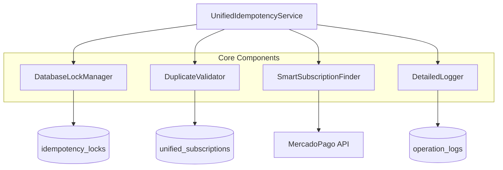

# Documentación Técnica: Fase 1 - Estabilización del Sistema de Suscripciones

## 📋 Resumen Ejecutivo

Esta documentación técnica detalla la implementación de la **Fase 1: Estabilización** del sistema de suscripciones de PetGourmet, enfocándose en resolver los problemas críticos de duplicación de registros y condiciones de carrera identificados en el informe de análisis.

### Objetivos de la Fase 1
1. **Consolidar servicios de idempotencia fragmentados** en un único `UnifiedIdempotencyService`
2. **Implementar validación robusta de duplicados** con locks de base de datos
3. **Agregar sistema de logging detallado** para debugging y monitoreo
4. **Eliminar condiciones de carrera** en operaciones críticas

---

## 🔍 Análisis de Servicios de Idempotencia Existentes

### Estado Actual: Fragmentación Crítica

Se identificaron **4 servicios diferentes** de idempotencia que operan de forma independiente, causando:
- Duplicación de lógica
- Inconsistencias en validación
- Condiciones de carrera
- Dificultad de mantenimiento

### 1. `idempotency-service.ts`

**Ubicación**: `lib/idempotency-service.ts`

**Características**:
- Servicio base con locks distribuidos
- Singleton pattern
- TTL configurable (300s por defecto)
- Retry logic con backoff

**Fortalezas**:
```typescript
// Lock distribuido robusto
async acquireLock(key: string, ttlSeconds: number): Promise<string | null> {
  const lockId = crypto.randomUUID()
  const expiresAt = new Date(Date.now() + ttlSeconds * 1000)
  
  const { data, error } = await this.supabase
    .from('idempotency_locks')
    .insert({ key, lock_id: lockId, expires_at: expiresAt })
    .select()
    .single()
}
```

**Debilidades**:
- No maneja datos específicos de suscripciones
- Validación genérica insuficiente
- Sin integración con external_reference

### 2. `enhanced-idempotency-service.ts`

**Ubicación**: `lib/enhanced-idempotency-service.ts`

**Características**:
- Integra `subscription-deduplication-service`
- Validación previa opcional
- Manejo específico de suscripciones

**Fortalezas**:
```typescript
// Integración con deduplicación
async executeSubscriptionWithIdempotency<T>(
  operation: (externalReference: string) => Promise<T>,
  options: EnhancedIdempotencyOptions
): Promise<EnhancedIdempotencyResult<T>> {
  // Pre-validación de duplicados
  if (options.enablePreValidation && options.subscriptionData) {
    const validation = await subscriptionDeduplicationService
      .validateBeforeCreate(options.subscriptionData)
  }
}
```

**Debilidades**:
- Dependencia circular con otros servicios
- Lógica compleja y difícil de debuggear
- Sin manejo de múltiples criterios de búsqueda

### 3. `advanced-idempotency.service.ts`

**Ubicación**: `lib/services/advanced-idempotency.service.ts`

**Características**:
- Validación por múltiples criterios
- Detección avanzada de duplicados
- Configuración granular

**Fortalezas**:
```typescript
// Búsqueda por múltiples criterios
private async checkForDuplicates(subscriptionData: any) {
  const criteria = [
    { external_reference: subscriptionData.externalReference },
    { user_id: subscriptionData.userId, product_id: subscriptionData.productId },
    { payer_email: subscriptionData.payerEmail }
  ]
  
  for (const criterion of criteria) {
    const existing = await this.findByCriteria(criterion)
    if (existing) return existing
  }
}
```

**Debilidades**:
- Ubicación inconsistente (`lib/services/`)
- Sin integración con otros servicios
- Configuración compleja

### 4. `subscription-deduplication-service.ts`

**Ubicación**: `lib/subscription-deduplication-service.ts`

**Características**:
- Generación determinística de external_reference
- Validación específica de suscripciones
- Singleton pattern

**Fortalezas**:
```typescript
// Generación determinística
generateDeterministicReference(subscriptionData: SubscriptionData): string {
  const { userId, planId, timestamp } = subscriptionData
  const baseString = `${userId}-${planId}-${timestamp}`
  return `PG-SUB-${crypto.createHash('sha256').update(baseString).digest('hex').substring(0, 16)}`
}
```

**Debilidades**:
- Solo maneja external_reference local
- No sincroniza con MercadoPago
- Validación limitada

---

## 🏗️ Diseño del UnifiedIdempotencyService

### Arquitectura Consolidada



### Especificación Técnica

#### Interfaz Principal

```typescript
interface UnifiedIdempotencyOptions {
  // Configuración básica
  key: string
  ttlSeconds?: number
  maxRetries?: number
  retryDelayMs?: number
  
  // Configuración de suscripciones
  subscriptionData?: SubscriptionData
  enableSmartSearch?: boolean
  enablePreValidation?: boolean
  
  // Configuración de logging
  logLevel?: 'debug' | 'info' | 'warn' | 'error'
  enableDetailedLogging?: boolean
}

interface UnifiedIdempotencyResult<T> {
  success: boolean
  data?: T
  error?: string
  
  // Metadata de operación
  operationId: string
  executionTime: number
  lockAcquired: boolean
  duplicateFound: boolean
  
  // Información de debugging
  searchCriteria?: SearchCriteria[]
  validationResults?: ValidationResult[]
  logEntries?: LogEntry[]
}
```

#### Implementación Core

```typescript
export class UnifiedIdempotencyService {
  private static instance: UnifiedIdempotencyService
  private supabase = createClient()
  private lockManager: DatabaseLockManager
  private validator: DuplicateValidator
  private finder: SmartSubscriptionFinder
  private logger: DetailedLogger
  
  constructor() {
    this.lockManager = new DatabaseLockManager(this.supabase)
    this.validator = new DuplicateValidator(this.supabase)
    this.finder = new SmartSubscriptionFinder(this.supabase)
    this.logger = new DetailedLogger(this.supabase)
  }
  
  static getInstance(): UnifiedIdempotencyService {
    if (!UnifiedIdempotencyService.instance) {
      UnifiedIdempotencyService.instance = new UnifiedIdempotencyService()
    }
    return UnifiedIdempotencyService.instance
  }
  
  /**
   * Ejecuta operación con idempotencia unificada
   */
  async executeWithIdempotency<T>(
    operation: () => Promise<T>,
    options: UnifiedIdempotencyOptions
  ): Promise<UnifiedIdempotencyResult<T>> {
    const operationId = crypto.randomUUID()
    const startTime = Date.now()
    
    await this.logger.logOperationStart(operationId, options)
    
    try {
      // PASO 1: Adquirir lock distribuido
      const lockResult = await this.lockManager.acquireLock(
        options.key,
        options.ttlSeconds || 300
      )
      
      if (!lockResult.acquired) {
        return this.handleLockFailure(operationId, lockResult, startTime)
      }
      
      try {
        // PASO 2: Validación previa (si está habilitada)
        if (options.enablePreValidation && options.subscriptionData) {
          const validationResult = await this.validator.validateBeforeCreate(
            options.subscriptionData
          )
          
          if (!validationResult.isValid) {
            return this.handleValidationFailure(operationId, validationResult, startTime)
          }
        }
        
        // PASO 3: Búsqueda inteligente de duplicados
        if (options.enableSmartSearch && options.subscriptionData) {
          const existingSubscription = await this.finder.findExistingSubscription(
            options.subscriptionData
          )
          
          if (existingSubscription) {
            return this.handleDuplicateFound(operationId, existingSubscription, startTime)
          }
        }
        
        // PASO 4: Ejecutar operación
        const result = await operation()
        
        // PASO 5: Log de éxito
        await this.logger.logOperationSuccess(operationId, result, Date.now() - startTime)
        
        return {
          success: true,
          data: result,
          operationId,
          executionTime: Date.now() - startTime,
          lockAcquired: true,
          duplicateFound: false
        }
        
      } finally {
        // PASO 6: Liberar lock
        await this.lockManager.releaseLock(lockResult.lockId)
      }
      
    } catch (error) {
      await this.logger.logOperationError(operationId, error, Date.now() - startTime)
      
      return {
        success: false,
        error: error.message,
        operationId,
        executionTime: Date.now() - startTime,
        lockAcquired: false,
        duplicateFound: false
      }
    }
  }
}
```

---

## 🔒 DatabaseLockManager: Locks Distribuidos Robustos

### Esquema de Base de Datos

```sql
-- Tabla para locks distribuidos
CREATE TABLE IF NOT EXISTS idempotency_locks (
  id UUID PRIMARY KEY DEFAULT gen_random_uuid(),
  key TEXT NOT NULL,
  lock_id TEXT NOT NULL,
  acquired_at TIMESTAMP WITH TIME ZONE DEFAULT NOW(),
  expires_at TIMESTAMP WITH TIME ZONE NOT NULL,
  released_at TIMESTAMP WITH TIME ZONE,
  operation_id TEXT,
  metadata JSONB DEFAULT '{}'
);

-- Índices para performance
CREATE UNIQUE INDEX IF NOT EXISTS idx_idempotency_locks_key_active 
  ON idempotency_locks(key) 
  WHERE released_at IS NULL AND expires_at > NOW();

CREATE INDEX IF NOT EXISTS idx_idempotency_locks_expires_at 
  ON idempotency_locks(expires_at);

CREATE INDEX IF NOT EXISTS idx_idempotency_locks_operation_id 
  ON idempotency_locks(operation_id);
```

### Implementación

```typescript
export class DatabaseLockManager {
  constructor(private supabase: SupabaseClient) {}
  
  /**
   * Adquiere lock distribuido con retry automático
   */
  async acquireLock(
    key: string, 
    ttlSeconds: number,
    operationId?: string
  ): Promise<LockResult> {
    const lockId = crypto.randomUUID()
    const expiresAt = new Date(Date.now() + ttlSeconds * 1000)
    const maxRetries = 3
    
    for (let attempt = 1; attempt <= maxRetries; attempt++) {
      try {
        // Limpiar locks expirados primero
        await this.cleanupExpiredLocks()
        
        // Intentar adquirir lock
        const { data, error } = await this.supabase
          .from('idempotency_locks')
          .insert({
            key,
            lock_id: lockId,
            expires_at: expiresAt.toISOString(),
            operation_id: operationId,
            metadata: { attempt, maxRetries }
          })
          .select()
          .single()
        
        if (!error) {
          return {
            acquired: true,
            lockId,
            expiresAt,
            attempt
          }
        }
        
        // Si es error de constraint (lock ya existe), esperar y reintentar
        if (error.code === '23505') { // unique_violation
          const delay = Math.min(1000 * Math.pow(2, attempt - 1), 5000) // Exponential backoff
          await this.sleep(delay)
          continue
        }
        
        throw error
        
      } catch (error) {
        if (attempt === maxRetries) {
          return {
            acquired: false,
            error: error.message,
            attempt
          }
        }
      }
    }
    
    return {
      acquired: false,
      error: 'Max retries exceeded',
      attempt: maxRetries
    }
  }
  
  /**
   * Libera lock específico
   */
  async releaseLock(lockId: string): Promise<void> {
    await this.supabase
      .from('idempotency_locks')
      .update({ released_at: new Date().toISOString() })
      .eq('lock_id', lockId)
  }
  
  /**
   * Limpia locks expirados automáticamente
   */
  private async cleanupExpiredLocks(): Promise<void> {
    await this.supabase
      .from('idempotency_locks')
      .update({ released_at: new Date().toISOString() })
      .lt('expires_at', new Date().toISOString())
      .is('released_at', null)
  }
}
```

---

## ✅ DuplicateValidator: Validación Robusta

### Criterios de Validación Múltiples

```typescript
export class DuplicateValidator {
  constructor(private supabase: SupabaseClient) {}
  
  /**
   * Valida antes de crear usando múltiples criterios
   */
  async validateBeforeCreate(
    subscriptionData: SubscriptionData
  ): Promise<ValidationResult> {
    const validationId = crypto.randomUUID()
    const startTime = Date.now()
    
    const results: ValidationCheck[] = []
    
    // Criterio 1: external_reference exacto
    if (subscriptionData.external_reference) {
      const exactMatch = await this.checkExactReference(
        subscriptionData.external_reference
      )
      results.push({
        criterion: 'exact_reference',
        passed: !exactMatch,
        details: exactMatch ? { foundId: exactMatch.id } : null
      })
    }
    
    // Criterio 2: user_id + product_id + amount
    const userProductMatch = await this.checkUserProductAmount(
      subscriptionData.user_id,
      subscriptionData.product_id,
      subscriptionData.amount
    )
    results.push({
      criterion: 'user_product_amount',
      passed: !userProductMatch,
      details: userProductMatch ? { foundId: userProductMatch.id } : null
    })
    
    // Criterio 3: email + timestamp range (últimos 5 minutos)
    if (subscriptionData.payer_email) {
      const emailTimeMatch = await this.checkEmailTimeRange(
        subscriptionData.payer_email,
        5 // minutos
      )
      results.push({
        criterion: 'email_time_range',
        passed: !emailTimeMatch,
        details: emailTimeMatch ? { foundId: emailTimeMatch.id } : null
      })
    }
    
    const isValid = results.every(r => r.passed)
    const failedChecks = results.filter(r => !r.passed)
    
    return {
      isValid,
      validationId,
      executionTime: Date.now() - startTime,
      checks: results,
      failedChecks,
      duplicateFound: !isValid,
      duplicateDetails: failedChecks.length > 0 ? failedChecks[0].details : null
    }
  }
  
  private async checkExactReference(externalReference: string) {
    const { data } = await this.supabase
      .from('unified_subscriptions')
      .select('id, status, created_at')
      .eq('external_reference', externalReference)
      .single()
    
    return data
  }
  
  private async checkUserProductAmount(
    userId: string, 
    productId: number, 
    amount: number
  ) {
    const { data } = await this.supabase
      .from('unified_subscriptions')
      .select('id, status, created_at')
      .eq('user_id', userId)
      .eq('product_id', productId)
      .eq('amount', amount)
      .in('status', ['pending', 'active'])
      .gte('created_at', new Date(Date.now() - 10 * 60 * 1000).toISOString()) // Últimos 10 minutos
      .single()
    
    return data
  }
  
  private async checkEmailTimeRange(email: string, minutes: number) {
    const { data } = await this.supabase
      .from('unified_subscriptions')
      .select('id, status, created_at')
      .eq('payer_email', email)
      .in('status', ['pending', 'active'])
      .gte('created_at', new Date(Date.now() - minutes * 60 * 1000).toISOString())
      .single()
    
    return data
  }
}
```

---

## 🔍 SmartSubscriptionFinder: Búsqueda Inteligente

### Algoritmo de Búsqueda Multi-Criterio

```typescript
export class SmartSubscriptionFinder {
  constructor(private supabase: SupabaseClient) {}
  
  /**
   * Encuentra suscripción existente usando múltiples estrategias
   */
  async findExistingSubscription(
    subscriptionData: SubscriptionData
  ): Promise<SubscriptionMatch | null> {
    const searchId = crypto.randomUUID()
    const strategies: SearchStrategy[] = [
      'exact_reference',
      'user_product_amount',
      'email_time_range',
      'collection_payment_id',
      'fuzzy_reference'
    ]
    
    for (const strategy of strategies) {
      const result = await this.executeSearchStrategy(strategy, subscriptionData)
      
      if (result) {
        return {
          subscription: result,
          matchStrategy: strategy,
          confidence: this.calculateConfidence(strategy, result, subscriptionData),
          searchId
        }
      }
    }
    
    return null
  }
  
  private async executeSearchStrategy(
    strategy: SearchStrategy,
    data: SubscriptionData
  ): Promise<any> {
    switch (strategy) {
      case 'exact_reference':
        return this.searchByExactReference(data.external_reference)
        
      case 'user_product_amount':
        return this.searchByUserProductAmount(
          data.user_id, 
          data.product_id, 
          data.amount
        )
        
      case 'email_time_range':
        return this.searchByEmailTimeRange(
          data.payer_email, 
          10 // minutos
        )
        
      case 'collection_payment_id':
        return this.searchByCollectionPaymentId(
          data.collection_id,
          data.payment_id
        )
        
      case 'fuzzy_reference':
        return this.searchByFuzzyReference(data.external_reference)
        
      default:
        return null
    }
  }
  
  private calculateConfidence(
    strategy: SearchStrategy,
    result: any,
    originalData: SubscriptionData
  ): number {
    const confidenceMap = {
      'exact_reference': 0.95,
      'user_product_amount': 0.85,
      'email_time_range': 0.70,
      'collection_payment_id': 0.80,
      'fuzzy_reference': 0.60
    }
    
    let baseConfidence = confidenceMap[strategy] || 0.50
    
    // Ajustar confianza basado en coincidencias adicionales
    if (result.payer_email === originalData.payer_email) {
      baseConfidence += 0.10
    }
    
    if (result.amount === originalData.amount) {
      baseConfidence += 0.05
    }
    
    return Math.min(baseConfidence, 1.0)
  }
}
```

---

## 📊 DetailedLogger: Sistema de Logging Avanzado

### Esquema de Logging

```sql
-- Tabla para logs detallados de operaciones
CREATE TABLE IF NOT EXISTS operation_logs (
  id UUID PRIMARY KEY DEFAULT gen_random_uuid(),
  operation_id TEXT NOT NULL,
  operation_type TEXT NOT NULL,
  level TEXT NOT NULL CHECK (level IN ('debug', 'info', 'warn', 'error')),
  message TEXT NOT NULL,
  details JSONB DEFAULT '{}',
  created_at TIMESTAMP WITH TIME ZONE DEFAULT NOW(),
  
  -- Contexto de suscripción
  subscription_id UUID,
  user_id UUID,
  external_reference TEXT,
  
  -- Métricas de performance
  execution_time_ms INTEGER,
  memory_usage_mb NUMERIC,
  
  -- Información de debugging
  stack_trace TEXT,
  request_id TEXT,
  session_id TEXT
);

-- Índices para consultas eficientes
CREATE INDEX IF NOT EXISTS idx_operation_logs_operation_id 
  ON operation_logs(operation_id);

CREATE INDEX IF NOT EXISTS idx_operation_logs_created_at 
  ON operation_logs(created_at DESC);

CREATE INDEX IF NOT EXISTS idx_operation_logs_level 
  ON operation_logs(level);

CREATE INDEX IF NOT EXISTS idx_operation_logs_external_reference 
  ON operation_logs(external_reference);
```

### Implementación del Logger

```typescript
export class DetailedLogger {
  constructor(private supabase: SupabaseClient) {}
  
  /**
   * Log de inicio de operación
   */
  async logOperationStart(
    operationId: string,
    options: UnifiedIdempotencyOptions
  ): Promise<void> {
    await this.log({
      operation_id: operationId,
      operation_type: 'idempotency_start',
      level: 'info',
      message: 'Iniciando operación con idempotencia unificada',
      details: {
        key: options.key,
        ttlSeconds: options.ttlSeconds,
        enablePreValidation: options.enablePreValidation,
        enableSmartSearch: options.enableSmartSearch,
        subscriptionData: options.subscriptionData ? {
          userId: options.subscriptionData.user_id,
          productId: options.subscriptionData.product_id,
          amount: options.subscriptionData.amount,
          hasExternalReference: !!options.subscriptionData.external_reference
        } : null
      },
      subscription_id: options.subscriptionData?.id,
      user_id: options.subscriptionData?.user_id,
      external_reference: options.subscriptionData?.external_reference
    })
  }
  
  /**
   * Log de éxito de operación
   */
  async logOperationSuccess(
    operationId: string,
    result: any,
    executionTime: number
  ): Promise<void> {
    await this.log({
      operation_id: operationId,
      operation_type: 'idempotency_success',
      level: 'info',
      message: 'Operación completada exitosamente',
      details: {
        resultType: typeof result,
        hasData: !!result,
        resultKeys: result && typeof result === 'object' ? Object.keys(result) : null
      },
      execution_time_ms: executionTime
    })
  }
  
  /**
   * Log de error de operación
   */
  async logOperationError(
    operationId: string,
    error: Error,
    executionTime: number
  ): Promise<void> {
    await this.log({
      operation_id: operationId,
      operation_type: 'idempotency_error',
      level: 'error',
      message: `Error en operación: ${error.message}`,
      details: {
        errorName: error.name,
        errorMessage: error.message,
        errorCode: (error as any).code
      },
      execution_time_ms: executionTime,
      stack_trace: error.stack
    })
  }
  
  /**
   * Log de duplicado encontrado
   */
  async logDuplicateFound(
    operationId: string,
    duplicateData: any,
    searchStrategy: string,
    confidence: number
  ): Promise<void> {
    await this.log({
      operation_id: operationId,
      operation_type: 'duplicate_found',
      level: 'warn',
      message: `Duplicado encontrado usando estrategia: ${searchStrategy}`,
      details: {
        searchStrategy,
        confidence,
        duplicateId: duplicateData.id,
        duplicateStatus: duplicateData.status,
        duplicateCreatedAt: duplicateData.created_at
      },
      subscription_id: duplicateData.id,
      external_reference: duplicateData.external_reference
    })
  }
  
  private async log(logEntry: Partial<OperationLog>): Promise<void> {
    try {
      await this.supabase
        .from('operation_logs')
        .insert({
          ...logEntry,
          created_at: new Date().toISOString()
        })
    } catch (error) {
      // Fallback a console si falla el logging a DB
      console.error('Failed to log to database:', error)
      console.log('Log entry:', logEntry)
    }
  }
}
```

---

## 🚀 Plan de Implementación

### Paso 1: Preparación de Base de Datos

```sql
-- Ejecutar migraciones para nuevas tablas
-- 1. idempotency_locks
-- 2. operation_logs
-- 3. Índices de performance
```

### Paso 2: Implementación de Componentes Core

1. **DatabaseLockManager** - Implementar primero para locks distribuidos
2. **DuplicateValidator** - Validación robusta con múltiples criterios
3. **SmartSubscriptionFinder** - Búsqueda inteligente
4. **DetailedLogger** - Sistema de logging avanzado

### Paso 3: Integración del UnifiedIdempotencyService

1. Crear servicio principal que integre todos los componentes
2. Implementar interfaz unificada
3. Agregar tests unitarios y de integración

### Paso 4: Migración Gradual

1. **Fase 4.1**: Implementar en endpoints nuevos
2. **Fase 4.2**: Migrar `create-without-plan` endpoint
3. **Fase 4.3**: Migrar webhook processing
4. **Fase 4.4**: Deprecar servicios antiguos

### Paso 5: Monitoreo y Optimización

1. Implementar dashboard de métricas
2. Configurar alertas para errores
3. Optimizar performance basado en logs

---

## 📈 Métricas de Éxito

### KPIs Técnicos
- **Tasa de duplicación**: 0% (objetivo)
- **Tiempo de adquisición de lock**: <100ms (p95)
- **Tiempo total de operación**: <500ms (p95)
- **Tasa de éxito de locks**: >99.9%

### KPIs de Negocio
- **Suscripciones duplicadas**: 0 por día
- **Tiempo de activación**: <30 segundos
- **Tasa de error en webhooks**: <0.1%

### Monitoreo Continuo
- Dashboard en tiempo real de operaciones
- Alertas automáticas para anomalías
- Reportes diarios de performance
- Análisis semanal de tendencias

---

*Documentación técnica generada para la Fase 1 de estabilización*
*Fecha: 25 de enero de 2025*
*Versión: 1.0*