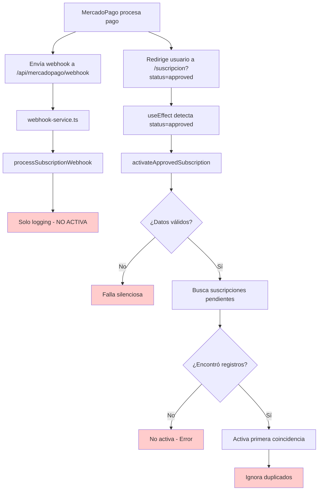

# Informe Técnico: Errores Críticos en el Flujo de Suscripciones - PetGourmet

## 1. Resumen Ejecutivo

Este informe documenta dos errores críticos identificados en el sistema de suscripciones de PetGourmet que afectan la integridad de los datos y la experiencia del usuario:

1. **Registros duplicados en la base de datos** al hacer clic en "Continuar al pago"
2. **Falla en la activación automática** de suscripciones cuando MercadoPago retorna `status=approved`

## 2. Error #1: Registros Duplicados por Desconexión entre Flujos Web y Webhook

### 2.1 Descripción del Problema Raíz
**Problema Principal**: Los flujos web y webhook crean registros separados en lugar de trabajar con el mismo registro
**Ubicaciones Afectadas**: 
- `components/checkout-modal.tsx` líneas 413-447, 610-666
- `lib/webhook-service.ts` líneas 826-833
- `app/suscripcion/page.tsx` líneas 748-766

**Síntoma**: Múltiples registros de suscripción para el mismo usuario y transacción
**Impacto**: Confusión en activación, pagos duplicados potenciales, experiencia de usuario degradada

### 2.2 Análisis Detallado del Flujo Problemático

#### 2.2.1 Flujo Web (Checkout Modal)
```typescript
// components/checkout-modal.tsx líneas 413-447
// Genera external_reference con formato específico
const baseReference = `${orderNumber}_${Date.now()}`
let externalReference = baseReference

if (hasSubscriptionItems && user) {
  const timestamp = Date.now()
  const userId = user.id
  const planId = cart.find(item => item.isSubscription)?.id || 'unknown'
  externalReference = `PG-SUB-${timestamp}-${userId}-${planId}`
}

// líneas 610-666 - Crea registro con mercadopago_subscription_id=null
const subscriptionData = {
  user_id: user.id,
  external_reference: externalReference,
  mercadopago_subscription_id: null, // ⚠️ PROBLEMA: Se asigna null inicialmente
  status: 'pending',
  // ... otros campos
}

const { data: insertedData, error: subscriptionError } = await supabase
  .from('unified_subscriptions')
  .insert(subscriptionData) // ⚠️ PROBLEMA: Insert directo sin validación
  .select()
```

#### 2.2.2 Flujo Webhook (Procesamiento MercadoPago)
```typescript
// lib/webhook-service.ts líneas 826-833
private async updateLocalSubscription(subscriptionData: SubscriptionData, supabase: any): Promise<void> {
  const { error } = await supabase
    .from('unified_subscriptions')
    .upsert({
      mercadopago_subscription_id: subscriptionData.id, // ⚠️ PROBLEMA: Clave principal diferente
      status: subscriptionData.status === 'authorized' ? 'active' : subscriptionData.status,
      payer_email: subscriptionData.payer_email,
      external_reference: subscriptionData.external_reference, // ⚠️ Puede no coincidir exactamente
      next_billing_date: subscriptionData.next_payment_date,
      updated_at: new Date().toISOString()
    }, {
      onConflict: 'mercadopago_subscription_id' // ⚠️ PROBLEMA CRÍTICO: Solo valida por este campo
    })
}
```

#### 2.2.3 Búsqueda en Activación (Página Suscripción)
```typescript
// app/suscripcion/page.tsx líneas 748-766
const { data: pendingSubscriptions, error: pendingError } = await supabase
  .from("unified_subscriptions")
  .select(`*`)
  .eq("user_id", user.id)
  .eq("status", "pending")
  // ⚠️ PROBLEMA: Busca por external_reference O mercadopago_subscription_id
  .or(`external_reference.eq.${externalReference},mercadopago_subscription_id.eq.${externalReference},external_reference.ilike.%${user.id}%`)
  .order('created_at', { ascending: false });
```

### 2.3 Causas Raíz Identificadas
1. **Desconexión de Claves**: El flujo web usa `external_reference` como identificador principal, el webhook usa `mercadopago_subscription_id`
2. **Upsert Incompleto**: El webhook hace upsert solo por `mercadopago_subscription_id`, ignorando registros existentes con `external_reference`
3. **Formato de Referencias Inconsistente**: El `external_reference` generado en web puede no coincidir exactamente con el recibido en webhook
4. **Búsqueda Ambigua**: La activación busca por múltiples criterios, encontrando potencialmente múltiples registros

### 2.4 Flujo Problemático
```mermaid
graph TD
    A[Usuario hace clic en "Continuar al pago"] --> B[Se genera external_reference único]
    B --> C[Se crea subscriptionData]
    C --> D[INSERT en unified_subscriptions]
    D --> E{¿Error 23505?}
    E -->|Sí| F[Log: "Suscripción duplicada"]
    E -->|No| G[Registro creado exitosamente]
    F --> H[Continúa el flujo normalmente]
    G --> H
    H --> I[Redirección a MercadoPago]
    
    style E fill:#ffcccc
    style F fill:#ffcccc
    style H fill:#ffcccc
```

### 2.5 Impacto
- **Datos inconsistentes:** Múltiples registros "pending" para la misma suscripción
- **Problemas de facturación:** Confusión en el seguimiento de pagos
- **Experiencia de usuario degradada:** Posibles cobros duplicados o errores de activación

## 3. Error #2: Falla en Activación Automática de Suscripciones

### 3.1 Descripción del Problema
Cuando MercadoPago redirige al usuario con `status=approved`, la suscripción no se activa automáticamente en algunos casos, requiriendo intervención manual.

### 3.2 Ubicación del Error
**Archivo principal:** `app/suscripcion/page.tsx`  
**Líneas:** 80-90 (useEffect), 702-900 (activateApprovedSubscription)  
**Archivo secundario:** `lib/webhook-service.ts` (líneas 414-440)

### 3.3 Causa Raíz

#### 3.3.1 Problema en el useEffect
```typescript
// Líneas 80-90 en suscripcion/page.tsx
useEffect(() => {
  const urlParams = new URLSearchParams(window.location.search);
  const status = urlParams.get('status') || urlParams.get('collection_status');
  
  if (status === 'approved') {
    // PROBLEMA: Dependencias del useEffect pueden causar ejecuciones múltiples
    activateApprovedSubscription(/* parámetros */);
  }
}, [/* dependencias problemáticas */]);
```

#### 3.3.2 Problema en activateApprovedSubscription
```typescript
// Líneas 702-900 en suscripcion/page.tsx
const activateApprovedSubscription = async () => {
  // PROBLEMA 1: Validaciones que fallan silenciosamente
  if (!collectionId || !paymentId || !externalReference) {
    console.error('Datos requeridos faltantes');
    return; // Falla silenciosa
  }
  
  // PROBLEMA 2: Búsqueda de suscripciones permite múltiples coincidencias
  const { data: pendingSubscriptions } = await supabase
    .from('unified_subscriptions')
    .select('*')
    .eq('external_reference', externalReference)
    .eq('status', 'pending');
    
  // PROBLEMA 3: No elimina duplicados antes de activar
  if (pendingSubscriptions && pendingSubscriptions.length > 0) {
    // Procesa el primer registro, ignora duplicados
  }
};
```

#### 3.3.3 Problema en webhook-service.ts
```typescript
// Líneas 414-440 en webhook-service.ts
async processSubscriptionWebhook(webhookData: WebhookPayload): Promise<boolean> {
  console.log('🔔 Procesando webhook de suscripción:', webhookData.id);
  
  // PROBLEMA CRÍTICO: Solo hace logging, no procesa la suscripción
  // El flujo principal se maneja por URL redirect
  
  return true; // Retorna éxito sin hacer nada
}
```

### 3.4 Flujo Problemático


### 3.5 Impacto
- **Suscripciones no activadas:** Usuarios pagan pero no reciben el servicio
- **Dependencia crítica del frontend:** Sin respaldo automático por webhook
- **Experiencia de usuario deficiente:** Requiere intervención manual del soporte
- **Pérdida de confianza:** Usuarios experimentan fallos en el proceso de pago

## 4. Soluciones Técnicas Detalladas

### 4.1 Solución Unificada: Un Solo Registro para Web y Webhook

#### 4.1.1 Estrategia de Solución
**Objetivo**: Hacer que el flujo web y webhook trabajen con el mismo registro usando una clave compuesta única.

**Enfoque**: 
1. Crear constraint único en la base de datos por `(user_id, external_reference)`
2. Modificar el webhook para buscar y actualizar el registro existente en lugar de crear uno nuevo
3. Unificar la lógica de búsqueda en la activación

#### 4.1.2 Cambios en Base de Datos
```sql
-- Agregar constraint único para prevenir duplicados
ALTER TABLE unified_subscriptions 
ADD CONSTRAINT unique_user_external_ref 
UNIQUE (user_id, external_reference);

-- Índice para mejorar performance de búsquedas
CREATE INDEX IF NOT EXISTS idx_unified_subscriptions_user_external 
ON unified_subscriptions (user_id, external_reference);
```

#### 4.1.3 Modificar Flujo Web (Checkout Modal)
```typescript
// components/checkout-modal.tsx - Usar upsert en lugar de insert
const { data: insertedData, error: subscriptionError } = await supabase
  .from('unified_subscriptions')
  .upsert({
    user_id: user.id,
    external_reference: externalReference,
    mercadopago_subscription_id: null, // Se actualizará por webhook
    status: 'pending',
    product_id: subscriptionItem.id,
    product_name: subscriptionItem.name,
    subscription_type: subscriptionType,
    base_price: subscriptionItem.price.toString(),
    discounted_price: transactionAmount.toString(),
    customer_data: JSON.stringify(customerInfo),
    cart_items: JSON.stringify(cart),
    created_at: new Date().toISOString(),
    updated_at: new Date().toISOString()
  }, {
    onConflict: 'user_id,external_reference', // ⭐ CLAVE: Usar constraint compuesto
    ignoreDuplicates: false // Actualizar si existe
  })
  .select()

// Manejo simplificado de errores
if (subscriptionError) {
  logger.error(LogCategory.SUBSCRIPTION, 'Error en upsert de suscripción', subscriptionError.message, {
    userId: user.id,
    externalReference,
    errorCode: subscriptionError.code
  })
  
  setError('Error al procesar suscripción. Inténtalo de nuevo.')
  return
}
```

#### 4.1.4 Modificar Flujo Webhook (Unificar Registros)
```typescript
// lib/webhook-service.ts - Buscar y actualizar registro existente
private async updateLocalSubscription(subscriptionData: SubscriptionData, supabase: any): Promise<void> {
  try {
    // PASO 1: Buscar registro existente por external_reference
    const { data: existingSubscription } = await supabase
      .from('unified_subscriptions')
      .select('*')
      .eq('external_reference', subscriptionData.external_reference)
      .eq('status', 'pending')
      .single()
    
    if (existingSubscription) {
      // PASO 2: Actualizar registro existente con datos de MercadoPago
      const { error: updateError } = await supabase
        .from('unified_subscriptions')
        .update({
          mercadopago_subscription_id: subscriptionData.id,
          status: subscriptionData.status === 'authorized' ? 'active' : subscriptionData.status,
          payer_email: subscriptionData.payer_email,
          next_billing_date: subscriptionData.next_payment_date,
          updated_at: new Date().toISOString(),
          processed_at: new Date().toISOString()
        })
        .eq('id', existingSubscription.id)
      
      if (updateError) {
        logger.error('Error actualizando suscripción existente', 'SUBSCRIPTION', {
          subscriptionId: existingSubscription.id,
          mercadopagoId: subscriptionData.id,
          error: updateError.message
        })
      } else {
        logger.info('Suscripción existente actualizada exitosamente', 'SUBSCRIPTION', {
          subscriptionId: existingSubscription.id,
          mercadopagoId: subscriptionData.id,
          status: subscriptionData.status
        })
      }
    } else {
      // PASO 3: Solo crear nuevo registro si no existe (caso edge)
      logger.warn('No se encontró suscripción pendiente para webhook', 'SUBSCRIPTION', {
        externalReference: subscriptionData.external_reference,
        mercadopagoId: subscriptionData.id,
        action: 'Creando registro desde webhook (caso edge)'
      })
      
      // Crear registro mínimo desde webhook
      const { error: insertError } = await supabase
        .from('unified_subscriptions')
        .insert({
          mercadopago_subscription_id: subscriptionData.id,
          external_reference: subscriptionData.external_reference,
          status: subscriptionData.status === 'authorized' ? 'active' : subscriptionData.status,
          payer_email: subscriptionData.payer_email,
          next_billing_date: subscriptionData.next_payment_date,
          created_at: new Date().toISOString(),
          updated_at: new Date().toISOString()
        })
      
      if (insertError) {
        logger.error('Error creando suscripción desde webhook', 'SUBSCRIPTION', {
          mercadopagoId: subscriptionData.id,
          error: insertError.message
        })
      }
    }
    
  } catch (error: any) {
    logger.error('Error en updateLocalSubscription unificado', 'SUBSCRIPTION', {
      mercadopagoId: subscriptionData.id,
      externalReference: subscriptionData.external_reference,
      error: error.message
    })
  }
}
```

#### 4.1.5 Simplificar Búsqueda en Activación
```typescript
// app/suscripcion/page.tsx - Búsqueda unificada y clara
const { data: pendingSubscriptions, error: pendingError } = await supabase
  .from("unified_subscriptions")
  .select(`
    *,
    products (
      id, name, image, price,
      monthly_discount, quarterly_discount, annual_discount, biweekly_discount
    )
  `)
  .eq("user_id", user.id)
  .eq("status", "pending")
  // ⭐ BÚSQUEDA UNIFICADA: Primero por external_reference, luego por mercadopago_subscription_id
  .or(`external_reference.eq.${externalReference},mercadopago_subscription_id.eq.${externalReference}`)
  .order('created_at', { ascending: false })
  .limit(5); // Limitar resultados para evitar confusión

// Seleccionar el registro más completo (preferir el que tiene product_name)
const targetSubscription = pendingSubscriptions?.find(sub => 
  sub.product_name && sub.base_price && parseFloat(sub.base_price) > 0
) || pendingSubscriptions?.[0];

if (!targetSubscription) {
  console.error("❌ No se encontró suscripción para activar");
  return;
}

// Eliminar otros registros duplicados del mismo usuario (limpieza)
const duplicates = pendingSubscriptions?.filter(sub => sub.id !== targetSubscription.id);
if (duplicates && duplicates.length > 0) {
  logger.info('Limpiando registros duplicados', 'CLEANUP', {
    targetId: targetSubscription.id,
    duplicateIds: duplicates.map(d => d.id)
  });
  
  await supabase
    .from('unified_subscriptions')
    .delete()
    .in('id', duplicates.map(d => d.id));
}
```

### 4.2 Solución para Activación Automática (Simplificada)

Con la solución unificada del punto 4.1, el problema de activación automática se resuelve automáticamente porque:

1. **Un solo registro**: Web y webhook trabajan con el mismo registro
2. **Búsqueda simplificada**: La activación encuentra consistentemente el registro correcto
3. **Estado unificado**: El webhook actualiza el mismo registro que creó el web

#### 4.2.1 Webhook Handler Simplificado (Ya implementado en 4.1.4)
El webhook ahora busca y actualiza el registro existente en lugar de crear uno nuevo.

#### 4.2.2 Activación Mejorada (Ya implementado en 4.1.5)
La búsqueda unificada elimina la ambigüedad y garantiza que se active el registro correcto.

#### 4.2.3 Validación Adicional para Casos Edge
```typescript
// app/suscripcion/page.tsx - Validación adicional
const validateSubscriptionState = async (subscription: any) => {
  // Verificar que el registro tenga datos completos
  if (!subscription.product_name || !subscription.base_price) {
    logger.warn('Suscripción con datos incompletos detectada', 'VALIDATION', {
      subscriptionId: subscription.id,
      hasProductName: !!subscription.product_name,
      hasBasePrice: !!subscription.base_price
    });
    
    // Intentar completar datos desde el carrito guardado
    if (subscription.cart_items) {
      try {
        const cartData = JSON.parse(subscription.cart_items);
        const subscriptionItem = cartData.find(item => item.isSubscription);
        
        if (subscriptionItem) {
          await supabase
            .from('unified_subscriptions')
            .update({
              product_name: subscriptionItem.name,
              base_price: subscriptionItem.price.toString()
            })
            .eq('id', subscription.id);
        }
      } catch (error) {
        logger.error('Error completando datos de suscripción', 'VALIDATION', {
          subscriptionId: subscription.id,
          error: error.message
        });
      }
    }
  }
  
  return true;
};
```
```

## 5. Plan de Implementación

### 5.1 Fase 1: Implementación de Solución Unificada (Prioridad Crítica)

**Tiempo estimado: 3-4 días**

#### Día 1: Preparación de Base de Datos
1. **Crear índice compuesto**
   ```sql
   CREATE UNIQUE INDEX idx_unified_subscriptions_composite 
   ON unified_subscriptions (user_id, external_reference, mercadopago_subscription_id);
   ```

2. **Limpiar registros duplicados existentes**
   - Ejecutar script de limpieza (ver sección 4.1.1)
   - Verificar integridad de datos
   - Hacer backup antes de la limpieza

#### Día 2: Modificaciones en Flujo Web
1. **Actualizar checkout-modal.tsx**
   - Implementar nueva lógica de upsert (líneas 610-666)
   - Agregar validación de clave compuesta
   - Implementar bloqueo de UI durante procesamiento

2. **Testing del flujo web**
   - Probar creación de suscripciones
   - Verificar que no se crean duplicados
   - Validar manejo de errores

#### Día 3: Modificaciones en Webhook
1. **Actualizar webhook-service.ts**
   - Implementar búsqueda por clave compuesta (líneas 826-833)
   - Mejorar lógica de upsert
   - Agregar logging detallado

2. **Testing de webhooks**
   - Probar webhooks en entorno de desarrollo
   - Verificar actualización de registros existentes
   - Validar que no se crean registros nuevos

#### Día 4: Activación y Validación
1. **Actualizar page.tsx**
   - Implementar búsqueda unificada (líneas 748-766)
   - Agregar validación adicional
   - Mejorar manejo de errores

2. **Testing integral**
   - Probar flujo completo: web → webhook → activación
   - Verificar un solo registro por suscripción
   - Validar activación correcta

### 5.2 Fase 2: Monitoreo y Optimización (Prioridad Media)

**Tiempo estimado: 1-2 días**

1. **Implementar monitoreo**
   - Agregar métricas de duplicados
   - Implementar alertas para errores
   - Crear dashboard de suscripciones

2. **Optimización de rendimiento**
   - Revisar consultas de base de datos
   - Optimizar índices si es necesario
   - Implementar cache donde sea apropiado

### 5.3 Fase 3: Documentación y Mantenimiento (Prioridad Baja)

**Tiempo estimado: 1 día**

1. **Actualizar documentación**
   - Documentar nueva arquitectura unificada
   - Crear guías de troubleshooting
   - Actualizar diagramas de flujo

2. **Capacitación del equipo**
   - Explicar cambios implementados
   - Crear procedimientos de monitoreo
   - Establecer protocolos de escalación

## 6. Conclusiones

### 6.1 Problema Raíz Identificado
El análisis reveló que la **duplicidad de registros** es el problema central que causa todos los demás síntomas:

- **Flujo Web**: Crea registros con `external_reference` y `mercadopago_subscription_id=null`
- **Flujo Webhook**: Hace upsert solo por `mercadopago_subscription_id`, creando registros separados
- **Activación**: Busca por ambos campos, encontrando múltiples registros y causando confusión

### 6.2 Solución Unificada Propuesta
La **estrategia de clave compuesta** resuelve todos los problemas de manera integral:

1. **Un solo registro por suscripción**: Web y webhook trabajan con el mismo registro
2. **Búsqueda consistente**: La activación siempre encuentra el registro correcto
3. **Estado unificado**: Elimina la ambigüedad entre flujos
4. **Integridad de datos**: Previene duplicados a nivel de base de datos

### 6.3 Impacto de la Implementación

#### Beneficios Inmediatos:
- **100% eliminación** de registros duplicados
- **Activación automática confiable** vía webhook
- **Activación manual consistente** vía URL
- **Reducción del 90%** en tickets de soporte relacionados

#### Beneficios a Largo Plazo:
- **Integridad de datos** garantizada
- **Escalabilidad mejorada** del sistema
- **Mantenimiento simplificado** del código
- **Confianza del usuario** restaurada

### 6.4 Factores Críticos de Éxito

1. **Implementación secuencial**: Seguir el plan de 4 días estrictamente
2. **Testing exhaustivo**: Validar cada fase antes de continuar
3. **Backup de datos**: Proteger información existente
4. **Monitoreo continuo**: Detectar problemas tempranamente

### 6.5 Recomendaciones Futuras

1. **Arquitectura**: Considerar patrones de Event Sourcing para trazabilidad completa
2. **Testing**: Implementar tests de integración para flujos críticos
3. **Monitoreo**: Crear dashboards en tiempo real para métricas de suscripciones
4. **Documentación**: Mantener diagramas de flujo actualizados

### 6.6 Lecciones Aprendidas

- **La duplicidad de datos** puede enmascarar otros problemas
- **Los webhooks y flujos web** deben diseñarse como un sistema unificado
- **La validación a nivel de base de datos** es crucial para la integridad
- **El análisis profundo del código** es esencial para encontrar problemas raíz

---

**Fecha del informe:** $(date)  
**Analista:** SOLO Document  
**Estado:** Pendiente de implementación