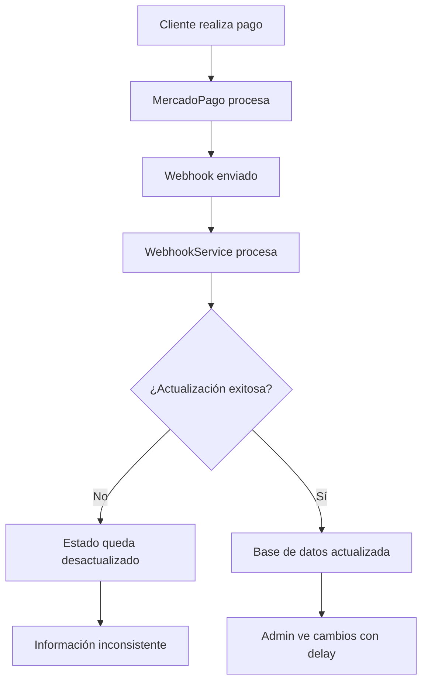
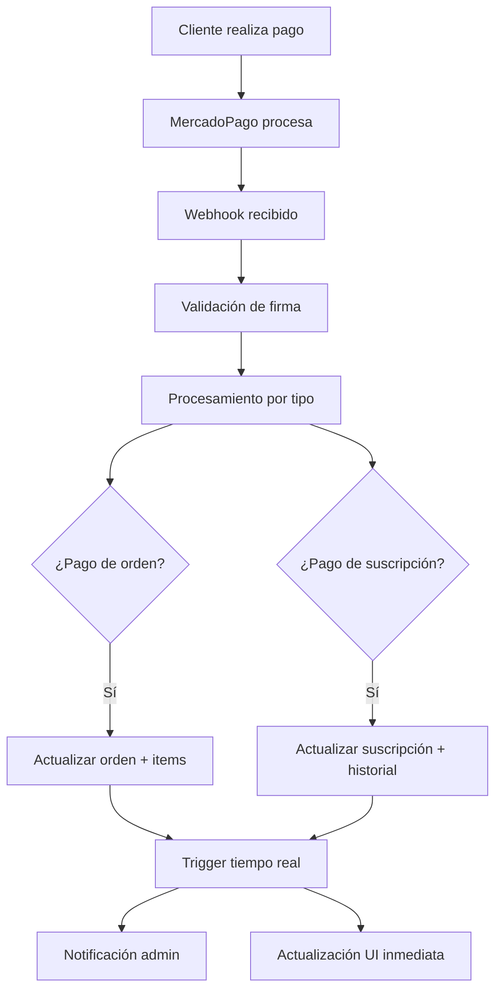

# Mejoras del Sistema de Webhooks de MercadoPago y Actualización en Tiempo Real

## 1. Análisis del Problema Actual

### 1.1 Problemas Identificados
- **Estados de pago no se actualizan en tiempo real**: Los webhooks de MercadoPago no están sincronizando correctamente los estados de las órdenes
- **Información de método de pago faltante**: Los datos como método de pago, detalles de transacción no se almacenan completamente
- **Seguimiento de suscripciones incompleto**: Las suscripciones no muestran frecuencia, recurrencia y próximos pagos correctamente
- **Sincronización inconsistente**: Desconexión entre los datos de MercadoPago y la base de datos local
- **Falta de notificaciones en tiempo real**: Los administradores no reciben actualizaciones inmediatas de cambios de estado

### 1.2 Flujo Actual Problemático


## 2. Arquitectura de Solución Propuesta

### 2.1 Flujo Mejorado de Webhooks


### 2.2 Componentes a Mejorar

#### WebhookService Mejorado
- **Validación robusta de firmas**
- **Procesamiento idempotente** (evitar duplicados)
- **Manejo de reintentos automáticos**
- **Logging detallado para debugging**
- **Sincronización bidireccional con MercadoPago**

#### Base de Datos Optimizada
- **Campos adicionales para metadatos de pago**
- **Historial completo de transacciones**
- **Estados de suscripción más granulares**
- **Triggers para notificaciones automáticas**

## 3. Mejoras Específicas por Módulo

### 3.1 Órdenes (/admin/orders/135)

#### Campos Adicionales Necesarios
```sql
-- Agregar a tabla orders
ALTER TABLE orders ADD COLUMN IF NOT EXISTS payment_method_details JSONB;
ALTER TABLE orders ADD COLUMN IF NOT EXISTS mercadopago_payment_details JSONB;
ALTER TABLE orders ADD COLUMN IF NOT EXISTS webhook_received_at TIMESTAMP;
ALTER TABLE orders ADD COLUMN IF NOT EXISTS last_webhook_status VARCHAR(50);
ALTER TABLE orders ADD COLUMN IF NOT EXISTS payment_attempts INTEGER DEFAULT 0;
```

#### Estructura de payment_method_details
```json
{
  "payment_method_id": "visa",
  "payment_type_id": "credit_card",
  "issuer_id": "25",
  "last_four_digits": "1234",
  "cardholder_name": "Juan Pérez",
  "installments": 1,
  "transaction_amount": 409.00,
  "net_received_amount": 395.73,
  "fee_details": [
    {
      "type": "mercadopago_fee",
      "amount": 13.27
    }
  ]
}
```

#### Procesamiento Mejorado de Webhooks de Órdenes
```typescript
// Mejoras en WebhookService.handleOrderPayment()
private async handleOrderPayment(paymentData: PaymentData, supabase: any): Promise<boolean> {
  try {
    const orderId = paymentData.external_reference
    
    // 1. Validar que la orden existe
    const { data: order, error: orderError } = await supabase
      .from('orders')
      .select('*')
      .eq('id', orderId)
      .single()

    if (orderError || !order) {
      console.warn(`Orden ${orderId} no encontrada`)
      return true // No fallar por órdenes inexistentes
    }

    // 2. Preparar datos completos de actualización
    const updateData = {
      payment_status: paymentData.status,
      status: this.mapPaymentStatusToOrderStatus(paymentData.status),
      mercadopago_payment_id: paymentData.id.toString(),
      payment_method_details: {
        payment_method_id: paymentData.payment_method_id,
        payment_type_id: paymentData.payment_type_id,
        last_four_digits: paymentData.card?.last_four_digits,
        cardholder_name: paymentData.card?.cardholder?.name,
        installments: paymentData.installments,
        transaction_amount: paymentData.transaction_amount,
        net_received_amount: paymentData.transaction_details?.net_received_amount
      },
      mercadopago_payment_details: {
        date_created: paymentData.date_created,
        date_approved: paymentData.date_approved,
        date_last_updated: paymentData.date_last_updated,
        status_detail: paymentData.status_detail,
        currency_id: paymentData.currency_id,
        payer: paymentData.payer
      },
      webhook_received_at: new Date().toISOString(),
      last_webhook_status: 'success',
      updated_at: new Date().toISOString()
    }

    // 3. Actualizar con confirmación si es aprobado
    if (paymentData.status === 'approved') {
      updateData.confirmed_at = paymentData.date_approved || new Date().toISOString()
    }

    // 4. Actualizar orden
    const { error: updateError } = await supabase
      .from('orders')
      .update(updateData)
      .eq('id', orderId)

    if (updateError) {
      console.error(`Error actualizando orden ${orderId}:`, updateError)
      return false
    }

    // 5. Trigger notificación en tiempo real
    await this.triggerRealtimeUpdate('orders', orderId, updateData)

    // 6. Enviar email si es necesario
    if (paymentData.status === 'approved') {
      await this.sendOrderConfirmationEmail(order, paymentData)
    }

    console.log(`✅ Orden ${orderId} actualizada - Estado: ${updateData.status}`)
    return true

  } catch (error) {
    console.error('Error manejando pago de orden:', error)
    return false
  }
}
```

### 3.2 Suscripciones (/admin/subscription-orders)

#### Campos Adicionales para Suscripciones
```sql
-- Mejorar tabla user_subscriptions
ALTER TABLE user_subscriptions ADD COLUMN IF NOT EXISTS frequency_type VARCHAR(20); -- 'days', 'weeks', 'months'
ALTER TABLE user_subscriptions ADD COLUMN IF NOT EXISTS frequency_value INTEGER; -- 1, 2, 3, etc.
ALTER TABLE user_subscriptions ADD COLUMN IF NOT EXISTS auto_recurring_details JSONB;
ALTER TABLE user_subscriptions ADD COLUMN IF NOT EXISTS mercadopago_status_detail VARCHAR(100);
ALTER TABLE user_subscriptions ADD COLUMN IF NOT EXISTS charges_made INTEGER DEFAULT 0;
ALTER TABLE user_subscriptions ADD COLUMN IF NOT EXISTS total_charged DECIMAL(10,2) DEFAULT 0;
ALTER TABLE user_subscriptions ADD COLUMN IF NOT EXISTS last_webhook_received_at TIMESTAMP;
```

#### Estructura de auto_recurring_details
```json
{
  "frequency": 1,
  "frequency_type": "months",
  "transaction_amount": 409.00,
  "currency_id": "ARS",
  "free_trial": null,
  "repetitions": null,
  "billing_day": 15,
  "billing_day_proportional": false
}
```

#### Procesamiento Mejorado de Webhooks de Suscripciones
```typescript
// Mejoras en WebhookService.processSubscriptionWebhook()
async processSubscriptionWebhook(webhookData: WebhookPayload): Promise<boolean> {
  try {
    const supabase = await this.initializeSupabase()
    const subscriptionId = webhookData.data.id
    
    console.log(`📋 Procesando webhook de suscripción: ${subscriptionId}, acción: ${webhookData.action}`)
    
    // 1. Obtener datos completos de MercadoPago
    const subscriptionData = await this.getSubscriptionData(subscriptionId)
    if (!subscriptionData) {
      console.error(`No se pudieron obtener datos de suscripción ${subscriptionId}`)
      return false
    }

    // 2. Actualizar suscripción local con datos completos
    await this.updateLocalSubscriptionComplete(subscriptionData, supabase)

    // 3. Manejar acciones específicas
    switch (webhookData.action) {
      case 'created':
        await this.handleSubscriptionCreated(subscriptionData, supabase)
        break
      case 'updated':
        await this.handleSubscriptionUpdated(subscriptionData, supabase)
        break
      case 'cancelled':
        await this.handleSubscriptionCancelled(subscriptionData, supabase)
        break
      case 'payment_created':
      case 'payment_updated':
        await this.handleSubscriptionPaymentWebhook(webhookData, supabase)
        break
    }

    // 4. Trigger actualización en tiempo real
    await this.triggerRealtimeUpdate('user_subscriptions', subscriptionId, {
      status: subscriptionData.status,
      updated_at: new Date().toISOString()
    })

    return true

  } catch (error) {
    console.error('Error procesando webhook de suscripción:', error)
    return false
  }
}

private async updateLocalSubscriptionComplete(subscriptionData: SubscriptionData, supabase: any): Promise<void> {
  try {
    const updateData = {
      status: subscriptionData.status,
      mercadopago_status_detail: subscriptionData.reason,
      next_payment_date: subscriptionData.next_payment_date,
      frequency_type: subscriptionData.auto_recurring?.frequency_type || 'months',
      frequency_value: subscriptionData.auto_recurring?.frequency || 1,
      auto_recurring_details: subscriptionData.auto_recurring,
      last_webhook_received_at: new Date().toISOString(),
      updated_at: new Date().toISOString()
    }

    const { error } = await supabase
      .from('user_subscriptions')
      .update(updateData)
      .eq('mercadopago_subscription_id', subscriptionData.id)

    if (error) {
      console.error('Error actualizando suscripción local:', error)
      throw error
    }

    console.log(`✅ Suscripción ${subscriptionData.id} actualizada localmente`)

  } catch (error) {
    console.error('Error en updateLocalSubscriptionComplete:', error)
    throw error
  }
}
```

## 4. Implementación de Tiempo Real Mejorado

### 4.1 Servicio de Notificaciones en Tiempo Real
```typescript
// Nuevo servicio: lib/realtime-service.ts
export class RealtimeService {
  private supabase: any

  constructor() {
    this.initializeSupabase()
  }

  async triggerUpdate(table: string, id: string, data: any) {
    try {
      // 1. Actualizar en base de datos
      const { error } = await this.supabase
        .from(table)
        .update({
          ...data,
          realtime_updated_at: new Date().toISOString()
        })
        .eq('id', id)

      if (error) throw error

      // 2. Enviar notificación personalizada
      await this.supabase
        .channel(`admin_${table}_updates`)
        .send({
          type: 'broadcast',
          event: 'update',
          payload: {
            table,
            id,
            data,
            timestamp: new Date().toISOString()
          }
        })

      console.log(`✅ Actualización en tiempo real enviada: ${table}/${id}`)

    } catch (error) {
      console.error('Error en triggerUpdate:', error)
    }
  }

  // Configurar listeners para admin
  setupAdminListeners(callbacks: {
    onOrderUpdate?: (data: any) => void
    onSubscriptionUpdate?: (data: any) => void
  }) {
    const channel = this.supabase
      .channel('admin_realtime_updates')
      .on('broadcast', { event: 'update' }, (payload) => {
        const { table, id, data } = payload.payload
        
        if (table === 'orders' && callbacks.onOrderUpdate) {
          callbacks.onOrderUpdate({ id, ...data })
        }
        
        if (table === 'user_subscriptions' && callbacks.onSubscriptionUpdate) {
          callbacks.onSubscriptionUpdate({ id, ...data })
        }
      })
      .subscribe()

    return channel
  }
}
```

### 4.2 Integración en Páginas de Admin
```typescript
// Mejoras en /admin/orders/page.tsx
const [realtimeService] = useState(() => new RealtimeService())

useEffect(() => {
  // Configurar listeners de tiempo real
  const channel = realtimeService.setupAdminListeners({
    onOrderUpdate: (orderData) => {
      // Actualizar orden específica en la lista
      setOrders(prevOrders => 
        prevOrders.map(order => 
          order.id === orderData.id 
            ? { ...order, ...orderData }
            : order
        )
      )
      
      // Mostrar notificación
      toast.success(`Orden ${orderData.id} actualizada: ${orderData.status}`)
    }
  })

  return () => {
    channel.unsubscribe()
  }
}, [])
```

## 5. Validación y Monitoreo

### 5.1 Sistema de Validación de Webhooks
```typescript
// Nuevo endpoint: /api/admin/validate-webhooks/route.ts
export async function POST(request: NextRequest) {
  try {
    const { orderId, subscriptionId } = await request.json()
    
    const results = []
    
    if (orderId) {
      // Validar orden contra MercadoPago
      const validation = await validateOrderPayment(orderId)
      results.push(validation)
    }
    
    if (subscriptionId) {
      // Validar suscripción contra MercadoPago
      const validation = await validateSubscriptionStatus(subscriptionId)
      results.push(validation)
    }
    
    return NextResponse.json({ results })
    
  } catch (error) {
    return NextResponse.json({ error: error.message }, { status: 500 })
  }
}

async function validateOrderPayment(orderId: string) {
  // 1. Obtener orden local
  const localOrder = await getLocalOrder(orderId)
  
  // 2. Obtener pago de MercadoPago
  const mpPayment = await getMercadoPagoPayment(localOrder.mercadopago_payment_id)
  
  // 3. Comparar estados
  const isValid = localOrder.payment_status === mpPayment.status
  
  return {
    orderId,
    isValid,
    localStatus: localOrder.payment_status,
    mercadopagoStatus: mpPayment.status,
    lastUpdated: localOrder.updated_at,
    recommendations: isValid ? [] : ['Sincronizar estado desde MercadoPago']
  }
}
```

### 5.2 Dashboard de Monitoreo
```typescript
// Nuevo componente: components/admin/webhook-monitor.tsx
export function WebhookMonitor() {
  const [stats, setStats] = useState({
    webhooksReceived: 0,
    webhooksProcessed: 0,
    webhooksFailed: 0,
    lastWebhookTime: null,
    ordersOutOfSync: 0,
    subscriptionsOutOfSync: 0
  })
  
  useEffect(() => {
    // Cargar estadísticas cada 30 segundos
    const interval = setInterval(loadWebhookStats, 30000)
    loadWebhookStats()
    
    return () => clearInterval(interval)
  }, [])
  
  return (
    <Card>
      <CardHeader>
        <CardTitle>Monitor de Webhooks</CardTitle>
      </CardHeader>
      <CardContent>
        <div className="grid grid-cols-3 gap-4">
          <div className="text-center">
            <div className="text-2xl font-bold text-green-600">
              {stats.webhooksProcessed}
            </div>
            <div className="text-sm text-gray-600">Procesados</div>
          </div>
          <div className="text-center">
            <div className="text-2xl font-bold text-red-600">
              {stats.webhooksFailed}
            </div>
            <div className="text-sm text-gray-600">Fallidos</div>
          </div>
          <div className="text-center">
            <div className="text-2xl font-bold text-yellow-600">
              {stats.ordersOutOfSync + stats.subscriptionsOutOfSync}
            </div>
            <div className="text-sm text-gray-600">Desincronizados</div>
          </div>
        </div>
      </CardContent>
    </Card>
  )
}
```

## 6. Plan de Implementación

### Fase 1: Mejoras de Base de Datos (1-2 días)
1. ✅ Agregar campos adicionales a tablas `orders` y `user_subscriptions`
2. ✅ Crear índices para optimizar consultas
3. ✅ Migrar datos existentes si es necesario

### Fase 2: Mejoras del WebhookService (2-3 días)
1. ✅ Implementar procesamiento mejorado de webhooks de órdenes
2. ✅ Implementar procesamiento mejorado de webhooks de suscripciones
3. ✅ Agregar validación robusta y manejo de errores
4. ✅ Implementar logging detallado

### Fase 3: Sistema de Tiempo Real (2 días)
1. ✅ Crear RealtimeService
2. ✅ Integrar en páginas de admin
3. ✅ Implementar notificaciones push

### Fase 4: Validación y Monitoreo (1-2 días)
1. ✅ Crear endpoints de validación
2. ✅ Implementar dashboard de monitoreo
3. ✅ Configurar alertas automáticas

### Fase 5: Testing y Optimización (1-2 días)
1. ✅ Pruebas de webhooks en entorno de desarrollo
2. ✅ Pruebas de sincronización
3. ✅ Optimización de rendimiento

## 7. Configuración de Entorno

### Variables de Entorno Necesarias
```env
# MercadoPago
MERCADOPAGO_ACCESS_TOKEN=your_access_token
MERCADOPAGO_WEBHOOK_SECRET=your_webhook_secret

# Supabase (ya configurado)
NEXT_PUBLIC_SUPABASE_URL=your_supabase_url
NEXT_PUBLIC_SUPABASE_ANON_KEY=your_anon_key
SUPABASE_SERVICE_ROLE_KEY=your_service_role_key

# Notificaciones
SMTP_HOST=your_smtp_host
SMTP_PORT=465
SMTP_USER=your_email
SMTP_PASS=your_password
```

### Configuración de Webhooks en MercadoPago
```bash
# URL del webhook
https://tu-dominio.com/api/mercadopago/webhook

# Eventos a suscribir
- payment
- subscription_preapproval
- subscription_authorized_payment
```

## 8. Métricas de Éxito

### KPIs a Monitorear
- **Tiempo de sincronización**: < 5 segundos desde webhook hasta UI
- **Tasa de éxito de webhooks**: > 99%
- **Órdenes desincronizadas**: < 1%
- **Suscripciones con estado incorrecto**: 0%
- **Tiempo de respuesta de APIs**: < 500ms

### Alertas Automáticas
- Webhook fallido > 3 veces consecutivas
- Orden sin actualizar > 10 minutos
- Suscripción sin sincronizar > 1 hora
- Tasa de error > 5% en 1 hora

Esta documentación proporciona una hoja de ruta completa para resolver los problemas de sincronización y actualización en tiempo real del sistema de webhooks de MercadoPago.