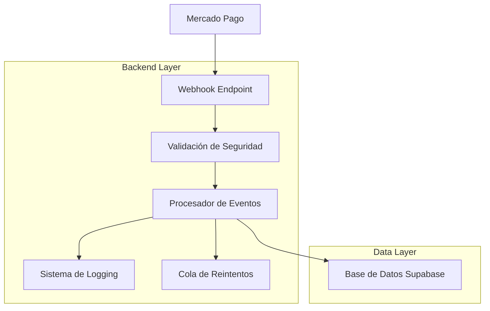

# Arquitectura Técnica - Sistema de Webhooks Mercado Pago

## 1. Arquitectura del Sistema



## 2. Tecnologías Utilizadas

- **Backend**: Node.js/Express o Next.js API Routes
- **Base de Datos**: Supabase (PostgreSQL)
- **Validación**: crypto (HMAC-SHA256)
- **Logging**: Winston o similar
- **Cola de Reintentos**: Bull Queue con Redis (opcional)

## 3. Configuración de Webhooks en Mercado Pago

### 3.1 URL del Webhook
```
https://tu-dominio.com/api/webhooks/mercadopago
```

### 3.2 Eventos a Configurar
- **payment**: Notificaciones de pagos
- **merchant_order**: Órdenes de comercio
- **subscription_preapproval**: Suscripciones
- **subscription_preapproval_plan**: Planes de suscripción

### 3.3 Configuración en el Panel de Mercado Pago
1. Ir a "Integraciones" > "Webhooks"
2. Agregar nueva URL de notificación
3. Seleccionar eventos requeridos
4. Configurar modo de prueba/producción

## 4. Estructura de la Base de Datos

### 4.1 Tabla mercadopago_webhooks (Existente)
```sql
-- Tabla para almacenar todos los webhooks recibidos
CREATE TABLE mercadopago_webhooks (
    id UUID PRIMARY KEY DEFAULT gen_random_uuid(),
    webhook_id VARCHAR(255),
    topic VARCHAR(100) NOT NULL,
    resource_id VARCHAR(255),
    user_id VARCHAR(255),
    application_id VARCHAR(255),
    webhook_type VARCHAR(100),
    data_id VARCHAR(255),
    action VARCHAR(100),
    api_version VARCHAR(50),
    live_mode BOOLEAN DEFAULT false,
    date_created TIMESTAMP WITH TIME ZONE,
    raw_data JSONB,
    processed BOOLEAN DEFAULT false,
    processed_at TIMESTAMP WITH TIME ZONE,
    error_message TEXT,
    retry_count INTEGER DEFAULT 0,
    created_at TIMESTAMP WITH TIME ZONE DEFAULT NOW(),
    updated_at TIMESTAMP WITH TIME ZONE DEFAULT NOW()
);
```

### 4.2 Campos Mercado Pago en Tablas Existentes

**Tabla orders:**
- `mercadopago_payment_id`: ID del pago en Mercado Pago
- `mercadopago_preference_id`: ID de la preferencia
- `mercadopago_merchant_order_id`: ID de la orden de comercio

**Tabla user_subscriptions:**
- `mercadopago_subscription_id`: ID de la suscripción
- `mercadopago_preapproval_id`: ID de la preaprobación

## 5. Endpoint para Recibir Webhooks

### 5.1 Estructura del Endpoint
```javascript
// /api/webhooks/mercadopago.js
import crypto from 'crypto';
import { createClient } from '@supabase/supabase-js';

const supabase = createClient(
  process.env.NEXT_PUBLIC_SUPABASE_URL,
  process.env.SUPABASE_SERVICE_ROLE_KEY
);

export default async function handler(req, res) {
  if (req.method !== 'POST') {
    return res.status(405).json({ error: 'Method not allowed' });
  }

  try {
    // 1. Validar la firma del webhook
    const isValid = validateWebhookSignature(req);
    if (!isValid) {
      return res.status(401).json({ error: 'Invalid signature' });
    }

    // 2. Extraer datos del webhook
    const webhookData = extractWebhookData(req);
    
    // 3. Almacenar webhook en la base de datos
    await storeWebhook(webhookData);
    
    // 4. Procesar el evento
    await processWebhookEvent(webhookData);
    
    // 5. Responder con éxito
    res.status(200).json({ status: 'success' });
    
  } catch (error) {
    console.error('Webhook processing error:', error);
    res.status(500).json({ error: 'Internal server error' });
  }
}
```

### 5.2 Validación de Seguridad
```javascript
function validateWebhookSignature(req) {
  const signature = req.headers['x-signature'];
  const requestId = req.headers['x-request-id'];
  
  if (!signature || !requestId) {
    return false;
  }
  
  // Extraer timestamp y hash de la firma
  const parts = signature.split(',');
  let ts, hash;
  
  parts.forEach(part => {
    const [key, value] = part.split('=');
    if (key === 'ts') ts = value;
    if (key === 'v1') hash = value;
  });
  
  // Crear el payload para validar
  const payload = `id:${req.body.data?.id};request-id:${requestId};ts:${ts};`;
  
  // Calcular HMAC
  const expectedHash = crypto
    .createHmac('sha256', process.env.MERCADOPAGO_WEBHOOK_SECRET)
    .update(payload)
    .digest('hex');
  
  return hash === expectedHash;
}
```

## 6. Procesamiento de Eventos

### 6.1 Procesador Principal
```javascript
async function processWebhookEvent(webhookData) {
  const { topic, resource_id, data_id } = webhookData;
  
  switch (topic) {
    case 'payment':
      await processPaymentEvent(data_id);
      break;
      
    case 'merchant_order':
      await processMerchantOrderEvent(data_id);
      break;
      
    case 'subscription_preapproval':
      await processSubscriptionEvent(data_id);
      break;
      
    default:
      console.log(`Unhandled webhook topic: ${topic}`);
  }
}
```

### 6.2 Procesamiento de Pagos
```javascript
async function processPaymentEvent(paymentId) {
  try {
    // 1. Obtener información del pago desde Mercado Pago API
    const paymentInfo = await getPaymentInfo(paymentId);
    
    // 2. Buscar la orden relacionada
    const { data: order } = await supabase
      .from('orders')
      .select('*')
      .eq('mercadopago_payment_id', paymentId)
      .single();
    
    if (!order) {
      throw new Error(`Order not found for payment ${paymentId}`);
    }
    
    // 3. Actualizar estado de la orden
    const newStatus = mapPaymentStatusToOrderStatus(paymentInfo.status);
    
    await supabase
      .from('orders')
      .update({ 
        status: newStatus,
        updated_at: new Date().toISOString()
      })
      .eq('id', order.id);
    
    // 4. Procesar según el estado
    if (paymentInfo.status === 'approved') {
      await handleApprovedPayment(order, paymentInfo);
    } else if (paymentInfo.status === 'rejected') {
      await handleRejectedPayment(order, paymentInfo);
    }
    
  } catch (error) {
    console.error('Error processing payment event:', error);
    throw error;
  }
}
```

### 6.3 Procesamiento de Suscripciones
```javascript
async function processSubscriptionEvent(subscriptionId) {
  try {
    // 1. Obtener información de la suscripción
    const subscriptionInfo = await getSubscriptionInfo(subscriptionId);
    
    // 2. Buscar la suscripción en la base de datos
    const { data: subscription } = await supabase
      .from('user_subscriptions')
      .select('*')
      .eq('mercadopago_subscription_id', subscriptionId)
      .single();
    
    if (!subscription) {
      throw new Error(`Subscription not found: ${subscriptionId}`);
    }
    
    // 3. Actualizar estado de la suscripción
    const newStatus = mapSubscriptionStatus(subscriptionInfo.status);
    
    await supabase
      .from('user_subscriptions')
      .update({
        status: newStatus,
        updated_at: new Date().toISOString()
      })
      .eq('id', subscription.id);
    
    // 4. Crear registro de pago si es necesario
    if (subscriptionInfo.status === 'authorized') {
      await createSubscriptionPayment(subscription, subscriptionInfo);
    }
    
  } catch (error) {
    console.error('Error processing subscription event:', error);
    throw error;
  }
}
```

## 7. Mapeo de Estados

### 7.1 Estados de Pago
```javascript
function mapPaymentStatusToOrderStatus(mpStatus) {
  const statusMap = {
    'pending': 'pending',
    'approved': 'paid',
    'authorized': 'paid',
    'in_process': 'processing',
    'in_mediation': 'disputed',
    'rejected': 'failed',
    'cancelled': 'cancelled',
    'refunded': 'refunded',
    'charged_back': 'chargeback'
  };
  
  return statusMap[mpStatus] || 'unknown';
}
```

### 7.2 Estados de Suscripción
```javascript
function mapSubscriptionStatus(mpStatus) {
  const statusMap = {
    'pending': 'pending',
    'authorized': 'active',
    'paused': 'paused',
    'cancelled': 'cancelled',
    'finished': 'expired'
  };
  
  return statusMap[mpStatus] || 'unknown';
}
```

## 8. Sistema de Reintentos

### 8.1 Configuración de Reintentos
```javascript
const RETRY_CONFIG = {
  maxRetries: 5,
  retryDelays: [1000, 5000, 15000, 60000, 300000], // ms
  exponentialBackoff: true
};

async function processWithRetry(webhookData, attempt = 1) {
  try {
    await processWebhookEvent(webhookData);
    
    // Marcar como procesado exitosamente
    await markWebhookAsProcessed(webhookData.id);
    
  } catch (error) {
    console.error(`Webhook processing failed (attempt ${attempt}):`, error);
    
    if (attempt < RETRY_CONFIG.maxRetries) {
      // Programar reintento
      const delay = RETRY_CONFIG.retryDelays[attempt - 1];
      setTimeout(() => {
        processWithRetry(webhookData, attempt + 1);
      }, delay);
      
      // Actualizar contador de reintentos
      await updateRetryCount(webhookData.id, attempt);
    } else {
      // Marcar como fallido después de todos los reintentos
      await markWebhookAsFailed(webhookData.id, error.message);
    }
  }
}
```

## 9. Logging y Monitoreo

### 9.1 Sistema de Logging
```javascript
import winston from 'winston';

const logger = winston.createLogger({
  level: 'info',
  format: winston.format.combine(
    winston.format.timestamp(),
    winston.format.errors({ stack: true }),
    winston.format.json()
  ),
  transports: [
    new winston.transports.File({ filename: 'logs/webhook-errors.log', level: 'error' }),
    new winston.transports.File({ filename: 'logs/webhooks.log' })
  ]
});

// Logging de eventos
function logWebhookEvent(webhookData, status, error = null) {
  const logData = {
    webhook_id: webhookData.id,
    topic: webhookData.topic,
    resource_id: webhookData.resource_id,
    status,
    timestamp: new Date().toISOString()
  };
  
  if (error) {
    logData.error = error.message;
    logData.stack = error.stack;
    logger.error('Webhook processing failed', logData);
  } else {
    logger.info('Webhook processed successfully', logData);
  }
}
```

### 9.2 Métricas y Monitoreo
```javascript
// Función para obtener estadísticas de webhooks
async function getWebhookStats(timeframe = '24h') {
  const since = new Date(Date.now() - (24 * 60 * 60 * 1000));
  
  const { data: stats } = await supabase
    .from('mercadopago_webhooks')
    .select('processed, topic, retry_count')
    .gte('created_at', since.toISOString());
  
  return {
    total: stats.length,
    processed: stats.filter(s => s.processed).length,
    failed: stats.filter(s => !s.processed && s.retry_count >= 5).length,
    byTopic: stats.reduce((acc, s) => {
      acc[s.topic] = (acc[s.topic] || 0) + 1;
      return acc;
    }, {})
  };
}
```

## 10. Funciones Auxiliares

### 10.1 Almacenamiento de Webhooks
```javascript
async function storeWebhook(webhookData) {
  const { data, error } = await supabase
    .from('mercadopago_webhooks')
    .insert({
      webhook_id: webhookData.id,
      topic: webhookData.topic,
      resource_id: webhookData.resource_id,
      user_id: webhookData.user_id,
      application_id: webhookData.application_id,
      webhook_type: webhookData.type,
      data_id: webhookData.data?.id,
      action: webhookData.action,
      api_version: webhookData.api_version,
      live_mode: webhookData.live_mode,
      date_created: webhookData.date_created,
      raw_data: webhookData,
      processed: false,
      retry_count: 0
    });
  
  if (error) {
    throw new Error(`Failed to store webhook: ${error.message}`);
  }
  
  return data;
}
```

### 10.2 Consultas a la API de Mercado Pago
```javascript
import axios from 'axios';

const mpApi = axios.create({
  baseURL: 'https://api.mercadopago.com',
  headers: {
    'Authorization': `Bearer ${process.env.MERCADOPAGO_ACCESS_TOKEN}`,
    'Content-Type': 'application/json'
  }
});

async function getPaymentInfo(paymentId) {
  const response = await mpApi.get(`/v1/payments/${paymentId}`);
  return response.data;
}

async function getSubscriptionInfo(subscriptionId) {
  const response = await mpApi.get(`/preapproval/${subscriptionId}`);
  return response.data;
}

async function getMerchantOrderInfo(orderId) {
  const response = await mpApi.get(`/merchant_orders/${orderId}`);
  return response.data;
}
```

## 11. Variables de Entorno

```env
# Mercado Pago
MERCADOPAGO_ACCESS_TOKEN=your_access_token
MERCADOPAGO_PUBLIC_KEY=your_public_key
MERCADOPAGO_WEBHOOK_SECRET=your_webhook_secret

# Supabase
NEXT_PUBLIC_SUPABASE_URL=your_supabase_url
SUPABASE_SERVICE_ROLE_KEY=your_service_role_key

# Aplicación
NEXT_PUBLIC_APP_URL=https://your-domain.com
```

## 12. Consideraciones de Seguridad

1. **Validación de Firma**: Siempre validar la firma HMAC-SHA256
2. **HTTPS**: Usar únicamente conexiones seguras
3. **Rate Limiting**: Implementar límites de velocidad
4. **Logging Seguro**: No registrar información sensible
5. **Variables de Entorno**: Mantener tokens seguros
6. **Validación de Datos**: Sanitizar todos los datos de entrada

## 13. Testing

### 13.1 Test del Endpoint
```javascript
// test/webhook.test.js
import { createMocks } from 'node-mocks-http';
import handler from '../pages/api/webhooks/mercadopago';

describe('/api/webhooks/mercadopago', () => {
  it('should process payment webhook successfully', async () => {
    const { req, res } = createMocks({
      method: 'POST',
      headers: {
        'x-signature': 'ts=1234567890,v1=valid_hash',
        'x-request-id': 'test-request-id'
      },
      body: {
        id: 'webhook-123',
        topic: 'payment',
        resource_id: 'payment-456',
        data: { id: 'payment-456' }
      }
    });

    await handler(req, res);
    expect(res._getStatusCode()).toBe(200);
  });
});
```

## 14. Deployment

### 14.1 Configuración en Vercel
```json
{
  "functions": {
    "pages/api/webhooks/mercadopago.js": {
      "maxDuration": 30
    }
  }
}
```

### 14.2 Configuración de Dominio
- Configurar SSL/TLS
- Verificar que la URL sea accesible públicamente
- Configurar DNS correctamente

Esta documentación proporciona una base sólida para implementar el sistema completo de webhooks de Mercado Pago con todas las consideraciones de seguridad, manejo de errores y monitoreo necesarias.