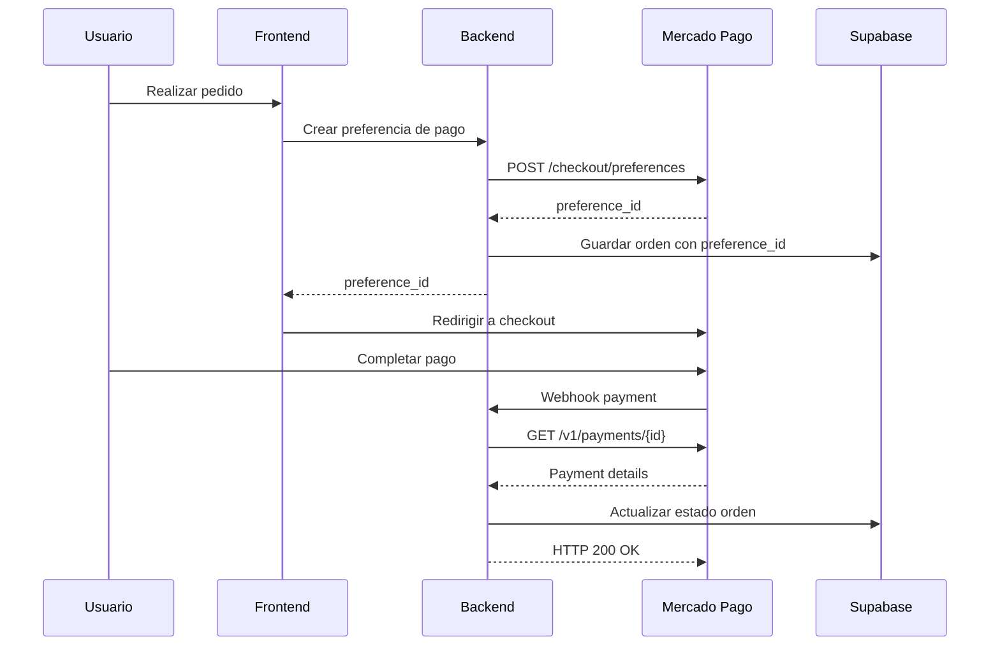
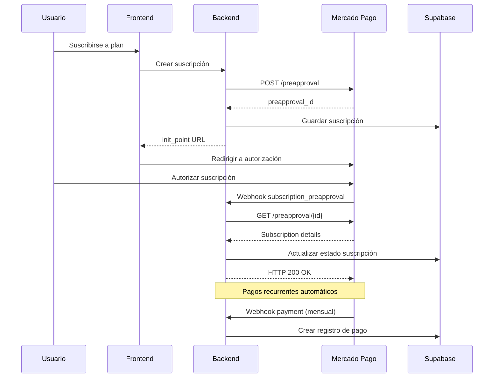

# Guía de Implementación - Webhooks Mercado Pago

## 1. Flujos de Trabajo Principales

### 1.1 Flujo de Pago Único


### 1.2 Flujo de Suscripción


## 2. Implementación Paso a Paso

### 2.1 Configuración Inicial

#### Paso 1: Instalar Dependencias
```bash
npm install @supabase/supabase-js axios crypto winston
```

#### Paso 2: Configurar Variables de Entorno
```env
# .env.local
MERCADOPAGO_ACCESS_TOKEN=APP_USR-your-access-token
MERCADOPAGO_PUBLIC_KEY=APP_USR-your-public-key
MERCADOPAGO_WEBHOOK_SECRET=your-webhook-secret
NEXT_PUBLIC_SUPABASE_URL=https://your-project.supabase.co
SUPABASE_SERVICE_ROLE_KEY=your-service-role-key
```

#### Paso 3: Crear Utilidades Base
```javascript
// lib/mercadopago.js
import axios from 'axios';

export const mpApi = axios.create({
  baseURL: process.env.NODE_ENV === 'production' 
    ? 'https://api.mercadopago.com' 
    : 'https://api.mercadopago.com',
  headers: {
    'Authorization': `Bearer ${process.env.MERCADOPAGO_ACCESS_TOKEN}`,
    'Content-Type': 'application/json'
  },
  timeout: 10000
});

// Interceptor para logging
mpApi.interceptors.request.use(request => {
  console.log('MP API Request:', {
    method: request.method,
    url: request.url,
    data: request.data
  });
  return request;
});

mpApi.interceptors.response.use(
  response => response,
  error => {
    console.error('MP API Error:', {
      status: error.response?.status,
      data: error.response?.data,
      message: error.message
    });
    throw error;
  }
);
```

### 2.2 Implementación del Endpoint Principal

```javascript
// pages/api/webhooks/mercadopago.js
import { createClient } from '@supabase/supabase-js';
import crypto from 'crypto';
import { mpApi } from '../../../lib/mercadopago';

const supabase = createClient(
  process.env.NEXT_PUBLIC_SUPABASE_URL,
  process.env.SUPABASE_SERVICE_ROLE_KEY
);

export default async function handler(req, res) {
  // Solo aceptar POST
  if (req.method !== 'POST') {
    return res.status(405).json({ error: 'Method not allowed' });
  }

  const startTime = Date.now();
  let webhookId = null;

  try {
    console.log('Webhook received:', {
      headers: req.headers,
      body: req.body,
      timestamp: new Date().toISOString()
    });

    // 1. Validar firma
    if (!validateSignature(req)) {
      console.error('Invalid webhook signature');
      return res.status(401).json({ error: 'Invalid signature' });
    }

    // 2. Extraer datos del webhook
    const webhookData = extractWebhookData(req);
    webhookId = webhookData.id;

    // 3. Verificar si ya fue procesado
    const { data: existing } = await supabase
      .from('mercadopago_webhooks')
      .select('id, processed')
      .eq('webhook_id', webhookId)
      .single();

    if (existing?.processed) {
      console.log(`Webhook ${webhookId} already processed`);
      return res.status(200).json({ status: 'already_processed' });
    }

    // 4. Almacenar webhook
    const storedWebhook = await storeWebhook(webhookData);

    // 5. Procesar evento
    await processWebhookEvent(webhookData, storedWebhook.id);

    // 6. Marcar como procesado
    await supabase
      .from('mercadopago_webhooks')
      .update({ 
        processed: true, 
        processed_at: new Date().toISOString(),
        processing_time_ms: Date.now() - startTime
      })
      .eq('id', storedWebhook.id);

    console.log(`Webhook ${webhookId} processed successfully in ${Date.now() - startTime}ms`);
    res.status(200).json({ status: 'success' });

  } catch (error) {
    console.error('Webhook processing error:', {
      webhookId,
      error: error.message,
      stack: error.stack,
      processingTime: Date.now() - startTime
    });

    // Actualizar registro con error
    if (webhookId) {
      await supabase
        .from('mercadopago_webhooks')
        .update({ 
          error_message: error.message,
          retry_count: 1,
          processing_time_ms: Date.now() - startTime
        })
        .eq('webhook_id', webhookId);
    }

    res.status(500).json({ error: 'Internal server error' });
  }
}

function validateSignature(req) {
  const signature = req.headers['x-signature'];
  const requestId = req.headers['x-request-id'];
  
  if (!signature || !requestId) {
    return false;
  }
  
  try {
    const parts = signature.split(',');
    let ts, hash;
    
    parts.forEach(part => {
      const [key, value] = part.split('=');
      if (key.trim() === 'ts') ts = value;
      if (key.trim() === 'v1') hash = value;
    });
    
    if (!ts || !hash) {
      return false;
    }
    
    // Verificar que el timestamp no sea muy antiguo (5 minutos)
    const now = Math.floor(Date.now() / 1000);
    if (now - parseInt(ts) > 300) {
      console.error('Webhook timestamp too old');
      return false;
    }
    
    const dataId = req.body.data?.id || '';
    const payload = `id:${dataId};request-id:${requestId};ts:${ts};`;
    
    const expectedHash = crypto
      .createHmac('sha256', process.env.MERCADOPAGO_WEBHOOK_SECRET)
      .update(payload)
      .digest('hex');
    
    return hash === expectedHash;
  } catch (error) {
    console.error('Signature validation error:', error);
    return false;
  }
}

function extractWebhookData(req) {
  return {
    id: req.body.id,
    topic: req.body.topic,
    resource_id: req.body.resource,
    user_id: req.body.user_id,
    application_id: req.body.application_id,
    type: req.body.type,
    data: req.body.data,
    action: req.body.action,
    api_version: req.body.api_version,
    live_mode: req.body.live_mode,
    date_created: req.body.date_created,
    raw_data: req.body
  };
}
```

### 2.3 Procesadores de Eventos Específicos

#### Procesador de Pagos
```javascript
// lib/webhook-processors/payment.js
import { mpApi } from '../mercadopago';
import { createClient } from '@supabase/supabase-js';

const supabase = createClient(
  process.env.NEXT_PUBLIC_SUPABASE_URL,
  process.env.SUPABASE_SERVICE_ROLE_KEY
);

export async function processPaymentEvent(paymentId) {
  console.log(`Processing payment event: ${paymentId}`);
  
  try {
    // 1. Obtener información del pago
    const { data: paymentInfo } = await mpApi.get(`/v1/payments/${paymentId}`);
    
    console.log('Payment info:', {
      id: paymentInfo.id,
      status: paymentInfo.status,
      external_reference: paymentInfo.external_reference,
      transaction_amount: paymentInfo.transaction_amount
    });
    
    // 2. Buscar orden por external_reference o payment_id
    let order = null;
    
    if (paymentInfo.external_reference) {
      const { data } = await supabase
        .from('orders')
        .select('*')
        .eq('id', paymentInfo.external_reference)
        .single();
      order = data;
    }
    
    if (!order) {
      const { data } = await supabase
        .from('orders')
        .select('*')
        .eq('mercadopago_payment_id', paymentId)
        .single();
      order = data;
    }
    
    if (!order) {
      throw new Error(`Order not found for payment ${paymentId}`);
    }
    
    // 3. Actualizar información del pago en la orden
    const updateData = {
      mercadopago_payment_id: paymentInfo.id,
      status: mapPaymentStatusToOrderStatus(paymentInfo.status),
      updated_at: new Date().toISOString()
    };
    
    // Agregar información adicional según el estado
    if (paymentInfo.status === 'approved') {
      updateData.paid_at = paymentInfo.date_approved;
      updateData.payment_method = paymentInfo.payment_method_id;
      updateData.transaction_amount = paymentInfo.transaction_amount;
    } else if (paymentInfo.status === 'rejected') {
      updateData.rejection_reason = paymentInfo.status_detail;
    }
    
    const { error } = await supabase
      .from('orders')
      .update(updateData)
      .eq('id', order.id);
    
    if (error) {
      throw new Error(`Failed to update order: ${error.message}`);
    }
    
    // 4. Procesar según el estado
    switch (paymentInfo.status) {
      case 'approved':
        await handleApprovedPayment(order, paymentInfo);
        break;
      case 'rejected':
        await handleRejectedPayment(order, paymentInfo);
        break;
      case 'refunded':
        await handleRefundedPayment(order, paymentInfo);
        break;
    }
    
    console.log(`Payment ${paymentId} processed successfully`);
    
  } catch (error) {
    console.error(`Error processing payment ${paymentId}:`, error);
    throw error;
  }
}

function mapPaymentStatusToOrderStatus(mpStatus) {
  const statusMap = {
    'pending': 'pending',
    'approved': 'paid',
    'authorized': 'paid',
    'in_process': 'processing',
    'in_mediation': 'disputed',
    'rejected': 'failed',
    'cancelled': 'cancelled',
    'refunded': 'refunded',
    'charged_back': 'chargeback'
  };
  
  return statusMap[mpStatus] || 'unknown';
}

async function handleApprovedPayment(order, paymentInfo) {
  console.log(`Handling approved payment for order ${order.id}`);
  
  try {
    // 1. Crear registro en subscription_payments si es suscripción
    if (order.subscription_id) {
      await supabase.from('subscription_payments').insert({
        subscription_id: order.subscription_id,
        amount: paymentInfo.transaction_amount,
        currency: paymentInfo.currency_id,
        mercadopago_payment_id: paymentInfo.id,
        payment_method: paymentInfo.payment_method_id,
        status: 'completed',
        paid_at: paymentInfo.date_approved,
        created_at: new Date().toISOString()
      });
    }
    
    // 2. Enviar notificación de confirmación (implementar según necesidades)
    await sendPaymentConfirmationEmail(order, paymentInfo);
    
    // 3. Actualizar inventario si es necesario
    if (order.type === 'product') {
      await updateProductInventory(order);
    }
    
    console.log(`Approved payment handled for order ${order.id}`);
    
  } catch (error) {
    console.error(`Error handling approved payment:`, error);
    // No relanzar el error para no fallar el webhook
  }
}

async function handleRejectedPayment(order, paymentInfo) {
  console.log(`Handling rejected payment for order ${order.id}`);
  
  try {
    // 1. Liberar inventario reservado
    if (order.type === 'product') {
      await releaseReservedInventory(order);
    }
    
    // 2. Enviar notificación de pago rechazado
    await sendPaymentRejectedEmail(order, paymentInfo);
    
    console.log(`Rejected payment handled for order ${order.id}`);
    
  } catch (error) {
    console.error(`Error handling rejected payment:`, error);
  }
}

// Funciones auxiliares (implementar según necesidades)
async function sendPaymentConfirmationEmail(order, paymentInfo) {
  // Implementar envío de email
  console.log(`Sending confirmation email for order ${order.id}`);
}

async function sendPaymentRejectedEmail(order, paymentInfo) {
  // Implementar envío de email
  console.log(`Sending rejection email for order ${order.id}`);
}

async function updateProductInventory(order) {
  // Implementar actualización de inventario
  console.log(`Updating inventory for order ${order.id}`);
}

async function releaseReservedInventory(order) {
  // Implementar liberación de inventario
  console.log(`Releasing inventory for order ${order.id}`);
}
```

#### Procesador de Suscripciones
```javascript
// lib/webhook-processors/subscription.js
import { mpApi } from '../mercadopago';
import { createClient } from '@supabase/supabase-js';

const supabase = createClient(
  process.env.NEXT_PUBLIC_SUPABASE_URL,
  process.env.SUPABASE_SERVICE_ROLE_KEY
);

export async function processSubscriptionEvent(subscriptionId) {
  console.log(`Processing subscription event: ${subscriptionId}`);
  
  try {
    // 1. Obtener información de la suscripción
    const { data: subscriptionInfo } = await mpApi.get(`/preapproval/${subscriptionId}`);
    
    console.log('Subscription info:', {
      id: subscriptionInfo.id,
      status: subscriptionInfo.status,
      external_reference: subscriptionInfo.external_reference
    });
    
    // 2. Buscar suscripción en la base de datos
    let subscription = null;
    
    if (subscriptionInfo.external_reference) {
      const { data } = await supabase
        .from('user_subscriptions')
        .select('*')
        .eq('id', subscriptionInfo.external_reference)
        .single();
      subscription = data;
    }
    
    if (!subscription) {
      const { data } = await supabase
        .from('user_subscriptions')
        .select('*')
        .eq('mercadopago_subscription_id', subscriptionId)
        .single();
      subscription = data;
    }
    
    if (!subscription) {
      throw new Error(`Subscription not found: ${subscriptionId}`);
    }
    
    // 3. Actualizar estado de la suscripción
    const newStatus = mapSubscriptionStatus(subscriptionInfo.status);
    const updateData = {
      mercadopago_subscription_id: subscriptionInfo.id,
      status: newStatus,
      updated_at: new Date().toISOString()
    };
    
    // Agregar fechas según el estado
    if (subscriptionInfo.status === 'authorized') {
      updateData.activated_at = new Date().toISOString();
      updateData.next_billing_date = subscriptionInfo.next_payment_date;
    } else if (subscriptionInfo.status === 'cancelled') {
      updateData.cancelled_at = new Date().toISOString();
    }
    
    const { error } = await supabase
      .from('user_subscriptions')
      .update(updateData)
      .eq('id', subscription.id);
    
    if (error) {
      throw new Error(`Failed to update subscription: ${error.message}`);
    }
    
    // 4. Procesar según el estado
    switch (subscriptionInfo.status) {
      case 'authorized':
        await handleAuthorizedSubscription(subscription, subscriptionInfo);
        break;
      case 'cancelled':
        await handleCancelledSubscription(subscription, subscriptionInfo);
        break;
      case 'paused':
        await handlePausedSubscription(subscription, subscriptionInfo);
        break;
    }
    
    console.log(`Subscription ${subscriptionId} processed successfully`);
    
  } catch (error) {
    console.error(`Error processing subscription ${subscriptionId}:`, error);
    throw error;
  }
}

function mapSubscriptionStatus(mpStatus) {
  const statusMap = {
    'pending': 'pending',
    'authorized': 'active',
    'paused': 'paused',
    'cancelled': 'cancelled',
    'finished': 'expired'
  };
  
  return statusMap[mpStatus] || 'unknown';
}

async function handleAuthorizedSubscription(subscription, subscriptionInfo) {
  console.log(`Handling authorized subscription ${subscription.id}`);
  
  try {
    // 1. Activar beneficios de la suscripción
    await activateSubscriptionBenefits(subscription);
    
    // 2. Programar próxima notificación
    await scheduleNextBillingNotification(subscription, subscriptionInfo.next_payment_date);
    
    // 3. Enviar email de bienvenida
    await sendSubscriptionWelcomeEmail(subscription);
    
    console.log(`Authorized subscription handled: ${subscription.id}`);
    
  } catch (error) {
    console.error(`Error handling authorized subscription:`, error);
  }
}

async function handleCancelledSubscription(subscription, subscriptionInfo) {
  console.log(`Handling cancelled subscription ${subscription.id}`);
  
  try {
    // 1. Desactivar beneficios (al final del período actual)
    await scheduleSubscriptionDeactivation(subscription);
    
    // 2. Enviar email de cancelación
    await sendSubscriptionCancelledEmail(subscription);
    
    console.log(`Cancelled subscription handled: ${subscription.id}`);
    
  } catch (error) {
    console.error(`Error handling cancelled subscription:`, error);
  }
}

// Funciones auxiliares
async function activateSubscriptionBenefits(subscription) {
  console.log(`Activating benefits for subscription ${subscription.id}`);
  // Implementar lógica específica de beneficios
}

async function scheduleNextBillingNotification(subscription, nextBillingDate) {
  console.log(`Scheduling billing notification for ${subscription.id}`);
  // Implementar programación de notificaciones
}

async function sendSubscriptionWelcomeEmail(subscription) {
  console.log(`Sending welcome email for subscription ${subscription.id}`);
  // Implementar envío de email
}
```

## 3. Herramientas de Debugging y Monitoreo

### 3.1 Dashboard de Webhooks
```javascript
// pages/api/admin/webhooks/stats.js
export default async function handler(req, res) {
  if (req.method !== 'GET') {
    return res.status(405).json({ error: 'Method not allowed' });
  }
  
  try {
    const timeframe = req.query.timeframe || '24h';
    const hours = timeframe === '24h' ? 24 : timeframe === '7d' ? 168 : 24;
    const since = new Date(Date.now() - (hours * 60 * 60 * 1000));
    
    const { data: webhooks } = await supabase
      .from('mercadopago_webhooks')
      .select('*')
      .gte('created_at', since.toISOString())
      .order('created_at', { ascending: false });
    
    const stats = {
      total: webhooks.length,
      processed: webhooks.filter(w => w.processed).length,
      failed: webhooks.filter(w => !w.processed && w.retry_count >= 5).length,
      pending: webhooks.filter(w => !w.processed && w.retry_count < 5).length,
      byTopic: {},
      byStatus: {},
      avgProcessingTime: 0,
      recentWebhooks: webhooks.slice(0, 10)
    };
    
    // Calcular estadísticas por tópico
    webhooks.forEach(w => {
      stats.byTopic[w.topic] = (stats.byTopic[w.topic] || 0) + 1;
      
      const status = w.processed ? 'success' : 
                    w.retry_count >= 5 ? 'failed' : 'pending';
      stats.byStatus[status] = (stats.byStatus[status] || 0) + 1;
    });
    
    // Calcular tiempo promedio de procesamiento
    const processedWebhooks = webhooks.filter(w => w.processing_time_ms);
    if (processedWebhooks.length > 0) {
      stats.avgProcessingTime = processedWebhooks.reduce(
        (sum, w) => sum + w.processing_time_ms, 0
      ) / processedWebhooks.length;
    }
    
    res.status(200).json(stats);
    
  } catch (error) {
    console.error('Error getting webhook stats:', error);
    res.status(500).json({ error: 'Internal server error' });
  }
}
```

### 3.2 Reprocessar Webhooks Fallidos
```javascript
// pages/api/admin/webhooks/retry.js
export default async function handler(req, res) {
  if (req.method !== 'POST') {
    return res.status(405).json({ error: 'Method not allowed' });
  }
  
  try {
    const { webhookId } = req.body;
    
    // Obtener webhook fallido
    const { data: webhook } = await supabase
      .from('mercadopago_webhooks')
      .select('*')
      .eq('id', webhookId)
      .single();
    
    if (!webhook) {
      return res.status(404).json({ error: 'Webhook not found' });
    }
    
    if (webhook.processed) {
      return res.status(400).json({ error: 'Webhook already processed' });
    }
    
    // Reintentar procesamiento
    await processWebhookEvent(webhook.raw_data, webhook.id);
    
    // Marcar como procesado
    await supabase
      .from('mercadopago_webhooks')
      .update({ 
        processed: true, 
        processed_at: new Date().toISOString(),
        error_message: null
      })
      .eq('id', webhook.id);
    
    res.status(200).json({ status: 'success' });
    
  } catch (error) {
    console.error('Error retrying webhook:', error);
    res.status(500).json({ error: error.message });
  }
}
```

## 4. Testing y Validación

### 4.1 Test de Integración
```javascript
// tests/webhooks.integration.test.js
import { createMocks } from 'node-mocks-http';
import handler from '../pages/api/webhooks/mercadopago';
import crypto from 'crypto';

describe('Mercado Pago Webhooks Integration', () => {
  const mockWebhookSecret = 'test-secret';
  
  beforeAll(() => {
    process.env.MERCADOPAGO_WEBHOOK_SECRET = mockWebhookSecret;
  });
  
  function createValidSignature(dataId, requestId, timestamp) {
    const payload = `id:${dataId};request-id:${requestId};ts:${timestamp};`;
    const hash = crypto
      .createHmac('sha256', mockWebhookSecret)
      .update(payload)
      .digest('hex');
    return `ts=${timestamp},v1=${hash}`;
  }
  
  it('should process payment webhook successfully', async () => {
    const timestamp = Math.floor(Date.now() / 1000);
    const requestId = 'test-request-123';
    const dataId = 'payment-456';
    
    const { req, res } = createMocks({
      method: 'POST',
      headers: {
        'x-signature': createValidSignature(dataId, requestId, timestamp),
        'x-request-id': requestId
      },
      body: {
        id: 'webhook-123',
        topic: 'payment',
        resource: 'payment-456',
        data: { id: dataId },
        live_mode: false,
        date_created: new Date().toISOString()
      }
    });

    await handler(req, res);
    expect(res._getStatusCode()).toBe(200);
    
    const response = JSON.parse(res._getData());
    expect(response.status).toBe('success');
  });
  
  it('should reject webhook with invalid signature', async () => {
    const { req, res } = createMocks({
      method: 'POST',
      headers: {
        'x-signature': 'ts=1234567890,v1=invalid_hash',
        'x-request-id': 'test-request-id'
      },
      body: {
        id: 'webhook-123',
        topic: 'payment',
        data: { id: 'payment-456' }
      }
    });

    await handler(req, res);
    expect(res._getStatusCode()).toBe(401);
  });
});
```

### 4.2 Simulador de Webhooks para Testing
```javascript
// scripts/simulate-webhook.js
import crypto from 'crypto';
import axios from 'axios';

const WEBHOOK_URL = 'http://localhost:3000/api/webhooks/mercadopago';
const WEBHOOK_SECRET = process.env.MERCADOPAGO_WEBHOOK_SECRET;

function createWebhookSignature(dataId, requestId) {
  const timestamp = Math.floor(Date.now() / 1000);
  const payload = `id:${dataId};request-id:${requestId};ts:${timestamp};`;
  const hash = crypto
    .createHmac('sha256', WEBHOOK_SECRET)
    .update(payload)
    .digest('hex');
  return `ts=${timestamp},v1=${hash}`;
}

async function simulatePaymentWebhook(paymentId, orderId) {
  const requestId = `test-${Date.now()}`;
  const webhookData = {
    id: `webhook-${Date.now()}`,
    topic: 'payment',
    resource: paymentId,
    data: { id: paymentId },
    external_reference: orderId,
    live_mode: false,
    date_created: new Date().toISOString()
  };
  
  try {
    const response = await axios.post(WEBHOOK_URL, webhookData, {
      headers: {
        'x-signature': createWebhookSignature(paymentId, requestId),
        'x-request-id': requestId,
        'content-type': 'application/json'
      }
    });
    
    console.log('Webhook simulation successful:', response.data);
  } catch (error) {
    console.error('Webhook simulation failed:', error.response?.data || error.message);
  }
}

// Uso
if (process.argv.length < 4) {
  console.log('Usage: node simulate-webhook.js <paymentId> <orderId>');
  process.exit(1);
}

const [,, paymentId, orderId] = process.argv;
simulatePaymentWebhook(paymentId, orderId);
```

## 5. Checklist de Implementación

### ✅ Configuración Inicial
- [ ] Variables de entorno configuradas
- [ ] Dependencias instaladas
- [ ] Tabla mercadopago_webhooks creada
- [ ] Campos MP agregados a orders y user_subscriptions

### ✅ Endpoint Principal
- [ ] Validación de firma implementada
- [ ] Manejo de duplicados
- [ ] Logging completo
- [ ] Manejo de errores

### ✅ Procesadores de Eventos
- [ ] Procesador de pagos
- [ ] Procesador de suscripciones
- [ ] Procesador de órdenes de comercio
- [ ] Mapeo de estados

### ✅ Seguridad
- [ ] Validación HMAC-SHA256
- [ ] Verificación de timestamp
- [ ] Rate limiting (opcional)
- [ ] Logs seguros (sin datos sensibles)

### ✅ Monitoreo
- [ ] Dashboard de estadísticas
- [ ] Sistema de alertas
- [ ] Logs estructurados
- [ ] Métricas de rendimiento

### ✅ Testing
- [ ] Tests unitarios
- [ ] Tests de integración
- [ ] Simulador de webhooks
- [ ] Validación en ambiente de pruebas

### ✅ Deployment
- [ ] Configuración en producción
- [ ] URL pública configurada
- [ ] SSL/TLS habilitado
- [ ] Webhooks configurados en MP

Esta guía proporciona una implementación completa y robusta del sistema de webhooks de Mercado Pago con todas las mejores prácticas de seguridad, monitoreo y mantenimiento.