# 🔄 Nueva Arquitectura de Suscripciones Sin Plan Asociado

## 1. Resumen Ejecutivo

Migración del sistema actual de suscripciones basado en links predefinidos hacia un sistema dinámico de **suscripciones sin plan asociado** utilizando la API `/preapproval` de MercadoPago. <mcreference link="https://www.mercadopago.com.mx/developers/es/docs/subscriptions/integration-configuration/subscription-no-associated-plan" index="0">0</mcreference>

### Beneficios del Nuevo Sistema:
- ✅ **Suscripciones dinámicas** específicas para cada producto y recurrencia
- ✅ **Validación por webhooks** (no dependiente de redirects)
- ✅ **Gestión automática de reintentos** (hasta 4 intentos por cuota)
- ✅ **Flexibilidad total** en precios y recurrencias
- ✅ **Mejor experiencia de usuario** con estados claros

## 2. Arquitectura del Nuevo Sistema

### 2.1 Flujo General

```mermaid
graph TD
    A[Usuario selecciona producto + recurrencia] --> B[Sistema crea preapproval en MercadoPago]
    B --> C{Tipo de suscripción}
    C -->|Con tarjeta| D[Suscripción autorizada]
    C -->|Sin tarjeta| E[Suscripción pendiente]
    D --> F[Cobro automático primera cuota]
    E --> G[Usuario completa pago]
    F --> H[Webhook valida pago]
    G --> H
    H --> I[Suscripción activa]
    I --> J[Cobros recurrentes automáticos]
    J --> K[Webhooks validan cada cuota]
```



### 2.2 Estados de Suscripción

| Estado | Descripción | Acción Requerida |
|--------|-------------|------------------|
| `pending` | Suscripción creada, esperando primer pago | Usuario debe completar pago |
| `authorized` | Suscripción con método de pago definido | Cobro automático en 1 hora |
| `active` | Suscripción activa con cobros recurrentes | Ninguna |
| `paused` | Suscripción pausada temporalmente | Reactivar cuando sea necesario |
| `cancelled` | Suscripción cancelada permanentemente | No reversible |

## 3. Implementación Técnica

### 3.1 Nuevos Endpoints API

#### 3.1.1 Crear Suscripción Dinámica
```typescript
POST /api/subscriptions/create-dynamic
```

**Request Body:**
```json
{
  "user_id": "uuid",
  "product_id": "uuid", 
  "product_name": "Alimento Premium Perro Adulto",
  "frequency": 1,
  "frequency_type": "months", // "days", "months"
  "transaction_amount": 850.00,
  "currency_id": "MXN",
  "payer_email": "cliente@email.com",
  "card_token_id": "optional_card_token", // Para suscripciones autorizadas
  "start_date": "2024-01-15T10:00:00.000Z",
  "end_date": "2025-01-15T10:00:00.000Z" // Opcional
}
```

**Response:**
```json
{
  "success": true,
  "subscription": {
    "id": "preapproval_id_from_mp",
    "external_reference": "SUB-PROD123-USER456-20240115",
    "status": "pending", // o "authorized"
    "init_point": "https://www.mercadopago.com/mla/debits/new?preapproval_id=xxx",
    "first_payment_date": "2024-01-15T10:00:00.000Z",
    "next_payment_date": "2024-02-15T10:00:00.000Z"
  }
}
```

#### 3.1.2 Actualizar Método de Pago
```typescript
PUT /api/subscriptions/{preapproval_id}/payment-method
```

#### 3.1.3 Gestionar Estado de Suscripción
```typescript
PUT /api/subscriptions/{preapproval_id}/status
```

### 3.2 Modelo de Datos Actualizado

#### 3.2.1 Tabla: `dynamic_subscriptions`
```sql
CREATE TABLE dynamic_subscriptions (
    id UUID PRIMARY KEY DEFAULT gen_random_uuid(),
    user_id UUID NOT NULL REFERENCES profiles(id),
    product_id UUID NOT NULL REFERENCES products(id),
    
    -- Datos de MercadoPago
    mercadopago_preapproval_id VARCHAR(255) UNIQUE NOT NULL,
    external_reference VARCHAR(255) UNIQUE NOT NULL,
    
    -- Configuración de suscripción
    product_name VARCHAR(255) NOT NULL,
    transaction_amount DECIMAL(10,2) NOT NULL,
    currency_id VARCHAR(3) DEFAULT 'MXN',
    frequency INTEGER NOT NULL,
    frequency_type VARCHAR(20) NOT NULL, -- 'days', 'months'
    
    -- Estados y fechas
    status VARCHAR(50) NOT NULL DEFAULT 'pending',
    start_date TIMESTAMP WITH TIME ZONE NOT NULL,
    end_date TIMESTAMP WITH TIME ZONE,
    next_payment_date TIMESTAMP WITH TIME ZONE,
    last_payment_date TIMESTAMP WITH TIME ZONE,
    
    -- Información del pagador
    payer_email VARCHAR(255) NOT NULL,
    payment_method_id VARCHAR(100),
    card_token_id VARCHAR(255),
    
    -- URLs y configuración
    back_url TEXT,
    init_point TEXT,
    
    -- Metadatos
    created_at TIMESTAMP WITH TIME ZONE DEFAULT NOW(),
    updated_at TIMESTAMP WITH TIME ZONE DEFAULT NOW(),
    cancelled_at TIMESTAMP WITH TIME ZONE,
    
    -- Estadísticas
    successful_payments INTEGER DEFAULT 0,
    failed_payments INTEGER DEFAULT 0,
    total_collected DECIMAL(10,2) DEFAULT 0.00
);

-- Índices
CREATE INDEX idx_dynamic_subscriptions_user_id ON dynamic_subscriptions(user_id);
CREATE INDEX idx_dynamic_subscriptions_mp_id ON dynamic_subscriptions(mercadopago_preapproval_id);
CREATE INDEX idx_dynamic_subscriptions_status ON dynamic_subscriptions(status);
CREATE INDEX idx_dynamic_subscriptions_next_payment ON dynamic_subscriptions(next_payment_date);
```

#### 3.2.2 Tabla: `subscription_payments` (Historial de cuotas)
```sql
CREATE TABLE subscription_payments (
    id UUID PRIMARY KEY DEFAULT gen_random_uuid(),
    subscription_id UUID NOT NULL REFERENCES dynamic_subscriptions(id),
    
    -- Datos de MercadoPago
    mercadopago_payment_id VARCHAR(255) UNIQUE,
    mercadopago_preapproval_id VARCHAR(255) NOT NULL,
    
    -- Información del pago
    transaction_amount DECIMAL(10,2) NOT NULL,
    currency_id VARCHAR(3) DEFAULT 'MXN',
    payment_method_id VARCHAR(100),
    
    -- Estados y fechas
    status VARCHAR(50) NOT NULL, -- 'processed', 'waiting_for_gateway', 'recycling'
    payment_status VARCHAR(50), -- 'approved', 'rejected', 'pending'
    scheduled_date TIMESTAMP WITH TIME ZONE NOT NULL,
    processed_date TIMESTAMP WITH TIME ZONE,
    
    -- Reintentos
    retry_count INTEGER DEFAULT 0,
    max_retries INTEGER DEFAULT 4,
    next_retry_date TIMESTAMP WITH TIME ZONE,
    
    -- Metadatos
    created_at TIMESTAMP WITH TIME ZONE DEFAULT NOW(),
    updated_at TIMESTAMP WITH TIME ZONE DEFAULT NOW(),
    
    -- Datos adicionales del webhook
    webhook_data JSONB
);

-- Índices
CREATE INDEX idx_subscription_payments_subscription_id ON subscription_payments(subscription_id);
CREATE INDEX idx_subscription_payments_mp_payment_id ON subscription_payments(mercadopago_payment_id);
CREATE INDEX idx_subscription_payments_status ON subscription_payments(status);
CREATE INDEX idx_subscription_payments_scheduled_date ON subscription_payments(scheduled_date);
```

## 4. Integración con MercadoPago

### 4.1 Crear Suscripción con Pago Pendiente <mcreference link="https://www.mercadopago.com.mx/developers/es/docs/subscriptions/integration-configuration/subscription-no-associated-plan/pending-payments" index="2">2</mcreference>

```typescript
async function createPendingSubscription(subscriptionData: SubscriptionRequest) {
  const preapprovalData = {
    reason: subscriptionData.product_name,
    external_reference: generateExternalReference(subscriptionData),
    payer_email: subscriptionData.payer_email,
    auto_recurring: {
      frequency: subscriptionData.frequency,
      frequency_type: subscriptionData.frequency_type,
      start_date: subscriptionData.start_date,
      end_date: subscriptionData.end_date,
      transaction_amount: subscriptionData.transaction_amount,
      currency_id: subscriptionData.currency_id
    },
    back_url: `${process.env.NEXT_PUBLIC_BASE_URL}/suscripcion/exito`,
    status: "pending"
  };

  const response = await fetch('https://api.mercadopago.com/preapproval', {
    method: 'POST',
    headers: {
      'Authorization': `Bearer ${process.env.MERCADOPAGO_ACCESS_TOKEN}`,
      'Content-Type': 'application/json'
    },
    body: JSON.stringify(preapprovalData)
  });

  return await response.json();
}
```

### 4.2 Crear Suscripción con Pago Autorizado <mcreference link="https://www.mercadopago.com.mx/developers/es/docs/subscriptions/integration-configuration/subscription-no-associated-plan/authorized-payments" index="1">1</mcreference>

```typescript
async function createAuthorizedSubscription(subscriptionData: SubscriptionRequest) {
  const preapprovalData = {
    reason: subscriptionData.product_name,
    external_reference: generateExternalReference(subscriptionData),
    payer_email: subscriptionData.payer_email,
    card_token_id: subscriptionData.card_token_id,
    auto_recurring: {
      frequency: subscriptionData.frequency,
      frequency_type: subscriptionData.frequency_type,
      start_date: subscriptionData.start_date,
      end_date: subscriptionData.end_date,
      transaction_amount: subscriptionData.transaction_amount,
      currency_id: subscriptionData.currency_id
    },
    back_url: `${process.env.NEXT_PUBLIC_BASE_URL}/suscripcion/exito`,
    status: "authorized"
  };

  const response = await fetch('https://api.mercadopago.com/preapproval', {
    method: 'POST',
    headers: {
      'Authorization': `Bearer ${process.env.MERCADOPAGO_ACCESS_TOKEN}`,
      'Content-Type': 'application/json'
    },
    body: JSON.stringify(preapprovalData)
  });

  return await response.json();
}
```

## 5. Sistema de Webhooks Mejorado

### 5.1 Webhook para Suscripciones
```typescript
// /api/mercadopago/webhook-subscriptions
export async function POST(request: NextRequest) {
  const body = await request.json();
  
  switch (body.type) {
    case 'subscription_preapproval':
      await handleSubscriptionEvent(body.data);
      break;
    case 'subscription_authorized_payment':
      await handleSubscriptionPayment(body.data);
      break;
    case 'subscription_payment':
      await handleRecurringPayment(body.data);
      break;
  }
  
  return NextResponse.json({ received: true });
}
```

### 5.2 Manejo de Estados de Cuotas <mcreference link="https://www.mercadopago.com.mx/developers/es/docs/subscriptions/integration-configuration/subscription-no-associated-plan/authorized-payments" index="1">1</mcreference>

```typescript
async function handleRecurringPayment(paymentData: any) {
  const payment = await getPaymentFromMercadoPago(paymentData.id);
  
  switch (payment.status) {
    case 'approved':
      // Cuota procesada exitosamente
      await updatePaymentStatus(payment.id, 'processed', 'approved');
      await updateSubscriptionStats(payment.preapproval_id, 'success');
      break;
      
    case 'rejected':
      // Cuota rechazada - iniciar reintentos
      await handlePaymentRetry(payment);
      break;
      
    case 'pending':
      // Cuota en espera
      await updatePaymentStatus(payment.id, 'waiting_for_gateway', 'pending');
      break;
  }
}

async function handlePaymentRetry(payment: any) {
  const currentRetries = await getPaymentRetryCount(payment.id);
  
  if (currentRetries < 4) {
    // Programar reintento dentro de los próximos 10 días
    const nextRetryDate = calculateNextRetryDate(currentRetries);
    await schedulePaymentRetry(payment.id, nextRetryDate);
    await updatePaymentStatus(payment.id, 'recycling', 'rejected');
  } else {
    // Máximo de reintentos alcanzado
    await updatePaymentStatus(payment.id, 'processed', 'rejected');
    await checkSubscriptionCancellation(payment.preapproval_id);
  }
}
```

## 6. Flujo de Usuario Frontend

### 6.1 Componente de Suscripción Mejorado

```typescript
// components/subscription/DynamicSubscriptionCreator.tsx
export function DynamicSubscriptionCreator({ product }: { product: Product }) {
  const [frequency, setFrequency] = useState(1);
  const [frequencyType, setFrequencyType] = useState('months');
  const [paymentMethod, setPaymentMethod] = useState<'pending' | 'authorized'>('pending');
  
  const handleCreateSubscription = async () => {
    const subscriptionData = {
      product_id: product.id,
      product_name: product.name,
      frequency,
      frequency_type: frequencyType,
      transaction_amount: calculateSubscriptionPrice(product, frequency, frequencyType),
      currency_id: 'MXN',
      payer_email: user.email,
      card_token_id: paymentMethod === 'authorized' ? selectedCard?.token : undefined
    };
    
    const response = await fetch('/api/subscriptions/create-dynamic', {
      method: 'POST',
      headers: { 'Content-Type': 'application/json' },
      body: JSON.stringify(subscriptionData)
    });
    
    const result = await response.json();
    
    if (result.success) {
      // Redirigir al checkout de MercadoPago
      window.location.href = result.subscription.init_point;
    }
  };
  
  return (
    <div className="subscription-creator">
      <h3>Suscríbete a {product.name}</h3>
      
      <div className="frequency-selector">
        <label>Frecuencia:</label>
        <select value={frequency} onChange={(e) => setFrequency(Number(e.target.value))}>
          <option value={1}>1</option>
          <option value={2}>2</option>
          <option value={3}>3</option>
        </select>
        
        <select value={frequencyType} onChange={(e) => setFrequencyType(e.target.value)}>
          <option value="months">Meses</option>
          <option value="days">Días</option>
        </select>
      </div>
      
      <div className="payment-method-selector">
        <label>
          <input 
            type="radio" 
            value="pending" 
            checked={paymentMethod === 'pending'}
            onChange={(e) => setPaymentMethod(e.target.value as 'pending')}
          />
          Elegir método de pago después
        </label>
        
        <label>
          <input 
            type="radio" 
            value="authorized" 
            checked={paymentMethod === 'authorized'}
            onChange={(e) => setPaymentMethod(e.target.value as 'authorized')}
          />
          Usar tarjeta guardada (cobro automático)
        </label>
      </div>
      
      <div className="price-preview">
        <p>Precio: ${calculateSubscriptionPrice(product, frequency, frequencyType)} MXN</p>
        <p>Cada {frequency} {frequencyType === 'months' ? 'mes(es)' : 'día(s)'}</p>
      </div>
      
      <button onClick={handleCreateSubscription}>
        Crear Suscripción
      </button>
    </div>
  );
}
```

## 7. Migración del Sistema Actual

### 7.1 Plan de Migración

1. **Fase 1: Implementación Paralela**
   - Crear nuevos endpoints sin afectar los existentes
   - Implementar nuevas tablas de base de datos
   - Configurar webhooks adicionales

2. **Fase 2: Testing y Validación**
   - Probar flujo completo con suscripciones de prueba
   - Validar webhooks y reintentos
   - Verificar estados y transiciones

3. **Fase 3: Migración Gradual**
   - Redirigir nuevas suscripciones al sistema nuevo
   - Mantener suscripciones existentes en sistema actual
   - Monitorear rendimiento y errores

4. **Fase 4: Deprecación del Sistema Anterior**
   - Migrar suscripciones activas al nuevo sistema
   - Eliminar endpoints y código obsoleto
   - Limpiar base de datos

### 7.2 Archivos a Modificar/Eliminar

**Eliminar:**
- `/api/subscription-urls/route.ts`
- `/components/subscription-plans.tsx` (reemplazar)
- URLs predefinidas de suscripción

**Modificar:**
- `/api/mercadopago/webhook/route.ts` (agregar manejo de suscripciones)
- `/app/suscripcion/exito/page.tsx` (adaptar para nuevos parámetros)
- Componentes de checkout (integrar creación dinámica)

**Crear:**
- `/api/subscriptions/create-dynamic/route.ts`
- `/api/subscriptions/[id]/status/route.ts`
- `/api/subscriptions/[id]/payment-method/route.ts`
- `/components/subscription/DynamicSubscriptionCreator.tsx`

## 8. Monitoreo y Alertas

### 8.1 Métricas Clave
- Tasa de éxito de primera cuota
- Tasa de reintentos por cuota fallida
- Suscripciones canceladas automáticamente
- Tiempo promedio de activación

### 8.2 Alertas Automáticas
- Webhook fallido > 3 veces
- Suscripción con > 2 cuotas rechazadas
- Pago pendiente > 24 horas
- Error en creación de preapproval

## 9. Consideraciones de Seguridad

### 9.1 Validación de Webhooks
```typescript
function validateWebhookSignature(body: string, signature: string): boolean {
  const expectedSignature = crypto
    .createHmac('sha256', process.env.MERCADOPAGO_WEBHOOK_SECRET!)
    .update(body)
    .digest('hex');
    
  return crypto.timingSafeEqual(
    Buffer.from(signature, 'hex'),
    Buffer.from(expectedSignature, 'hex')
  );
}
```

### 9.2 Protección de Datos
- Encriptar tokens de tarjeta
- No almacenar datos sensibles de pago
- Logs seguros sin información personal
- Rate limiting en endpoints críticos

## 10. Conclusión

El nuevo sistema de suscripciones sin plan asociado proporcionará:

✅ **Mayor flexibilidad** en precios y recurrencias  
✅ **Mejor experiencia de usuario** con estados claros  
✅ **Gestión automática** de reintentos y cancelaciones  
✅ **Validación robusta** mediante webhooks  
✅ **Escalabilidad** para futuros productos y planes  

La migración se realizará de forma gradual para minimizar riesgos y asegurar continuidad del servicio.