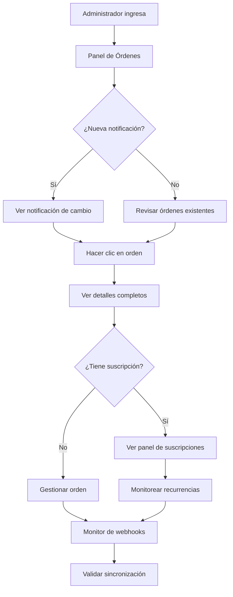

# Requerimientos de Producto: Panel de Administración con Webhooks en Tiempo Real

## 1. Resumen del Producto

Sistema de administración mejorado para PetGourmet que garantiza la sincronización en tiempo real entre MercadoPago y la plataforma, permitiendo a los administradores monitorear órdenes y suscripciones con información actualizada instantáneamente. El sistema resuelve los problemas actuales donde los estados de pago, métodos de pago y detalles de suscripciones no se actualizan correctamente desde los webhooks de MercadoPago.

## 2. Características Principales

### 2.1 Roles de Usuario
| Rol | Método de Registro | Permisos Principales |
|-----|-------------------|---------------------|
| Administrador | Acceso directo con credenciales | Acceso completo a panel de administración, gestión de órdenes y suscripciones |
| Super Admin | Configuración manual | Todos los permisos de administrador + configuración de webhooks y monitoreo del sistema |

### 2.2 Módulos de Funcionalidad

Nuestro sistema mejorado consiste en las siguientes páginas principales:

1. **Panel de Órdenes Mejorado** (`/admin/orders`): Lista de órdenes con estados actualizados en tiempo real, filtros avanzados, información completa de pagos
2. **Detalle de Orden Individual** (`/admin/orders/[id]`): Vista detallada con historial de pagos, método de pago, estado de webhook, información de suscripción asociada
3. **Panel de Suscripciones** (`/admin/subscription-orders`): Gestión completa de suscripciones con frecuencia, recurrencia, próximos pagos y estado en tiempo real
4. **Monitor de Webhooks** (`/admin/webhook-monitor`): Dashboard de monitoreo de webhooks con estadísticas, alertas y validación de sincronización
5. **Validador de Pagos** (`/admin/payment-validation`): Herramienta para validar y sincronizar manualmente pagos desactualizados

### 2.3 Detalles de Páginas

| Página | Módulo | Descripción de Funcionalidad |
|--------|--------|------------------------------|
| Panel de Órdenes | Lista de órdenes | Mostrar órdenes con estado de pago actualizado en tiempo real, filtros por estado/método de pago, búsqueda por ID/email, paginación, indicadores visuales de estado |
| Panel de Órdenes | Notificaciones en tiempo real | Mostrar notificaciones toast cuando se actualiza el estado de una orden, sonido opcional, contador de órdenes pendientes |
| Panel de Órdenes | Filtros avanzados | Filtrar por estado de pago (pendiente, aprobado, rechazado), método de pago, rango de fechas, monto |
| Detalle de Orden | Información de pago | Mostrar método de pago completo (tarjeta terminada en XXXX, cuotas, monto neto), estado detallado, fecha de aprobación |
| Detalle de Orden | Historial de webhooks | Mostrar cuándo se recibió el último webhook, estado del procesamiento, botón para revalidar |
| Detalle de Orden | Información de suscripción | Si la orden tiene suscripción asociada, mostrar frecuencia, próximo pago, estado de suscripción |
| Panel de Suscripciones | Lista de suscripciones | Mostrar todas las suscripciones con estado actualizado, frecuencia (semanal/mensual), próximo pago, total cobrado |
| Panel de Suscripciones | Estados en tiempo real | Actualizar automáticamente cuando MercadoPago cambia el estado de una suscripción (activa, pausada, cancelada) |
| Panel de Suscripciones | Gestión de suscripciones | Botones para pausar, reactivar, cancelar suscripciones directamente desde MercadoPago |
| Monitor de Webhooks | Dashboard de estadísticas | Mostrar webhooks recibidos vs procesados, tasa de éxito, últimos errores, tiempo promedio de procesamiento |
| Monitor de Webhooks | Alertas automáticas | Mostrar alertas cuando hay problemas de sincronización, webhooks fallidos, órdenes desactualizadas |
| Monitor de Webhooks | Validación masiva | Botón para validar todas las órdenes/suscripciones contra MercadoPago y mostrar discrepancias |
| Validador de Pagos | Sincronización manual | Permitir seleccionar órdenes específicas y sincronizar manualmente con MercadoPago |
| Validador de Pagos | Reporte de discrepancias | Mostrar lista de órdenes/suscripciones que tienen estados diferentes entre la base de datos local y MercadoPago |

## 3. Flujo Principal de Usuario

### Flujo del Administrador
1. **Acceso al Panel**: El administrador ingresa al panel de administración
2. **Monitoreo de Órdenes**: Ve la lista de órdenes con estados actualizados en tiempo real
3. **Recepción de Notificaciones**: Recibe notificaciones automáticas cuando cambia el estado de una orden
4. **Revisión de Detalles**: Hace clic en una orden para ver detalles completos de pago y suscripción
5. **Gestión de Suscripciones**: Accede al panel de suscripciones para monitorear recurrencias
6. **Validación de Datos**: Usa el monitor de webhooks para verificar que todo esté sincronizado

## 4. Diseño de Interfaz de Usuario

### 4.1 Estilo de Diseño
- **Colores primarios**: Azul (#3B82F6) para elementos principales, Verde (#10B981) para estados exitosos
- **Colores secundarios**: Amarillo (#F59E0B) para pendientes, Rojo (#EF4444) para errores
- **Estilo de botones**: Redondeados con sombra sutil, estados hover bien definidos
- **Tipografía**: Inter o similar, tamaños 14px para texto normal, 16px para títulos
- **Layout**: Diseño de tarjetas con espaciado generoso, navegación lateral fija
- **Iconos**: Lucide React para consistencia, iconos de estado intuitivos

### 4.2 Diseño de Páginas

| Página | Módulo | Elementos de UI |
|--------|--------|----------------|
| Panel de Órdenes | Header con filtros | Barra de búsqueda con icono de lupa, filtros dropdown para estado y método de pago, botón de refrescar con icono de actualización |
| Panel de Órdenes | Lista de órdenes | Tarjetas con información resumida, badges de estado con colores (verde=aprobado, amarillo=pendiente, rojo=rechazado), iconos de método de pago |
| Panel de Órdenes | Notificaciones | Toast notifications en esquina superior derecha, colores según tipo de notificación, auto-dismiss después de 5 segundos |
| Detalle de Orden | Información principal | Layout de 2 columnas, información del cliente a la izquierda, detalles de pago a la derecha, badges para estados |
| Detalle de Orden | Historial de webhooks | Timeline vertical con iconos de estado, timestamps, botón "Revalidar" con icono de refresh |
| Panel de Suscripciones | Tabla de suscripciones | Tabla responsive con columnas: Cliente, Producto, Frecuencia, Próximo Pago, Estado, Acciones |
| Panel de Suscripciones | Acciones de suscripción | Botones de acción con iconos: Pausar (pause), Reactivar (play), Cancelar (x), colores apropiados |
| Monitor de Webhooks | Dashboard de métricas | Cards con números grandes y colores de estado, gráficos simples para tendencias, indicadores de salud del sistema |
| Monitor de Webhooks | Lista de alertas | Lista con iconos de alerta, colores de prioridad, timestamps, botones de acción rápida |

### 4.3 Responsividad
El sistema está diseñado mobile-first con adaptación completa para tablets y desktop. En móviles, las tablas se convierten en cards apiladas, los filtros se colapsan en un menú hamburguesa, y las notificaciones se adaptan al ancho de pantalla.

## 5. Casos de Uso Específicos

### 5.1 Caso: Orden con Pago Pendiente se Aprueba
**Situación**: Una orden aparece como "Pendiente" en el panel
**Acción del Sistema**: 
1. MercadoPago procesa el pago y envía webhook
2. Sistema actualiza automáticamente el estado a "Aprobado"
3. Administrador ve notificación en tiempo real
4. Badge de la orden cambia de amarillo a verde
5. Se actualiza la información de método de pago

### 5.2 Caso: Suscripción se Cancela
**Situación**: Un cliente cancela su suscripción desde MercadoPago
**Acción del Sistema**:
1. Webhook de cancelación llega al sistema
2. Estado de suscripción se actualiza a "Cancelada"
3. Se actualiza la fecha de cancelación
4. Administrador ve el cambio inmediatamente en el panel
5. Se detienen los próximos cobros programados

### 5.3 Caso: Webhook Falla
**Situación**: Un webhook no se procesa correctamente
**Acción del Sistema**:
1. Sistema detecta el fallo en el procesamiento
2. Se registra el error en el monitor de webhooks
3. Se muestra alerta en el dashboard
4. Administrador puede usar el validador para sincronizar manualmente
5. Sistema intenta reprocesar automáticamente

## 6. Criterios de Aceptación

### 6.1 Funcionalidad Básica
- ✅ Las órdenes deben actualizarse en tiempo real cuando cambia su estado de pago
- ✅ Los métodos de pago deben mostrarse completamente (tipo, últimos 4 dígitos, cuotas)
- ✅ Las suscripciones deben mostrar frecuencia y próximo pago correctamente
- ✅ Las notificaciones deben aparecer inmediatamente cuando hay cambios
- ✅ Los filtros deben funcionar correctamente para buscar órdenes específicas

### 6.2 Rendimiento
- ✅ Las actualizaciones en tiempo real deben ocurrir en menos de 5 segundos
- ✅ La carga inicial del panel no debe tomar más de 3 segundos
- ✅ Los webhooks deben procesarse con 99% de tasa de éxito
- ✅ La interfaz debe ser responsive en dispositivos móviles

### 6.3 Confiabilidad
- ✅ El sistema debe detectar automáticamente órdenes desincronizadas
- ✅ Debe haber alertas automáticas para webhooks fallidos
- ✅ Los administradores deben poder sincronizar manualmente cuando sea necesario
- ✅ El historial de webhooks debe ser visible para debugging

## 7. Métricas de Éxito

### 7.1 Métricas Operacionales
- **Tiempo de sincronización promedio**: < 5 segundos
- **Tasa de éxito de webhooks**: > 99%
- **Órdenes con estado incorrecto**: < 1%
- **Tiempo de respuesta del panel**: < 2 segundos

### 7.2 Métricas de Usuario
- **Satisfacción del administrador**: Encuesta post-implementación
- **Tiempo para resolver discrepancias**: Reducción del 80%
- **Errores reportados por administradores**: Reducción del 90%
- **Uso del panel de monitoreo**: > 80% de administradores lo usan semanalmente

## 8. Consideraciones Técnicas

### 8.1 Integración con MercadoPago
- Uso de webhooks oficiales de MercadoPago
- Validación de firmas para seguridad
- Manejo de reintentos automáticos
- Sincronización bidireccional cuando sea necesario

### 8.2 Tiempo Real con Supabase
- Uso de Supabase Realtime para actualizaciones instantáneas
- Canales específicos para órdenes y suscripciones
- Manejo de reconexión automática
- Optimización para múltiples usuarios simultáneos

### 8.3 Almacenamiento de Datos
- Campos adicionales para metadatos de MercadoPago
- Historial completo de transacciones
- Logs de webhooks para auditoría
- Índices optimizados para consultas rápidas

Este documento define los requerimientos específicos para mejorar la experiencia del administrador y garantizar la sincronización perfecta con MercadoPago.