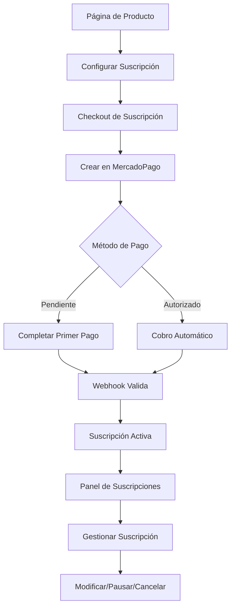

# 📋 Requerimientos del Producto: Sistema de Suscripciones Dinámicas

## 1. Resumen del Producto

Sistema de suscripciones dinámicas para PetGourmet que permite a los clientes crear suscripciones personalizadas para productos de mascotas con diferentes frecuencias de entrega, utilizando la API de MercadoPago "Suscripciones sin plan asociado" para mayor flexibilidad y control.

- **Problema a resolver**: El sistema actual de suscripciones con links predefinidos es rígido y no permite personalización por producto o frecuencia.
- **Usuarios objetivo**: Dueños de mascotas que desean recibir productos de forma recurrente con flexibilidad en frecuencia y método de pago.
- **Valor del producto**: Automatización de compras recurrentes con gestión inteligente de pagos y reintentos automáticos.

## 2. Funcionalidades Principales

### 2.1 Roles de Usuario

| Rol | Método de Registro | Permisos Principales |
|-----|-------------------|---------------------|
| Cliente Registrado | Email + contraseña | Crear suscripciones, gestionar métodos de pago, ver historial |
| Administrador | Acceso interno | Gestionar productos, ver métricas, manejar suscripciones problemáticas |

### 2.2 Módulos de Funcionalidad

Nuestro sistema de suscripciones dinámicas consta de las siguientes páginas principales:

1. **Página de Producto**: selector de suscripción, configuración de frecuencia, vista previa de precios.
2. **Página de Checkout de Suscripción**: confirmación de datos, selección de método de pago, términos y condiciones.
3. **Página de Éxito de Suscripción**: confirmación de creación, detalles de primera cuota, información de cobros futuros.
4. **Panel de Suscripciones**: lista de suscripciones activas, historial de pagos, opciones de gestión.
5. **Página de Gestión de Suscripción**: modificar frecuencia, cambiar método de pago, pausar/cancelar.

### 2.3 Detalles de Páginas

| Página | Módulo | Descripción de Funcionalidad |
|--------|--------|------------------------------|
| Página de Producto | Selector de Suscripción | Mostrar opciones de frecuencia (1-3 meses/días), calcular precio con descuentos, botón "Suscribirse" |
| Página de Producto | Vista Previa de Suscripción | Mostrar resumen: producto, frecuencia, precio por cuota, fecha estimada de próximo envío |
| Checkout de Suscripción | Formulario de Datos | Validar email, dirección de envío, información de contacto |
| Checkout de Suscripción | Selección de Método de Pago | Opciones: pago pendiente (elegir después) o tarjeta guardada (cobro automático) |
| Checkout de Suscripción | Confirmación | Mostrar resumen completo, términos de suscripción, botón "Crear Suscripción" |
| Éxito de Suscripción | Confirmación de Creación | Mostrar ID de suscripción, estado inicial, instrucciones para primer pago |
| Éxito de Suscripción | Detalles de Cobro | Mostrar fecha de primer cobro, monto, frecuencia de cobros futuros |
| Panel de Suscripciones | Lista de Suscripciones | Mostrar todas las suscripciones con estado, próximo cobro, acciones rápidas |
| Panel de Suscripciones | Filtros y Búsqueda | Filtrar por estado (activa, pausada, cancelada), buscar por producto |
| Gestión de Suscripción | Información General | Mostrar detalles completos: producto, frecuencia, historial de pagos |
| Gestión de Suscripción | Modificar Suscripción | Cambiar frecuencia, actualizar método de pago, modificar dirección |
| Gestión de Suscripción | Control de Estado | Pausar temporalmente, reactivar, cancelar permanentemente |
| Panel Admin | Dashboard de Métricas | Mostrar suscripciones activas, ingresos recurrentes, tasas de éxito/fallo |
| Panel Admin | Gestión de Problemas | Lista de suscripciones con pagos fallidos, herramientas de resolución |

## 3. Flujo Principal del Usuario

### Flujo del Cliente:
1. **Navegación**: Cliente navega productos y selecciona uno de interés
2. **Configuración**: Elige frecuencia de suscripción (1-3 meses/días) y ve precio calculado
3. **Checkout**: Completa datos personales y selecciona método de pago (pendiente o autorizado)
4. **Creación**: Sistema crea suscripción en MercadoPago y redirige a página de éxito
5. **Primer Pago**: Cliente completa primer pago (si eligió método pendiente)
6. **Activación**: Webhook valida pago y activa suscripción para cobros automáticos
7. **Gestión**: Cliente puede modificar, pausar o cancelar desde su panel

### Flujo del Administrador:
1. **Monitoreo**: Revisa dashboard con métricas de suscripciones
2. **Resolución**: Identifica y resuelve suscripciones con problemas de pago
3. **Análisis**: Evalúa rendimiento y optimiza productos/precios

## 4. Diseño de Interfaz de Usuario

### 4.1 Estilo de Diseño

- **Colores primarios**: Verde #22C55E (éxito/activo), Azul #3B82F6 (información)
- **Colores secundarios**: Gris #6B7280 (texto secundario), Rojo #EF4444 (errores/cancelado)
- **Estilo de botones**: Redondeados (border-radius: 8px) con efectos hover suaves
- **Tipografía**: Inter o similar, tamaños 14px (texto), 16px (botones), 24px (títulos)
- **Layout**: Diseño basado en tarjetas con navegación superior, espaciado generoso
- **Iconos**: Lucide React para consistencia, estilo outline

### 4.2 Resumen de Diseño por Página

| Página | Módulo | Elementos de UI |
|--------|--------|-----------------|
| Página de Producto | Selector de Suscripción | Card con fondo blanco, dropdown para frecuencia, badge con descuento, precio destacado en verde |
| Checkout de Suscripción | Formulario de Datos | Layout de 2 columnas, inputs con validación en tiempo real, iconos de estado |
| Checkout de Suscripción | Método de Pago | Radio buttons estilizados, iconos de tarjetas, texto explicativo en gris |
| Éxito de Suscripción | Confirmación | Icono de check verde grande, card con bordes verdes, botón CTA azul |
| Panel de Suscripciones | Lista | Tabla responsiva, badges de estado coloridos, botones de acción pequeños |
| Gestión de Suscripción | Controles | Tabs para secciones, switches para pausar/activar, botones de peligro para cancelar |
| Panel Admin | Dashboard | Cards con métricas, gráficos simples, tabla de problemas con filtros |

### 4.3 Responsividad

- **Diseño mobile-first** con breakpoints en 768px (tablet) y 1024px (desktop)
- **Navegación adaptativa** con menú hamburguesa en móvil
- **Tablas responsivas** que se convierten en cards apiladas en móvil
- **Formularios optimizados** para touch con inputs más grandes en móvil
- **Botones de acción** con tamaño mínimo de 44px para facilitar toque

## 5. Estados y Notificaciones

### 5.1 Estados de Suscripción Visibles

| Estado | Color de Badge | Descripción para Usuario |
|--------|----------------|--------------------------|
| `pending` | Amarillo | "Esperando primer pago" |
| `authorized` | Azul | "Pago autorizado - próximo cobro en 1 hora" |
| `active` | Verde | "Activa - próximo cobro: [fecha]" |
| `paused` | Gris | "Pausada temporalmente" |
| `cancelled` | Rojo | "Cancelada" |

### 5.2 Notificaciones del Sistema

- **Toast notifications** para acciones exitosas (crear, modificar, cancelar)
- **Alertas por email** para cobros exitosos, fallidos y próximos vencimientos
- **Notificaciones push** (opcional) para recordatorios de pago pendiente
- **Badges en navegación** para indicar suscripciones que requieren atención

## 6. Validaciones y Reglas de Negocio

### 6.1 Validaciones de Entrada

- **Frecuencia**: Mínimo 1 día, máximo 3 meses
- **Email**: Formato válido y único por usuario
- **Método de pago**: Token válido para suscripciones autorizadas
- **Dirección**: Campos obligatorios para envío

### 6.2 Reglas de Negocio

- **Descuentos por suscripción**: 5% para mensual, 10% para trimestral
- **Reintentos automáticos**: Máximo 4 intentos en 10 días
- **Cancelación automática**: Después de 4 pagos fallidos consecutivos
- **Modificaciones**: Permitidas hasta 24 horas antes del próximo cobro
- **Pausas**: Máximo 3 meses, mínimo 1 mes

## 7. Integraciones Requeridas

### 7.1 MercadoPago API
- **Endpoint**: `/preapproval` para crear suscripciones
- **Webhooks**: Validación de pagos recurrentes
- **Tokens**: Gestión segura de métodos de pago

### 7.2 Sistema de Notificaciones
- **Email**: SendGrid o similar para notificaciones transaccionales
- **SMS**: Opcional para alertas críticas
- **Push**: Firebase para notificaciones móviles

### 7.3 Base de Datos
- **Supabase**: Almacenamiento de suscripciones y historial
- **Backup**: Respaldos automáticos diarios
- **Logs**: Registro de todas las transacciones

## 8. Métricas y Análisis

### 8.1 KPIs Principales
- **Tasa de conversión**: Visitantes → Suscriptores
- **Retención**: Suscripciones activas por mes
- **Valor de vida del cliente**: Ingresos promedio por suscriptor
- **Tasa de éxito de pagos**: Cobros exitosos vs fallidos

### 8.2 Reportes Requeridos
- **Dashboard ejecutivo**: Métricas clave en tiempo real
- **Reporte mensual**: Análisis detallado de rendimiento
- **Alertas automáticas**: Notificaciones por métricas críticas

## 9. Consideraciones Técnicas

### 9.1 Rendimiento
- **Tiempo de carga**: < 2 segundos para páginas principales
- **Disponibilidad**: 99.9% uptime
- **Escalabilidad**: Soporte para 10,000+ suscripciones activas

### 9.2 Seguridad
- **Encriptación**: Datos sensibles encriptados en reposo
- **Validación**: Webhooks firmados y validados
- **Acceso**: Autenticación requerida para todas las operaciones

### 9.3 Mantenimiento
- **Logs estructurados**: Para debugging y monitoreo
- **Versionado**: Control de versiones para cambios críticos
- **Testing**: Cobertura mínima del 80% en funciones críticas