# 🔗 DIAGRAMA DE RELACIONES - BASE DE DATOS PETGOURMET

## 📊 VISTA GENERAL DEL SISTEMA

```mermaid
graph TB
    %% Módulo de Autenticación
    AUTH["🔐 auth.users<br/>(Supabase Auth)"] --> PROFILES["👤 profiles<br/>Datos de usuario"]
    PROFILES --> PETS["🐕 pets<br/>Mascotas"]
    PROFILES --> PAYMENT_METHODS["💳 user_payment_methods<br/>Métodos de pago"]
    
    %% Módulo de Productos
    CATEGORIES["📂 categories<br/>Categorías"] --> PRODUCTS["📦 products<br/>Catálogo"]
    PRODUCTS --> PRODUCT_IMAGES["🖼️ product_images<br/>Galería"]
    PRODUCTS --> PRODUCT_FEATURES["⭐ product_features<br/>Características"]
    PRODUCTS --> PRODUCT_SIZES["📏 product_sizes<br/>Tamaños"]
    PRODUCTS --> PRODUCT_REVIEWS["💬 product_reviews<br/>Reseñas"]
    PRODUCTS --> ORDER_ITEMS["🛒 order_items<br/>Compras"]
    
    %% Módulo de Suscripciones
    AUTH --> USER_SUBS["🔄 user_subscriptions<br/>Suscripciones activas"]
    PRODUCTS --> USER_SUBS
    USER_SUBS --> SUB_BILLING["📋 subscription_billing_history<br/>Historial facturación"]
    USER_SUBS --> SUB_PAYMENTS["💰 subscription_payments<br/>Pagos MercadoPago"]
    USER_SUBS --> SUB_MODS["📝 subscription_modifications<br/>Modificaciones"]
    USER_SUBS --> NOTIFICATIONS["📧 scheduled_notifications<br/>Notificaciones"]
    
    %% Configuración
    SUB_CONFIG["⚙️ subscription_config<br/>Configuración"]
    SUBSCRIPTIONS["📋 subscriptions<br/>Planes generales"]
    
    %% Contenido
    BLOG_CATS["📂 blog_categories<br/>Categorías blog"] --> BLOGS["📰 blogs<br/>Artículos"]
    
    %% Estilos
    classDef authModule fill:#e1f5fe
    classDef productModule fill:#f3e5f5
    classDef subscriptionModule fill:#e8f5e8
    classDef contentModule fill:#fff3e0
    classDef configModule fill:#fce4ec
    
    class AUTH,PROFILES,PETS,PAYMENT_METHODS authModule
    class CATEGORIES,PRODUCTS,PRODUCT_IMAGES,PRODUCT_FEATURES,PRODUCT_SIZES,PRODUCT_REVIEWS,ORDER_ITEMS productModule
    class USER_SUBS,SUB_BILLING,SUB_PAYMENTS,SUB_MODS,NOTIFICATIONS subscriptionModule
    class BLOGS,BLOG_CATS contentModule
    class SUB_CONFIG,SUBSCRIPTIONS configModule
```



## 🏗️ ARQUITECTURA POR MÓDULOS

### 🔐 **MÓDULO DE AUTENTICACIÓN**
```
┌─────────────────────────────────────────┐
│              AUTENTICACIÓN              │
├─────────────────────────────────────────┤
│  auth.users (Supabase)                  │
│       ↓                                 │
│  profiles (Extensión de usuario)        │
│       ├── pets (Mascotas)               │
│       └── user_payment_methods          │
└─────────────────────────────────────────┘
```

### 📦 **MÓDULO DE PRODUCTOS**
```
┌─────────────────────────────────────────┐
│               PRODUCTOS                 │
├─────────────────────────────────────────┤
│  categories                             │
│       ↓                                 │
│  products (Catálogo principal)          │
│       ├── product_images                │
│       ├── product_features              │
│       ├── product_sizes                 │
│       ├── product_reviews               │
│       └── order_items (⚠️ NO orders)    │
└─────────────────────────────────────────┘
```

### 🔄 **MÓDULO DE SUSCRIPCIONES**
```
┌─────────────────────────────────────────┐
│             SUSCRIPCIONES               │
├─────────────────────────────────────────┤
│  user_subscriptions (Principal)         │
│       ├── subscription_billing_history  │
│       ├── subscription_payments         │
│       ├── subscription_modifications    │
│       └── scheduled_notifications       │
│                                         │
│  Configuración:                         │
│  ├── subscriptions (Planes)             │
│  └── subscription_config (Sistema)      │
└─────────────────────────────────────────┘
```

## 🔄 FLUJO DE DATOS DE SUSCRIPCIONES

```mermaid
sequenceDiagram
    participant U as Usuario
    participant UI as Interfaz
    participant API as API
    participant MP as MercadoPago
    participant DB as Base de Datos
    participant CRON as Cron Jobs
    
    %% Creación de suscripción
    U->>UI: Selecciona plan
    UI->>API: POST /api/subscriptions/create
    API->>MP: Crear suscripción
    MP-->>API: ID de suscripción
    API->>DB: Guardar en user_subscriptions
    DB-->>API: Confirmación
    API-->>UI: Suscripción creada
    
    %% Procesamiento automático
    MP->>API: Webhook pago procesado
    API->>DB: Actualizar subscription_billing_history
    API->>DB: Actualizar subscription_payments
    
    %% Cron jobs
    CRON->>DB: Verificar próximos pagos
    CRON->>U: Enviar recordatorio (3 días antes)
    CRON->>DB: Registrar en scheduled_notifications
```



## 📋 ÍNDICES Y OPTIMIZACIONES RECOMENDADAS

### 🚀 **ÍNDICES CRÍTICOS**
```sql
-- Suscripciones por usuario
CREATE INDEX idx_user_subscriptions_user_id ON user_subscriptions(user_id);
CREATE INDEX idx_user_subscriptions_active ON user_subscriptions(is_active) WHERE is_active = true;
CREATE INDEX idx_user_subscriptions_next_billing ON user_subscriptions(next_billing_date);

-- Historial de facturación
CREATE INDEX idx_billing_history_subscription ON subscription_billing_history(subscription_id);
CREATE INDEX idx_billing_history_date ON subscription_billing_history(billing_date);

-- Pagos MercadoPago
CREATE INDEX idx_subscription_payments_mp_id ON subscription_payments(mercadopago_payment_id);
CREATE INDEX idx_subscription_payments_status ON subscription_payments(status);

-- Productos
CREATE INDEX idx_products_subscription_available ON products(subscription_available) WHERE subscription_available = true;
CREATE INDEX idx_products_category ON products(category_id);

-- Order items
CREATE INDEX idx_order_items_order_id ON order_items(order_id);
```

### ⚡ **CONSULTAS OPTIMIZADAS**
```sql
-- Suscripciones activas de un usuario
SELECT us.*, p.name as product_name, p.image as product_image
FROM user_subscriptions us
JOIN products p ON us.product_id = p.id
WHERE us.user_id = $1 AND us.is_active = true;

-- Próximos pagos (para cron)
SELECT us.*, pr.email
FROM user_subscriptions us
JOIN profiles pr ON us.user_id = pr.auth_users_id
WHERE us.is_active = true 
  AND us.next_billing_date <= NOW() + INTERVAL '3 days'
  AND us.next_billing_date >= NOW();

-- Historial de facturación de usuario
SELECT sbh.*, us.product_name
FROM subscription_billing_history sbh
JOIN user_subscriptions us ON sbh.subscription_id = us.id
WHERE sbh.user_id = $1
ORDER BY sbh.billing_date DESC;
```

## 🔒 POLÍTICAS DE SEGURIDAD (RLS)

### 👤 **Row Level Security**
```sql
-- Usuarios solo pueden ver sus propios datos
ALTER TABLE profiles ENABLE ROW LEVEL SECURITY;
CREATE POLICY "Users can view own profile" ON profiles
  FOR SELECT USING (auth_users_id = auth.uid());

-- Suscripciones por usuario
ALTER TABLE user_subscriptions ENABLE ROW LEVEL SECURITY;
CREATE POLICY "Users can view own subscriptions" ON user_subscriptions
  FOR SELECT USING (user_id = auth.uid());

-- Historial de facturación
ALTER TABLE subscription_billing_history ENABLE ROW LEVEL SECURITY;
CREATE POLICY "Users can view own billing" ON subscription_billing_history
  FOR SELECT USING (auth_users_id = auth.uid());
```

## 📊 MÉTRICAS Y MONITOREO

### 📈 **KPIs Principales**
```sql
-- Suscripciones activas
SELECT COUNT(*) as active_subscriptions
FROM user_subscriptions 
WHERE is_active = true;

-- Ingresos mensuales recurrentes (MRR)
SELECT SUM(discounted_price) as mrr
FROM user_subscriptions 
WHERE is_active = true AND subscription_type = 'monthly';

-- Tasa de cancelación
SELECT 
  COUNT(CASE WHEN cancelled_at IS NOT NULL THEN 1 END) * 100.0 / COUNT(*) as churn_rate
FROM user_subscriptions
WHERE created_at >= NOW() - INTERVAL '30 days';

-- Próximos pagos por día
SELECT 
  DATE(next_billing_date) as payment_date,
  COUNT(*) as payments_count,
  SUM(discounted_price) as total_amount
FROM user_subscriptions 
WHERE is_active = true 
  AND next_billing_date BETWEEN NOW() AND NOW() + INTERVAL '7 days'
GROUP BY DATE(next_billing_date)
ORDER BY payment_date;
```

## 🚨 ALERTAS Y MONITOREO

### ⚠️ **Alertas Críticas**
1. **Pagos fallidos**: > 5% en 24h
2. **Suscripciones canceladas**: > 10% en 7 días
3. **Webhooks fallidos**: > 1% en 1h
4. **Cron jobs**: No ejecutados en 2h

### 📊 **Dashboard Recomendado**
- Suscripciones activas vs canceladas
- MRR (Monthly Recurring Revenue)
- Próximos pagos (7 días)
- Estado de webhooks
- Errores de procesamiento

---

*Este diagrama se mantiene sincronizado con el mapa principal de la base de datos.*
*Actualización automática: Enero 2025*