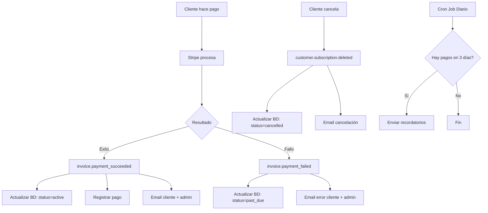

# Sistema de Sincronización Completo con Stripe

## 📋 Descripción General

Este sistema mantiene sincronizado en tiempo real el estado de las suscripciones entre Stripe y la base de datos de Pet Gourmet. Además, envía notificaciones proactivas a clientes y administradores sobre eventos importantes.

## 🔄 Sincronización de Estados

### Eventos Manejados

#### 1. **Pago Exitoso** (`invoice.payment_succeeded`)
- **Qué hace:**
  - ✅ Actualiza el estado de la suscripción a `active`
  - 📅 Actualiza las fechas del período actual
  - 💰 Registra el pago en `subscription_payments`
  - 📧 Envía notificación al cliente y admin

- **Datos actualizados:**
  ```typescript
  {
    status: 'active',
    current_period_start: '2024-01-01',
    current_period_end: '2024-01-31',
    next_billing_date: '2024-01-31',
    last_payment_date: '2024-01-01'
  }
  ```

#### 2. **Cancelación** (`customer.subscription.deleted`)
- **Qué hace:**
  - ❌ Actualiza el estado a `cancelled`
  - 🕐 Marca la fecha de cancelación
  - 📧 Envía notificación de cancelación al cliente y admin

- **Datos actualizados:**
  ```typescript
  {
    status: 'cancelled',
    cancelled_at: '2024-01-15T10:30:00Z'
  }
  ```

#### 3. **Pago Fallido** (`invoice.payment_failed`)
- **Qué hace:**
  - ⚠️ Actualiza el estado a `past_due`
  - 💳 Registra el intento fallido en `subscription_payments`
  - 📧 Envía notificación de error al cliente y admin

- **Datos actualizados:**
  ```typescript
  {
    status: 'past_due'
  }
  ```

#### 4. **Actualización de Suscripción** (`customer.subscription.updated`)
- **Qué hace:**
  - 🔄 Detecta cambios en fechas o estado
  - 📅 Actualiza período actual si cambió
  - 📧 Envía notificación SOLO si hay cambios significativos

- **Cambios detectados:**
  - Cambio en fechas del período
  - Cambio de estado (active ↔ paused)
  - Cambio en `cancel_at_period_end`

#### 5. **Checkout Completado** (`checkout.session.completed`)
- **Qué hace:**
  - 🎉 Crea nueva suscripción en BD
  - 📦 Crea orden si es pago único
  - 📧 Envía email de bienvenida

## 🔔 Sistema de Notificaciones Proactivas

### Recordatorios de Pago Próximo

**Endpoint:** `/api/cron/upcoming-payments`

**Frecuencia:** Diario a las 10:00 AM (configurado en `vercel.json`)

**Días de anticipación:** 3 días antes del próximo pago

#### Funcionamiento:

1. **Búsqueda Diaria:**
   ```typescript
   // Encuentra suscripciones con pago en 3 días
   const targetDate = new Date()
   targetDate.setDate(targetDate.getDate() + 3)
   
   const subscriptions = await supabase
     .from('unified_subscriptions')
     .select('*')
     .eq('status', 'active')
     .gte('next_billing_date', targetDate)
     .lte('next_billing_date', targetDateEnd)
   ```

2. **Notificaciones:**
   - 📧 Cliente: Recordatorio amigable con fecha y monto
   - 📧 Admin: Incluye detalles técnicos (user_id, subscription_id)

3. **Respuesta:**
   ```json
   {
     "success": true,
     "results": {
       "total": 5,
       "sent": 5,
       "failed": 0
     }
   }
   ```

## 📧 Tipos de Emails

### Para Clientes:

| Tipo | Cuándo | Asunto |
|------|--------|--------|
| `created` | Nueva suscripción | 🎉 ¡Bienvenido a Pet Gourmet! |
| `payment` | Pago procesado | 💳 Pago de suscripción procesado |
| `payment_reminder` | 3 días antes del pago | 🔔 Recordatorio: Próximo pago |
| `payment_failed` | Pago rechazado | ⚠️ Error en el pago |
| `cancelled` | Suscripción cancelada | ❌ Suscripción cancelada |
| `paused` | Suscripción pausada | ⏸️ Suscripción pausada |
| `resumed` | Suscripción reactivada | ▶️ Suscripción reactivada |
| `subscription_updated` | Cambio en fechas/estado | 🔄 Suscripción actualizada |

### Para Admin (contacto@petgourmet.mx):

Todos los emails incluyen sección adicional con:
- 🆔 User ID
- 📋 Subscription ID
- 📊 Detalles técnicos
- 📈 Cambios detectados (si aplica)

## ⚙️ Configuración

### 1. Variables de Entorno

```bash
# Stripe
STRIPE_SECRET_KEY=sk_live_xxxxx
STRIPE_WEBHOOK_SECRET=whsec_xxxxx

# Supabase
NEXT_PUBLIC_SUPABASE_URL=https://xxxxx.supabase.co
SUPABASE_SERVICE_ROLE_KEY=xxxxx

# Email (SMTP)
SMTP_HOST=smtp.gmail.com
SMTP_PORT=587
SMTP_USER=tu-email@petgourmet.mx
SMTP_PASSWORD=tu-password-smtp
EMAIL_FROM="Pet Gourmet <noreply@petgourmet.mx>"

# Cron Job
CRON_SECRET=tu-secret-aleatorio-seguro
```

### 2. Configuración en Stripe Dashboard

1. Ve a https://dashboard.stripe.com/webhooks
2. Crea un nuevo endpoint:
   - URL: `https://petgourmet.mx/api/stripe/webhook`
   - Eventos:
     - `checkout.session.completed`
     - `invoice.payment_succeeded`
     - `invoice.payment_failed`
     - `customer.subscription.updated`
     - `customer.subscription.deleted`
3. Copia el **Signing Secret** → `STRIPE_WEBHOOK_SECRET`

### 3. Configuración en Vercel

El archivo `vercel.json` ya incluye:

```json
{
  "crons": [
    {
      "path": "/api/cron/upcoming-payments",
      "schedule": "0 10 * * *"
    }
  ]
}
```

**Nota:** Los Cron Jobs de Vercel requieren plan Pro o superior.

## 🧪 Pruebas

### Probar Webhooks (Local)

1. **Instalar Stripe CLI:**
   ```bash
   stripe login
   ```

2. **Escuchar webhooks:**
   ```bash
   stripe listen --forward-to localhost:3000/api/stripe/webhook
   ```

3. **Disparar eventos de prueba:**
   ```bash
   # Pago exitoso
   stripe trigger invoice.payment_succeeded
   
   # Cancelación
   stripe trigger customer.subscription.deleted
   
   # Pago fallido
   stripe trigger invoice.payment_failed
   ```

### Probar Notificaciones de Pago Próximo

**Método 1: Localmente**

```bash
curl -X GET http://localhost:3000/api/cron/upcoming-payments \
  -H "Authorization: Bearer TU_CRON_SECRET"
```

**Método 2: En Vercel**

1. Ve a tu dashboard de Vercel
2. Busca el cron job "upcoming-payments"
3. Click en "Trigger" para ejecutar manualmente

**Método 3: Crear suscripción de prueba**

```sql
-- En Supabase SQL Editor
UPDATE unified_subscriptions
SET next_billing_date = NOW() + INTERVAL '3 days'
WHERE id = 'tu-subscription-id';
```

Luego ejecuta el cron manualmente.

## 📊 Monitoreo

### Logs a Revisar

```bash
# Vercel Logs
vercel logs --follow

# Filtrar por tipo
vercel logs --follow | grep "🔔"  # Recordatorios
vercel logs --follow | grep "💳"  # Pagos
vercel logs --follow | grep "❌"  # Errores
```

### Verificar Sincronización

```sql
-- Suscripciones con pagos próximos
SELECT 
  id,
  customer_name,
  customer_email,
  status,
  next_billing_date,
  EXTRACT(DAY FROM next_billing_date - NOW()) as days_until_payment
FROM unified_subscriptions
WHERE status = 'active'
  AND next_billing_date > NOW()
ORDER BY next_billing_date ASC;

-- Pagos recientes
SELECT 
  s.customer_name,
  sp.amount,
  sp.status,
  sp.payment_date
FROM subscription_payments sp
JOIN unified_subscriptions s ON s.id = sp.subscription_id
ORDER BY sp.payment_date DESC
LIMIT 20;
```

## 🔍 Troubleshooting

### Problema: Webhook no se ejecuta

**Causa:** Firma inválida o secret incorrecto

**Solución:**
1. Verifica `STRIPE_WEBHOOK_SECRET` en variables de entorno
2. Confirma que el endpoint esté registrado en Stripe Dashboard
3. Revisa logs: `vercel logs | grep webhook`

### Problema: No llegan notificaciones de pago próximo

**Causa:** Cron job no configurado o `next_billing_date` incorrecta

**Solución:**
1. Verifica que estés en plan Vercel Pro
2. Confirma configuración en `vercel.json`
3. Ejecuta manualmente para probar:
   ```bash
   curl -X GET https://petgourmet.mx/api/cron/upcoming-payments \
     -H "Authorization: Bearer $CRON_SECRET"
   ```

### Problema: Estado desincronizado

**Causa:** Webhook fallido o evento perdido

**Solución:**
```typescript
// Ejecutar script de re-sincronización
// app/api/admin/resync-subscription/route.ts
POST /api/admin/resync-subscription
{
  "subscription_id": "sub_xxxxx"
}
```

### Problema: Emails no se envían

**Causa:** Credenciales SMTP incorrectas

**Solución:**
1. Verifica variables:
   - `SMTP_HOST`
   - `SMTP_PORT`
   - `SMTP_USER`
   - `SMTP_PASSWORD`
2. Prueba conexión SMTP
3. Revisa logs de email: `grep "EMAIL-SERVICE"`

## 📈 Flujo Completo



## 🎯 Mejoras Futuras

- [ ] Dashboard admin para ver próximos pagos
- [ ] Configurar días de anticipación desde admin
- [ ] Notificaciones push (web push API)
- [ ] Historial completo de notificaciones enviadas
- [ ] Re-envío manual de notificaciones
- [ ] Webhooks para pausas automáticas
- [ ] Integración con WhatsApp Business API

## 📞 Soporte

Para problemas o dudas:
- 📧 Email: contacto@petgourmet.mx
- 📱 WhatsApp: [Número de soporte]
- 🌐 Documentación Stripe: https://docs.stripe.com/webhooks

---

**Última actualización:** 2024-01-15  
**Versión:** 2.0.0
