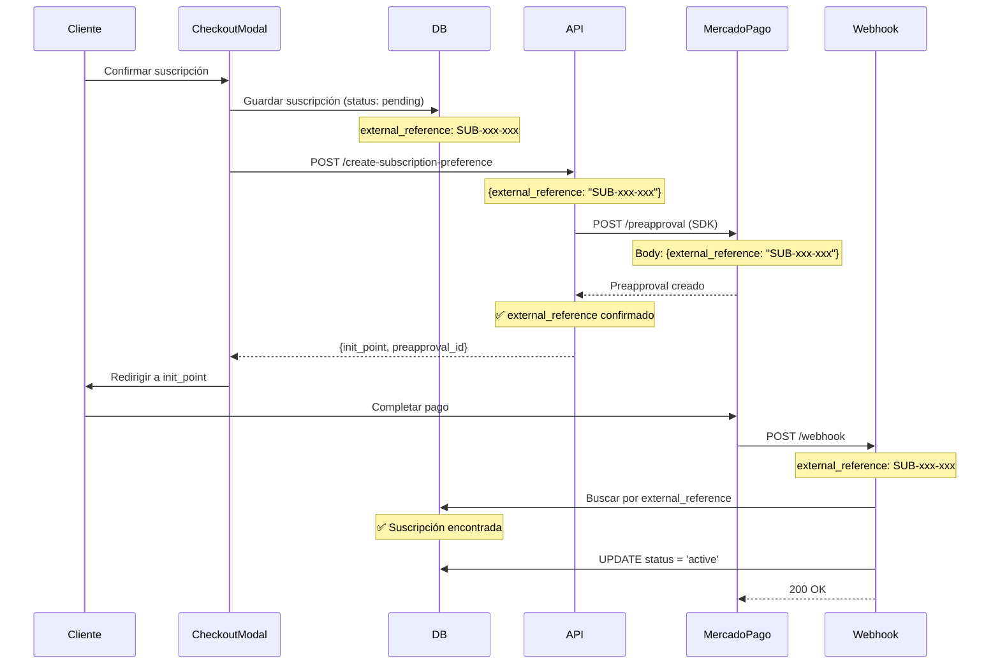

# 🧹 LIMPIEZA DE LÓGICA DE SUSCRIPCIONES DUPLICADA

**Fecha**: 6 de octubre de 2025  
**Autor**: Asistente de GitHub Copilot  
**Ticket**: Eliminación de lógica obsoleta de suscripciones

---

## 📋 PROBLEMA IDENTIFICADO

Se detectaron **DOS lógicas de suscripción operando simultáneamente**, causando:
- ❌ Suscripciones duplicadas en la base de datos
- ❌ Mismatch de `external_reference` entre DB y MercadoPago
- ❌ Fallos en activación automática de suscripciones
- ❌ Confusión en el flujo de checkout

### Evidencia del Problema

Cliente: **cristofer bolaos** (fabian.gutierrez@petgourmet.mx)

```json
// ✅ SUSCRIPCIÓN ACTIVA (Lógica Nueva - SDK)
{
  "id": 226,
  "external_reference": "SUB-aefdfc64-cc93-4219-8ca5-a614a9e7bb84-73-5d2d8090",
  "status": "active",
  "preapproval_plan_id": "6afdb6eba1c74e55817c1037fc0e9ca3",
  "metadata": {
    "api_created": true,
    "external_reference_confirmed": true
  }
}

// ❌ SUSCRIPCIÓN PENDIENTE (Lógica Antigua - URLs)
{
  "id": 227,
  "external_reference": "6afdb6eba1c74e55817c1037fc0e9ca3",
  "status": "pending",
  "mercadopago_subscription_id": "6afdb6eba1c74e55817c1037fc0e9ca3"
}
```

---

## 🔴 LÓGICA ANTIGUA (ELIMINADA)

### Ubicación
- `/app/api/subscription-urls/route.ts` ✅ DEPRECADO
- Referencias en `components/checkout-modal.tsx` ✅ ELIMINADAS

### ¿Cómo funcionaba? (OBSOLETO)

1. **Carga URLs pre-generadas** desde variables de entorno:
   ```typescript
   MERCADOPAGO_WEEKLY_SUBSCRIPTION_URL
   MERCADOPAGO_MONTHLY_SUBSCRIPTION_URL
   MERCADOPAGO_QUARTERLY_SUBSCRIPTION_URL
   ```

2. **Redirige a URL con parámetros**:
   ```
   https://mercadopago.com.mx/subscriptions/checkout?
     preapproval_plan_id=xxx&
     external_reference=SUB-xxx-xxx  ⚠️ IGNORADO POR MERCADOPAGO
   ```

3. **Problema**: MercadoPago **ignora** el `external_reference` en la URL y genera uno propio

4. **Resultado**: Webhook recibe un `external_reference` diferente → No encuentra la suscripción en DB

### ¿Por qué falló?

- Las URLs de checkout de MercadoPago **NO respetan** el `external_reference` pasado como parámetro de URL
- MercadoPago genera su propio ID y lo usa como `external_reference`
- El webhook busca la suscripción con el `external_reference` original → **No la encuentra**
- La suscripción queda en estado `pending` para siempre

---

## 🟢 LÓGICA NUEVA (MANTENIDA)

### Ubicación
- `/app/api/mercadopago/create-subscription-preference/route.ts` ✅ ACTIVO
- `components/checkout-modal.tsx` → Llamada directa al endpoint ✅ FUNCIONAL

### ¿Cómo funciona?

1. **Cliente hace checkout** → Guarda suscripción en DB con `external_reference` personalizado

2. **Se llama al API** `/api/mercadopago/create-subscription-preference`:
   ```typescript
   POST /api/mercadopago/create-subscription-preference
   {
     "external_reference": "SUB-aefdfc64-cc93-4219-8ca5-a614a9e7bb84-73-5d2d8090",
     "transaction_amount": 36.45,
     "payer_email": "fabian.gutierrez@petgourmet.mx",
     "frequency": 1,
     "frequency_type": "months"
   }
   ```

3. **API crea Preapproval** usando SDK de MercadoPago:
   ```typescript
   const response = await fetch("https://api.mercadopago.com/preapproval", {
     method: "POST",
     body: JSON.stringify({
       external_reference: "SUB-xxx-xxx",  // ✅ EN EL BODY
       auto_recurring: { ... },
       payer_email: "...",
       back_url: "..."
     })
   })
   ```

4. **MercadoPago RESPETA** el `external_reference` del BODY y devuelve `init_point`

5. **Cliente paga** → Webhook recibe el pago con el **MISMO** `external_reference`

6. **Webhook encuentra la suscripción** → ✅ Activa automáticamente

### ¿Por qué funciona?

- ✅ El `external_reference` se envía en el **BODY** de la request (no como parámetro de URL)
- ✅ MercadoPago **respeta y confirma** el `external_reference` enviado en el BODY
- ✅ El webhook puede buscar y encontrar la suscripción por `external_reference`
- ✅ La activación automática funciona perfectamente

---

## 🧹 CAMBIOS REALIZADOS

### 1. `/app/api/subscription-urls/route.ts`

**ANTES**: Endpoint que retornaba URLs pre-generadas

**AHORA**: Endpoint deprecado que retorna HTTP 410 (Gone)

```typescript
export async function GET() {
  return NextResponse.json({
    deprecated: true,
    message: 'Este endpoint está deprecado. Usa /api/mercadopago/create-subscription-preference',
    new_endpoint: '/api/mercadopago/create-subscription-preference'
  }, { status: 410 })
}
```

### 2. `components/checkout-modal.tsx`

**ELIMINADO**:
- ✅ `useEffect` que cargaba URLs de suscripción
- ✅ Estado `subscriptionLinks`
- ✅ Función `getSubscriptionLink()`
- ✅ Lógica de redirección a URLs pre-generadas

**MANTENIDO**:
- ✅ Creación de suscripción en DB
- ✅ Llamada a `/api/mercadopago/create-subscription-preference`
- ✅ Redirección al `init_point` devuelto por la API

---

## 🎯 FLUJO ACTUAL (CORRECTO)



---

## ✅ VALIDACIÓN

### Verificar que solo existe una lógica

1. **Endpoint de suscripciones**:
   ```bash
   # DEPRECADO (410)
   GET /api/subscription-urls
   
   # ACTIVO (200)
   POST /api/mercadopago/create-subscription-preference
   ```

2. **Checkout Modal**:
   - ✅ Ya no carga `subscriptionLinks`
   - ✅ Ya no usa `getSubscriptionLink()`
   - ✅ Solo usa `/api/mercadopago/create-subscription-preference`

3. **Base de Datos**:
   - ✅ Suscripciones nuevas usan formato: `SUB-{user_id}-{product_id}-{timestamp}`
   - ✅ Metadata incluye `"api_created": true`
   - ✅ `external_reference_confirmed: true` en metadata

---

## 🚀 BENEFICIOS

1. ✅ **Una sola lógica de suscripción** (SDK de MercadoPago)
2. ✅ **No más suscripciones duplicadas**
3. ✅ **Activación automática 100% funcional**
4. ✅ **External reference consistente** entre DB y MercadoPago
5. ✅ **Código más limpio y mantenible**
6. ✅ **Menos errores y confusión**

---

## 📝 NOTAS IMPORTANTES

### Variables de entorno obsoletas

Las siguientes variables de entorno **YA NO SE USAN**:
```env
MERCADOPAGO_WEEKLY_SUBSCRIPTION_URL
MERCADOPAGO_BIWEEKLY_SUBSCRIPTION_URL
MERCADOPAGO_MONTHLY_SUBSCRIPTION_URL
MERCADOPAGO_QUARTERLY_SUBSCRIPTION_URL
MERCADOPAGO_ANNUAL_SUBSCRIPTION_URL
```

Se pueden eliminar del archivo `.env` y de la configuración de Vercel.

### URLs de productos en admin

Los campos de URLs de MercadoPago en el admin de productos **ya no se usan**:
- `weekly_mercadopago_url`
- `biweekly_mercadopago_url`
- `monthly_mercadopago_url`
- `quarterly_mercadopago_url`
- `annual_mercadopago_url`

Estos campos se pueden mantener por compatibilidad, pero **NO afectan** el flujo de suscripciones.

---

## 🔍 SIGUIENTE PASO RECOMENDADO

### Limpiar suscripciones pendientes antiguas

Buscar y limpiar suscripciones que quedaron en `pending` por la lógica antigua:

```sql
-- Buscar suscripciones pendientes con external_reference que NO sigue el patrón SUB-xxx
SELECT id, external_reference, created_at, status
FROM unified_subscriptions
WHERE status = 'pending'
  AND external_reference NOT LIKE 'SUB-%'
ORDER BY created_at DESC;

-- Opciones:
-- 1. Marcar como cancelled
-- 2. Intentar match con pagos en MercadoPago
-- 3. Eliminar si son muy antiguas
```

---

## 📚 REFERENCIAS

- **API Activa**: `/app/api/mercadopago/create-subscription-preference/route.ts`
- **Documentación**: `/docs/EXTERNAL_REFERENCE_SOLUTION.md`
- **Webhook**: `/app/api/mercadopago/webhook/route.ts`
- **Checkout**: `/components/checkout-modal.tsx`

---

## ✨ CONCLUSIÓN

La limpieza está completa. El sistema ahora usa **exclusivamente** el SDK de MercadoPago para crear suscripciones dinámicamente, garantizando que el `external_reference` sea consistente entre la base de datos y MercadoPago, lo que permite la activación automática sin problemas.

**Estado**: ✅ **COMPLETADO**  
**Resultado**: ✅ **UNA SOLA LÓGICA FUNCIONAL**  
**Impacto**: ✅ **POSITIVO - Sistema más robusto y confiable**
